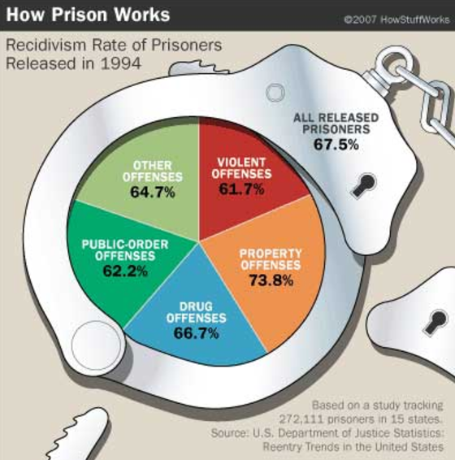
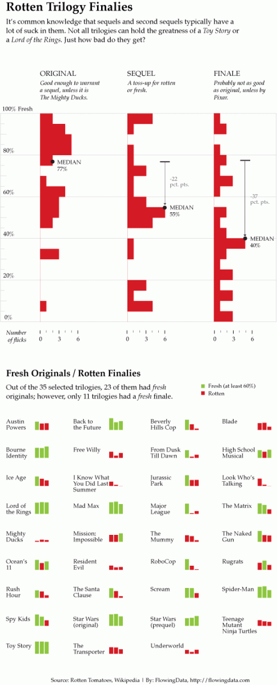
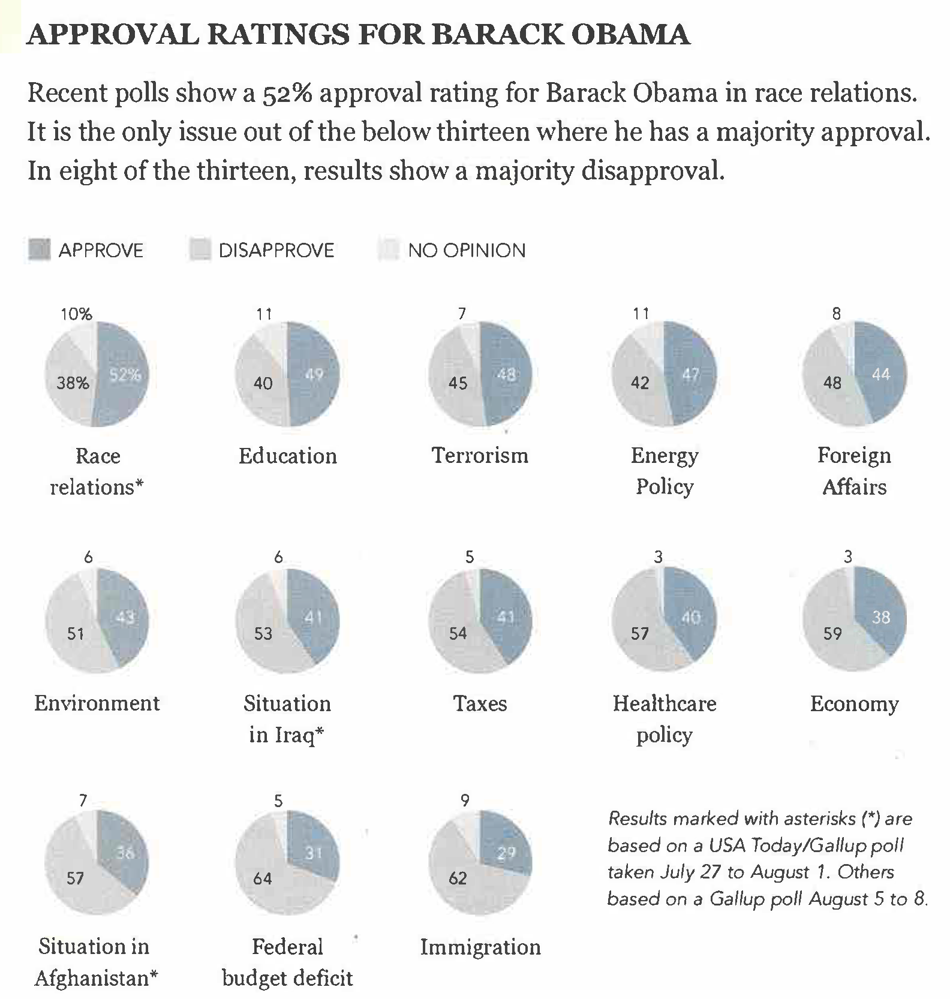
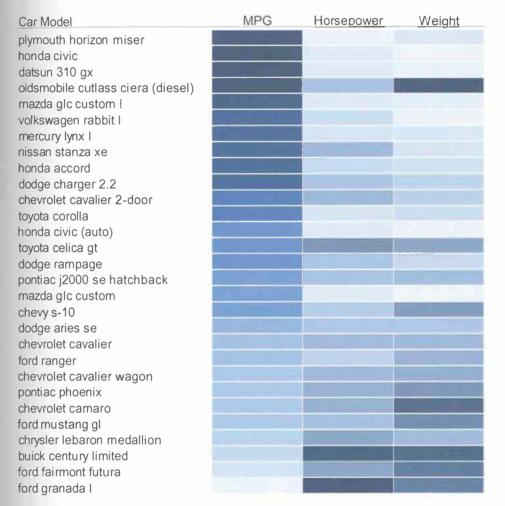
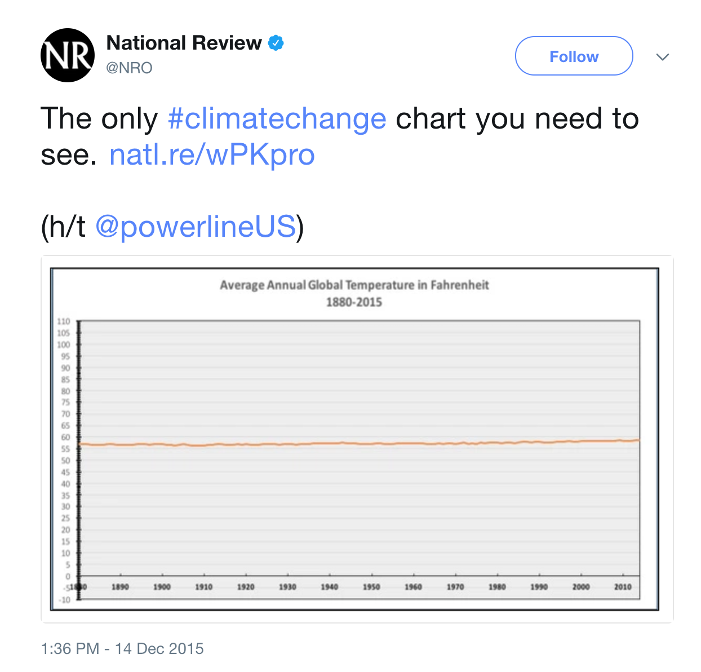
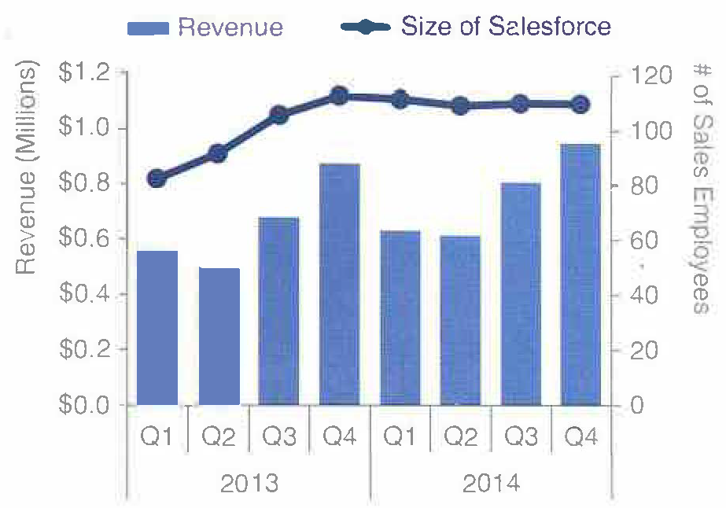
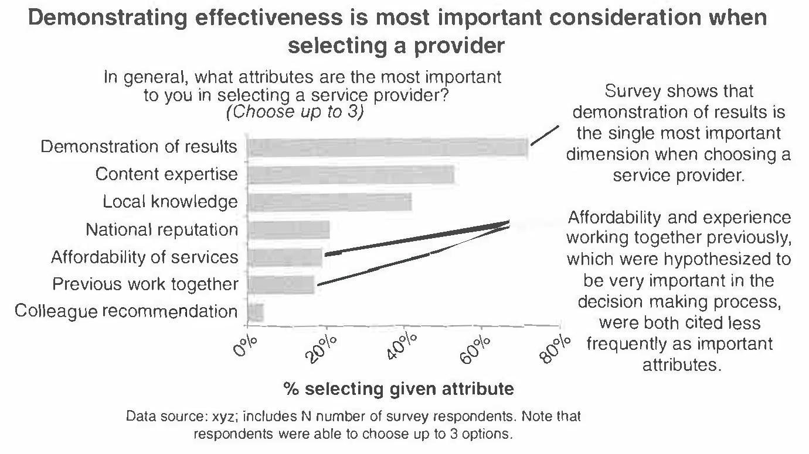

```{r 03_setup, include=FALSE}
knitr::opts_chunk$set(echo = TRUE, error = TRUE)
library(tufte)
library(tidyverse)
library(ggplot2)
library(ggmap)
library(tint)
library(fivethirtyeight)
library(babynames) 
library(readr)
knitr::opts_chunk$set(tidy = FALSE, message=FALSE, cache.extra = packageVersion('tufte'))
# options(htmltools.dir.version = FALSE)
```

# Effective Visualizations and Bivariate Visualizations

## Learning Goals {-}

- Understand and apply the guiding principles of effective visualizations
- Identify appropriate types of bivariate visualizations, depending on the type of variables (categorical, quantitative)
- Create basic bivariate visualizations based on real data

You can download a template .Rmd of this activity [here](template_rmd/03-Effective_Bivariate_Viz.Rmd) or a template .qmd of this activity [here](template_qmd/03-Effective_Bivariate_Viz.qmd).


## Effective Visualizations {-}

### Benefits of Visualizations {-}

- Visualizations help us understand what we're working with: What are the scales of our variables?  Are there any outliers, i.e. unusual cases?  What are the patterns among our variables?    
- This understanding will inform our next steps: What method of analysis / model is appropriate?    
- Once our analysis is complete, visualizations are a powerful way to communicate our findings and tell a story.

### Analysis of Graphics {-}

There is not one right way to visualize a data set. However, there are guiding principles that distinguish between "good" and "bad" graphics. 

One of the best ways to learn is by reading graphics and determining which ways of arranging thing are better or worse. So before jumping directly into theoretical principles, let's try some critical analysis on specific examples. 

For each of the following graphics or sets of graphics, identify the following:

1. the story the graphic is aiming to communicate to the audience
2. effective features of the graphic
3. areas for improvement


```{r,echo=FALSE, out.width = '50%',fig.show='hold',fig.cap="Source: http://viz.wtf/"}

```

\
\
\

```{r,echo=FALSE, out.width = '50%',fig.show='hold',fig.cap="Source: N. Yau, *Visualize This*, 2011, p. 223-225."}

```

\
\
\

```{r,echo=FALSE, out.width = '60%',fig.show='hold',fig.cap="Source: N. Yau, *Visualize This*, 2011, p. 242."}
knitr::include_graphics("images/chernoff.png")
```

\
\
\

```{r,echo=FALSE, out.width = '70%',fig.show='hold',fig.cap="Gun deaths."}
knitr::include_graphics("images/badviz2.png")
```

\
\
\

```{r,echo=FALSE, out.width = '80%',fig.show='hold',fig.cap="Source: N. Yau, *Visualize This*, 2011, p. 150."}

```

\
\
\

```{r,echo=FALSE, out.width = '80%',fig.show='hold',fig.cap="Source: C. N. Knaflic, *Storytelling with Data*, 2015, p. 142."}
knitr::include_graphics("images/breakup.png")
```

\
\
\

```{r,echo=FALSE, out.width = '60%',fig.show='hold',fig.cap="Source: S. Few, *Now You See It*, 2009, p. 45."}

```

\
\
\

```{r,echo=FALSE, out.width = '60%',fig.show='hold',fig.cap="Climate change."}

```

\
\
\

```{r,echo=FALSE, out.width = '50%',fig.show='hold',fig.cap="Source: C. N. Knaflic, *Storytelling with Data*, 2015, p. 48."}
knitr::include_graphics("images/slopegraph1.png")
```

\
\
\

```{r,echo=FALSE,fig.width=3.5,fig.height=3,fig.fullwidth=TRUE,fig.show='hold',fig.cap="Diamond data visualizations from [*R for Data Science*](http://r4ds.had.co.nz/data-visualisation.html#position-adjustments), 2017"}
ggplot(data = diamonds) + 
  geom_bar(mapping = aes(x = cut, fill = cut))
ggplot(data = diamonds) + 
  geom_bar(mapping = aes(x = cut, fill = clarity))
ggplot(data = diamonds, mapping = aes(x = cut, fill = clarity)) + 
  geom_bar(alpha = 1/5, position = "identity")
ggplot(data = diamonds) + 
  geom_bar(mapping = aes(x = cut, fill = clarity), position = "fill")
ggplot(data = diamonds) + 
  geom_bar(mapping = aes(x = cut, fill = clarity), position = "dodge")
```

\
\
\

```{r,echo=FALSE, out.width = '100%',fig.show='hold',fig.cap="Source: S. Few, *Now You See It*, 2009, p. 37."}
knitr::include_graphics("images/piechart.png")
```

\
\
\

```{r,echo=FALSE, out.width = '70%',fig.show='hold',fig.cap="Source: N. Yau, *Visualize This*, 2011, p. 249."}
knitr::include_graphics("images/Nightingale.png")
```

\
\
\

```{r,echo=FALSE, out.width = '80%',fig.show='hold',fig.cap="Source: S. Few, *Now You See It*, 2009, p. 61."}
knitr::include_graphics("images/compensation.png")
```

\
\
\

```{r,echo=FALSE, out.width = '100%',fig.show='hold',fig.cap="Source: C. N. Knaflic, *Storytelling with Data*, 2015, p. 68."}

```

\
\
\

```{r,echo=FALSE, out.width = '70%',fig.show='hold',fig.cap="Source: C. N. Knaflic, *Storytelling with Data*, 2015, p. 81."}

```

\
\
\

```{r,echo=FALSE, out.width = '60%',fig.show='hold',fig.cap="Source: http://viz.wtf/"}
knitr::include_graphics("images/badviz4.png")
```

\
\
\

```{r,echo=FALSE, out.width = '85%',fig.show='hold',fig.cap="Source: A. Cairo, *The Functional Art*, 2013, p. 340."}
knitr::include_graphics("images/plagiarism.png")
```

\
\
\

```{r,echo=FALSE, out.width = '70%',fig.show='hold',fig.cap="Source: N. Yau, *Visualize This*, 2011, p. 220."}
knitr::include_graphics("images/tv-size-by-year1.png")
```

\
\
\

**More examples**:

- FlowingData: [blog](http://flowingdata.com/) and [Best visualizations of 2016](https://flowingdata.com/2016/12/29/best-data-visualization-projects-of-2016/)
- [WTF Visualizations](http://viz.wtf/)


### Properties of Effective Visualizations {-}

#### Storytelling / Context {-}

Remember ... 

> Graphics are designed by the human expert (you!) in order to reveal information that's latent in the data.

Your choices depend on what information you want to reveal and convey. So before you complete a graphic, you should clearly identify what story you want the graphic to tell to the audience, and double check that this story is being told.^[A "negative" result (e.g., there is no correlation between two variables) is a perfectly fine story to tell.]

[Here](https://fivethirtyeight.com/features/six-charts-to-help-americans-understand-the-upcoming-german-election/) is a nice example from `FiveThirtyEight` where each chart tells a story in answer to a particular question about the [then] upcoming German election. 

[Here](https://fivethirtyeight.com/features/gun-deaths/) is an interactive visualization that tells a story about gun violence. 

Another important contextual question to ask is whether the graphic is for an explanatory or exploratory analysis.

#### Ethics {-}

1. Do not present data in a way that misleads the audience. 

2. Always include your data source. Doing so attributes credit where it is due, provides credibility to your work, and provides context for your graphic.


#### Design {-}

A basic principle is that a graphic is about *comparison*.  Good graphics make it easy for people to perceive things that are similar and things that are different.  Good graphics put the things to be compared "side-by-side," that is, in perceptual proximity to one another. The following aesthetics are listed in roughly descending order of human ability to perceive and compare nearby objects:^[This list is from B. S. Baumer, D. T. Kaplan, and N. J. Horton, *Modern Data Science with R*, 2017, p. 15. For more of the theory of perception, see also 
W.S. Cleveland and R. McGill, "[Graphical perception: Theory, experimentation, and application to the development of graphical methods](http://www.math.pku.edu.cn/teachers/xirb/Courses/biostatistics/Biostatistics2016/GraphicalPerception_Jasa1984.pdf)," *Journal of the American Statistical Association*, 1984.]

1. Position
2. Length
3. Angle
4. Direction
5. Shape (but only a very few different shapes)
6. Area
7. Volume
8. Shade
9. Color

Color is the most difficult, because it is a 3-dimensional quantity. We are pretty good at color gradients, but discrete colors must be selected carefully. We need to be particularly aware of red/green color blindness issues.    

**Visual perception and effective visualizations**

Here are some facts to keep in mind about visual perception from [Now You See It](https://www.amazon.com/Now-You-See-Visualization-Quantitative/dp/0970601980):

1. Visual perception is selective, and our attention is often drawn to constrasts from the norm.

```{r,echo=FALSE, out.width = '100%',fig.fullwidth=TRUE,fig.cap="Our attention is drawn to contrasts to the norm. What stands out in this example image?, which is originally from C. Ware, *Information Visualization: Perception for Design*, 2004? Source: S. Few, *Now You See It*, 2009, p. 33."}
knitr::include_graphics("images/contrast.png")
```

> **Implication**: We should design visualizations so that the features we want to highlight stand out in contrast from those that are not worth the audience's attention.

2. Our eyes are drawn to familiar patterns. We see what we know and expect.

```{r,echo=FALSE, out.width = '90%',fig.fullwidth=TRUE,fig.cap="Do you see anything embedded in this rose image from coolbubble.com? Source: S. Few, *Now You See It*, 2009, p. 34."}
knitr::include_graphics("images/rose1.png")
```

> **Implication**: Visualizations work best when they display information as patterns that familiar and easy to spot.

3. Memory plays an important role in human cognition, but working memory is extremely limited.

> **Implication**: Visualizations must serve as external aids to augment working memory.

**Gestalt principles**

The Gestalt principles (more info [here](https://en.wikipedia.org/wiki/Principles_of_grouping) or  [here](https://www.smashingmagazine.com/2014/03/design-principles-visual-perception-and-the-principles-of-gestalt/)) were developed by psychologists including Max Wertheimer in the early 1900s to explain how humans perceive organized patterns and objects. 

In a design setting, they help us understand how to incorporate **preattentive features** into visualizations. The figure below shows some preattentive features, all of which are processed prior to conscious attention ("at a glance") and can help the reader focus on relevant information in a visualization.

```{r,echo=FALSE, out.width = '100%',fig.fullwidth=TRUE,fig.cap="Preattentive features based on the Gestalt principles. Source: I. Meirelles, *Design for Information*, 2013, p. 23."}
knitr::include_graphics("images/gestalt.png")
```

**Other design tips** from [Visualize This](https://www.amazon.com/Visualize-This-FlowingData-Visualization-Statistics/dp/0470944889/) and [Storytelling with Data](https://www.amazon.com/Storytelling-Data-Visualization-Business-Professionals/dp/1119002257):

- Put yourself in a reader's shoes when you design data graphics. What parts of the data need explanation? We can minimize ambiguity by providing scales, label axes, etc.
- Data graphics are meant to shine a light on your data. Try to remove any elements that don't help you do that. That is, eliminate "chart junk" (distracting and unnecessary adornments). 
- Vary color and stroke styles to emphasize the parts in your graphic that are most important to the story you're telling 
- It is easier to judge length than it is to judge area or angles
- Be thoughtful about how your categories (levels) are ordered for categorical data. There may be a natural ordering
- Pie charts, donut charts, and 3D are evil


### Basic Rules for Constructing Graphics {-}

Instead of memorizing which plot is appropriate for which situation, it's best to simply start to recognize patterns in constructing graphics:

- Each quantitative variable requires a new axis.    
- Each categorical variable requires a new way to "group" the graphic (eg: using colors, shapes, separate facets, etc to capture the grouping).
- For visualizations in which overlap in glyphs or plots obscures the patterns, try faceting or transparency. 


### Still to Come {-}

While we will not cover all of visualization theory -- you can take a whole course on that at Macalester and it is a proper field in its own right -- we will touch on the following types of visualizations in the coming weeks:

- Univariate and bivariate visualizations
- Visualizations of higher dimensional data
- Temporal structures: timelines and flows
- Hierarchical structures: trees
- Relational structures: networks
- Spatial structures: maps
- Spatio-temporal structures
- Textual structures
- Interactive graphics (e.g., `gganimate`, `shiny`)

## Bivariate Visualizations {-}

The outcome of the 2016 presidential election surprised many people.  In this activity we  will analyze data from the 2016 presidential election. To better understand it ourselves, we'll explore county-level election outcomes and demographics.  The data set, prepared by Alicia Johnson, combines 2008/2012/2016 county-level election returns from [Tony McGovern  on github](https://github.com/tonmcg/County_Level_Election_Results_12-16), county-level demographics from the `df_county_demographics` data set within the `choroplethr` R package, and red/purple/blue state designations from [http://www.270towin.com/](http://www.270towin.com/).

### Getting to know the dataset {-}

```{exercise}
Begin by loading the data from "https://www.macalester.edu/~ajohns24/data/electionDemographics16.csv" and getting to know the data. Follow the prompts below to guide you.
```

```{r eval=FALSE}
# Load data from "https://www.macalester.edu/~ajohns24/data/electionDemographics16.csv"

# Check out the first rows of elect.  What are the units of observation?   

# How much data do we have?    

# What are the names of the variables?    

```

<details>
  <summary>Solution</summary>
```{r,collapse=TRUE}
# Load data from "https://www.macalester.edu/~ajohns24/data/electionDemographics16.csv"
elect <- read_csv("https://www.macalester.edu/~ajohns24/data/electionDemographics16.csv")
    
# Check out the first rows of elect.  
# The units of observation are county election results 
#  The variables are count name, vote counts for parties and total for presidential elections, and more
head(elect)
    
# There are 3,112 counties and 34 variables   
dim(elect)
    
# See the long list below    
names(elect)
```
</details>
\


```{exercise}
Explore the win column:
    The `winrep_2016` variable indicates whether or not the Republican (Trump) won the county in 2016, thus is *categorical*.  Let's construct both numerical and visual summaries of Trump wins/losses.  (Before you do, what do you anticipate?) 
```

```{r eval=FALSE}
#Construct a table (a numerical summary) of the number of counties that Trump won/lost
table(???)

#Attach a library needed for ggplots
library(???)

#Construct a bar chart (a visual summary) of this variable.    
ggplot(???, aes(???)) 
ggplot(???, aes(???)) + 
    geom_???()
```

<details>
  <summary>Solution</summary>
```{r eval=FALSE}
#Construct a table (a numerical summary) of the number of counties that Trump won/lost
table(elect$winrep_2016)

#Attach a library needed for ggplots
library(ggplot2)

#Construct a bar chart (a visual summary) of this variable.    
ggplot(elect, aes(x = winrep_2016)) + 
    geom_bar()
```
</details>

\

```{exercise name="Explore Vote Percentages"}
The `perrep_2016` variable includes a bit more detail about Trump's support in each county.    

```

a. Since it's *quantitative* we need different tools to visually explore the variability in `perrep_2016`.  To this end, construct & interpret both a histogram and density plot of `perrep_2016`.  (Before you do, what do you anticipate?)    
    ```{r eval=FALSE}
    ggplot(elect, aes(???))
        
    #histogram
    ggplot(elect, aes(???)) + 
        geom_???(color="white")
    
    #density plot
    ggplot(elect, aes(???)) + 
        geom_???()
    ```    

<details>
  <summary>Solution</summary>
```{r eval=FALSE}
ggplot(elect, aes(x=perrep_2016))

#histogram
ggplot(elect, aes(x=perrep_2016)) + 
    geom_histogram(color="white")

#density plot
ggplot(elect, aes(x = perrep_2016)) + 
    geom_density()
```

</details>


b. Thus far, we have a good sense for how Trump’s support varied from county to county. We don’t yet have a good sense for *why*. What other variables (ie. county features) might explain some of the variability in Trump’s support from county to county?  Which of these variables do you think will be the best predictors of support?  The worst?    


<details>
  <summary>Solution</summary>
Maybe past election history and information about the people that live there and the social culture and values. Let's see...
</details>


### Background on visualizing relationships {-}

We've come up with a list of variables that might explain some of the variability in Trump's support from county to county.  Thus we're interested in the relationship between:    

- **<span style="color:red">response variable</span>**: the variable whose variability we would like to explain (Trump's percent of the vote)    
- **<span style="color:red">predictors</span>**:  variables that might explain some of the variability in the response (percent white, per capita income, state color, etc)


Our goal is to construct visualizations that allow us to examine/identify the following features of the relationships among these variables:    

- relationship *trends*    
- relationship *strength* (degree of variability from the trend)    
- *outliers* in the relationship

Before constructing visualizations of the relationship among any set of these variables, we need to understand what features these should have.  As with univariate plots, the appropriate visualization also depends upon whether the variables are quantitative or categorical. Recall some **basic rules in constructing graphics:** 

- Each **quantitative variable** requires a new axis.  (We'll discuss later what to do when we run out of axes!)    
- Each **categorical variable** requires a new way to "group" the graphic (eg: using colors, shapes, separate facets, etc to capture the grouping)    
- For visualizations in which **overlap** in glyphs or plots obscures the patterns, try faceting or transparency. 


```{exercise, name="Mock-Ups"}
Consider a subset  of the variables: 

```

```{r echo=FALSE, warning=FALSE}
suppressPackageStartupMessages(library(dplyr))

fd <- elect %>% 
    filter(region %in% c(8039,28003,40129,29119,13247,27027)) %>% 
    select(c(county, abb, perrep_2016, perrep_2012, winrep_2016, StateColor)) %>% 
    mutate(perrep_2016 = round(perrep_2016,2), perrep_2012 = round(perrep_2012,2))
knitr::kable(fd)
```

In groups, sketch on paper a mock-up of a visualization of the relationship between the given pair of variables (i.e., what type of chart is appropriate to demonstrate the relationship?):

a. The relationship between `perrep_2016` (the response) and `perrep_2012` (the predictor).    

b. The relationship between `perrep_2016` (the response) and `StateColor` (the predictor).  Think: how might we modify the below density plot of `perrep_2016` to distinguish between counties in red/purple/blue states?    
    ```{r echo=FALSE}
    library(ggplot2)
    ```
    
    ```{r fig.width=2, fig.height=2}
    ggplot(elect, aes(x=perrep_2016)) + 
        geom_density()
    ```    

c. The relationship between Trump's county-levels wins/losses `winrep_2016` (the response) and `StateColor` (the predictor).  Think: how might we modify the below bar plot of `winrep_2016` to distinguish between counties in red/purple/blue states? 

    ```{r fig.width=3, fig.height=2}
    ggplot(elect, aes(x=winrep_2016)) + 
        geom_bar()
    ```    

### Visualizing quantitiative vs quantitative relationships {-}

Let's start by exploring the relationship between Trump's 2016 support (`perrep_2016`) and Romney's 2012 support (`perrep_2012`), both quantitative variables.    

```{exercise name="Scatterplots and Glyphs"}
Both `perrep_2016` and `perrep_2012` are quantitative, thus require their own axes.  Traditionally, the response variable (what we are trying to predict or explain) is placed on the y-axis.  Once the axes are set up, each case is represented by a "glyph" at the coordinates defined by these axes.    

```

a. Make a scatterplot of `perrep_2016` vs `perrep_2012` with different glyphs: points or text.    
  
    ```{r eval=FALSE}
    #just a graphics frame
    ggplot(elect, aes(y=perrep_2016, x=perrep_2012))
   
    #add a layer with "point" glyphs
    ggplot(elect, aes(y=perrep_2016, x=perrep_2012)) + 
        geom_point()    
    
    #add a layer with symbol glyphs
    ggplot(elect, aes(y=perrep_2016, x=perrep_2012)) + 
        geom_point(shape=3)
    
    #add a layer with "text" glyphs
    ggplot(elect, aes(y=perrep_2016, x=perrep_2012)) + 
        geom_text(aes(label=abb))
        
    ```    

b. Summarize the relationship between the Republican candidates' support in 2016 and 2012.  Be sure to comment on:    
        - the strength of the relationship (weak/moderate/strong)    
        - the direction of the relationship (positive/negative)    
        - outliers (In what state do counties deviate from the national trend?  Explain why this might be the case)    


<details>
  <summary>Solution</summary>

There is a strong positive relationship between the Republican support from 2012 to 2016, meaning that if a county highly favors a Republican candidate in 2012, they were likely to highly favor a Republican in 2016. Counties in Utah seems to not quite follow this pattern with lower support in 2016 than what you'd expect given the support in 2012. This is because the 2012 candidate was from Utah (data context!). 

</details>

\


```{exercise name="Capture the Trend with 'smooths'"}
The trend of the relationship between `perrep_2016` and `perrep_2012` is clearly positive and (mostly) linear.  We can highlight this trend by adding a model "smooth" to the plot.    

```

a. Add a layer with a model smooth:  
  
    ```{r eval=FALSE}
    ggplot(elect, aes(y=perrep_2016, x=perrep_2012)) + 
        geom_point() + 
        geom_smooth()
    ```
b. Construct a new plot that contains the model smooth but does not include the individual cases (eg: point glyphs).    

<details>
  <summary>Solution</summary>
```{r eval=FALSE, collapse = TRUE}
ggplot(elect, aes(y=perrep_2016, x=perrep_2012)) + 
  geom_smooth()
```
</details>

\

c. Notice that there are gray bands surrounding the blue model smooth line.  What do these gray bars illustrate/capture and why are they widest at the "ends" of the model?  

<details>
  <summary>Solution</summary>
There are fewer data points at the "ends" so there is more uncertainty about the relationship.
</details>


d. By default, `geom_smooth` adds a smooth, localized model line.  To examine the "best" *linear model*, we can specify `method="lm"`:    
  
    ```{r eval=FALSE}
    ggplot(elect, aes(y=perrep_2016, x=perrep_2012)) + 
        geom_point() + 
        geom_smooth(method="lm")
    ```    


```{exercise name="Modify the Scatterplots"}

  As with univariate plots, we can change the aesthetics of scatterplots.    

```

a. Add appropriate axis labels to your scatterplot.  Label the y-axis "Trump 2016 support (%)" and label the x-axis "Romney 2012 support (%)".    
b. Change the color of the points.    
c. Add some *transparency* to the points.  NOTE: `alpha` can be between 0 (complete transparency) and 1 (no transparency).      
d. Why is transparency useful in this particular graphic?
   
   
   
<details>
  <summary>Solution</summary>
```{r, eval=FALSE}
ggplot(elect, aes(y=perrep_2016, x=perrep_2012)) + 
    geom_point(color="red",alpha=0.1) +
    labs(x="Romney 2012 support (%)",y="Trump 2016 support (%)")
```
</details>
 
 \
 
    
```{exercise name="More Scatterplots"}

  2012 results aren't the only possible predictor of 2016 results.  Consider two more possibilities.    
```

a. Construct a scatterplot of `perrep_2016` and `median_rent`.  Summarize the relationship between these two variables.    
b. Construct a scatterplot of `perrep_2016` and `percent_white`.  Summarize the relationship between these two variables.    
c. Among `perrep_2012`, `median_rent` and `percent_white`, which is the best predictor of `perrep_2016`?  Why?    

### Visualizing quantitative vs. categorical relationships {-}

Consider a univariate histogram and density plot of `perrep_2016`:    

```{r echo=FALSE, warning=FALSE}
suppressPackageStartupMessages(library(gridExtra))
suppressPackageStartupMessages(library(ggplot2))
g1 = ggplot(elect, aes(x=perrep_2016)) + geom_histogram(color="white")
g2 = ggplot(elect, aes(x=perrep_2016)) + geom_density(fill="white")
grid.arrange(g1,g2,ncol=2)
```     

To visualize the relationship between Trump's 2016 support (`perrep_2016`) and the `StateColor` (categorical) we need to incorporate a grouping mechanism.  Work through the several options below.    

```{exercise name="Side-by-Side Density Plots"}
We can show density plots for each state color next to each other:
```

a. Construct a density plot for each group.     
    ```{r eval=FALSE}
    ggplot(elect, aes(x=perrep_2016, fill=StateColor)) + 
        geom_density()
    ```    
b.  Notice that `ggplot` randomly assigns colors to group based on alphabetical order.  In this example, the random color doesn't match the group itself (red/purple/blue)!  We can fix this:    
    ```{r eval=FALSE}
    ggplot(elect, aes(x=perrep_2016, fill=StateColor)) + 
        geom_density() + 
        scale_fill_manual(values=c("blue","purple","red"))
    ```    
c. The overlap between the groups makes it difficult to explore the features of each.  One option is to add *transparency* to the density plots:    
    ```{r eval=FALSE}
    ggplot(elect, aes(x=perrep_2016, fill=StateColor)) + 
        geom_density(alpha=0.5) + 
        scale_fill_manual(values=c("blue","purple","red"))
    ```    
d. Yet another option is to separate the density plots into separate "facets" defined by group:    
    ```{r eval=FALSE}
    ggplot(elect, aes(x=perrep_2016, fill=StateColor)) + 
        geom_density(alpha=0.5) + 
        scale_fill_manual(values=c("blue","purple","red")) + 
        facet_wrap( ~ StateColor)
    ```
    

```{exercise name="Side-by-Side Histograms"}
Let's try a similar strategy using histograms to illustrate the relationship between `perrep_2016` and `StateColor`.    
```

a. Start with the default histogram:    
    ```{r eval=FALSE}
    ggplot(elect, aes(x=perrep_2016, fill=StateColor)) + 
        geom_histogram(color="white") 
    ```
b. That's not very helpful!  Separate the histograms into separate facets for each `StateColor` group.    

```{exercise name="More Options!"}
Density plots and histograms aren't the only type of viz we might use...    
```

a. Construct side-by-side violins and side-by-side boxplots (see description below).    
    ```{r eval=FALSE}
    #violins instead
    ggplot(elect, aes(y=perrep_2016, x=StateColor)) + 
        geom_violin() 

    #boxes instead
    ggplot(elect, aes(y=perrep_2016, x=StateColor)) + 
        geom_boxplot() 
    ```    
    Box plots are constructed from five numbers - the minimum, 25th percentile, median, 75th percentile, and maximum value of a quantitative variable: 
    
```{r, out.width = "400px",echo=FALSE}
knitr::include_graphics("https://www.macalester.edu/~dshuman1/data/112/Boxplot.png")
```

b. In the future, we'll typically use *density plots* instead of histograms, violins, and boxes.  Explain at least one pro and one con of the density plot.    
  
```{exercise}
Let's not forget the most important purpose of these visualizations!  Summarize the relationship between Trump's 2016 county-level support among red/purple/blue states.  

```

### Visualizing categorical vs categorical relationships {-}

Finally, suppose that instead of Trump's percentage support, we simply want to explore his county-level wins/losses:    

```{r echo=FALSE,fig.width=4, fig.height=4}
ggplot(elect, aes(x=winrep_2016)) + geom_bar()
```


Specifically, let's explore the relationship between `winrep_2016` and `StateColor`, another categorical variable.  


```{exercise name="Side-by-side bar plots"}
We saw above that we can incorporate a new categorical variable into a visualization by using grouping features such as color or facets.  Let's add information about `StateColor` to our bar plot of `winrep_2016`.    

```

a. Construct the following 4 bar plot visualizations.    
    ```{r eval=FALSE}
    #a stacked bar plot
    ggplot(elect, aes(x=StateColor, fill=winrep_2016)) + 
        geom_bar()
    
    #a side-by-side bar plot
    ggplot(elect, aes(x=StateColor, fill=winrep_2016)) + 
        geom_bar(position="dodge")
    
    #a proportional bar plot
    ggplot(elect, aes(x=StateColor, fill=winrep_2016)) + 
        geom_bar(position="fill")    
    
    #faceted bar plot
    ggplot(elect, aes(x=StateColor, fill=winrep_2016)) + 
        geom_bar() +
        facet_wrap( ~ winrep_2016)
    
    ```    

b. Name one pro and one con of using the "proportional bar plot" instead of one of the other three options.    

c. What's your favorite bar plot from part (a)?  Why?    
   
### Practice {-}

#### Hot Dogs {-}

In the annual Nathan's hot dog eating contest, people compete to eat as many hot dogs as possible in ten minutes.  Data on past competitions were compiled by Nathan Yau for "Visualize This: The FlowingData Guide to Design, Visualization, and Statistics": 

```{r, message=FALSE}
hotdogs <- read_csv("http://datasets.flowingdata.com/hot-dog-contest-winners.csv")
```   

```{exercise}
   
   
a. Construct a visualization of the winning number of hot dogs by year. THINK: Which is the response variable?      
b. Temporal trends are often visualized using a line plot.  Add a `geom_line()` layer to your plot from part (a).       
c. Summarize your observations about the temporal trends in the hot dog contest.    

```


```{exercise}
All but two of the past winners are from the U.S. or Japan:

```

```{r}
table(hotdogs$Country)
```    
Use the following code to *filter* out just the winners from U.S. and Japan and name this `hotdogsSub`.  (Don't worry about the code itself - we'll discuss similar syntax later in the semester!)    

```{r}
library(dplyr)
hotdogsSub <- hotdogs %>% 
    filter(Country %in% c("Japan","United States"))
```    

a. Using a density plot approach *without* facets, construct a visualization of how the number of hot dogs eaten varies by country.
b. Repeat part a using a density plot approach *with* facets.    
c. Repeat part a using *something other than* a density plot approach.  (There are a few options!)    
d. Summarize your observations about the number of hot dogs eaten by country.    


#### The Bechdel Test {-}

Recall the "Bechdel test" data from the previous activity.  As a reminder, the “Bechdel test” tests whether movies meet the following criteria:    

- there are $\ge$ 2 female characters    
- the female characters talk to each other    
- at least 1 time, they talk about something other than a male character    

In the fivethirtyeight.com article ["The Dollar-And-Cents Case Against Hollywood's Exclusion of Women"](http://fivethirtyeight.com/features/the-dollar-and-cents-case-against-hollywoods-exclusion-of-women/), the authors analyze which Hollywood movies do/don't pass the test.  Their data are available in the `fivethirtyeight` package:    

```{r}
library(fivethirtyeight)
data(bechdel)
```
    
In investigating budgets and profits, the authors "focus on films released from 1990 to 2013, since the data has significantly more depth since then."  Use the following code to filter out just the movies in these years and name the resulting data set `Beyond1990` (don't worry about the syntax):    

```{r}
library(dplyr)
Beyond1990 <- bechdel %>% 
    filter(year >= 1990)
```

```{exercise}

   
a. Construct a visualization that addresses the following research question: Do bigger budgets (`budget_2013`) pay off with greater box office returns (`domgross_2013`)?  In constructing this visualization, add a smooth to highlight trends and pay attention to which of these variables is the response.       
b. Using your visualization as supporting evidence, answer the research question.          
c. Part of the fivethirtyeight article focuses on how budgets (`budget_2013`) differ among movies with different degrees of female character development (`clean_test`).  Construct a visualization that highlights the relationship between these two variables.  There are many options - some are better than others!       
d. Using your visualization as supporting evidence, address fivethirtyeight's concerns.  

```{r eval=FALSE, echo=FALSE}
#a
ggplot(Beyond1990, aes(y=domgross_2013, x=budget_2013)) + 
            geom_point(alpha=0.1) + 
            geom_smooth()

#b
#profits tend to increase with budget but the relationship is fairly weak

#c
#one option:
ggplot(Beyond1990, aes(x=budget_2013, fill=clean_test)) + 
            geom_density(alpha=0.5) + 
            facet_wrap(~ clean_test)

#d
#Budgets tend to be smaller among movies the pass the Bechdel test. 

```

```{exercise}
NOTE: The following exercise is inspired by a similar exercise proposed by Albert Kim, one of the `fivethirtyeight` package authors.    
    Return to the fivethirtyeight.com article and examine the plot titled "The Bechdel Test Over Time".    
```

a. Summarize the trends captured by this plot.  (How has the representation of women in movies evolved over time?)   
b. Recreate this plot!  To do so, you'll need to create a new data set named `newbechdel` in which the order of the Bechdel categories (`clean_test`) and the year categories (`yearCat`) match those used by fivethirtyeight.  Don't worry about the syntax:    
    ```{r}
    library(dplyr)
    newbechdel <- bechdel %>% 
        mutate(clean_test=factor(bechdel$clean_test, c("nowomen","notalk","men","dubious","ok"))) %>% 
        mutate(yearCat=cut(year, breaks=seq(1969,2014,by=5)))
    ```    
    Further, you'll need to add the following layer in order to get a color scheme that's close to that in the article:    
    ```{r eval=FALSE}
    scale_fill_manual(values = c("red","salmon","pink","steelblue1","steelblue4"))
    ```
    
    NOTE that your plot won't look *exactly* like the authors', but should be close to this:    
    
```{r, out.width = "800px",echo=FALSE}
knitr::include_graphics("images/bechdel_hist.jpeg")
```

 


