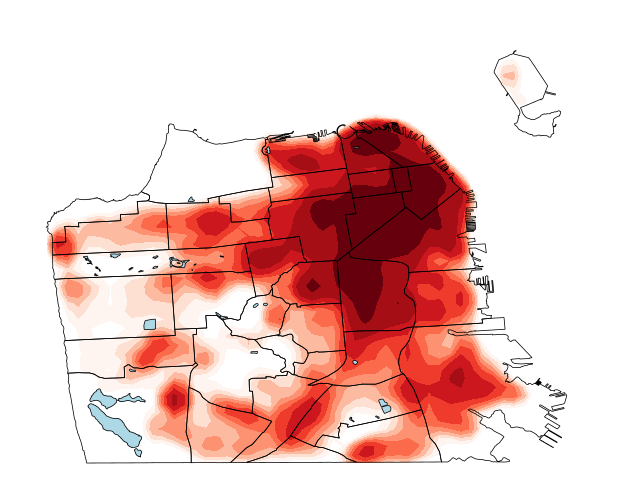

--- 
title: "STAT/COMP 112: Introduction to Data Science"
site: bookdown::bookdown_site
output:
  bookdown::gitbook:
    config:
      sharing:
        facebook: false
        twitter: false
documentclass: book
link-citations: yes
github-repo: bcheggeseth/112_fall_2022
description: "This is the class website for Introduction to Data Science at Macalester College for Fall 2022."
---

# Welcome! {-}

[Image source](https://bheggeseth.shinyapps.io/SFCrimeShinyApp/)

 
 

This is the day-to-day course site for Introduction to Data Science (STAT/COMP 112) at Macalester College for Fall 2022. The activities here were developed by a variety of faculty in the [MSCS Department](https://macalester.edu/mscs) at [Macalester College](https://macalester.edu).

 
 
 

This work is licensed under a [Creative Commons Attribution-NonCommercial-ShareAlike 4.0 International License](https://creativecommons.org/licenses/by-nc-sa/4.0/).
