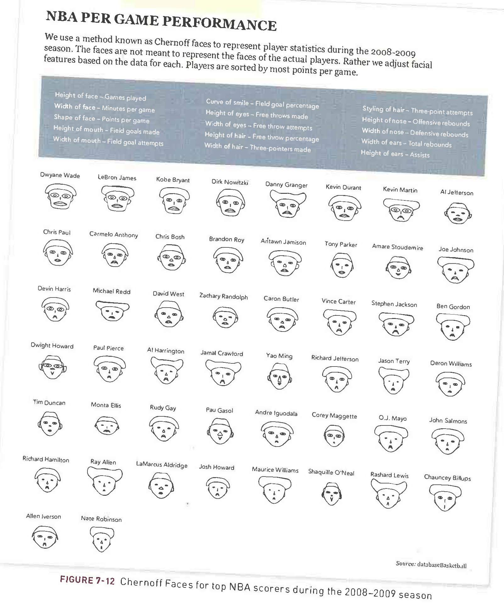
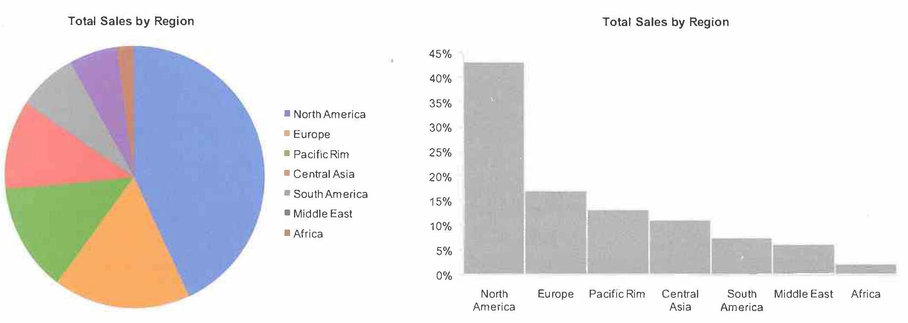
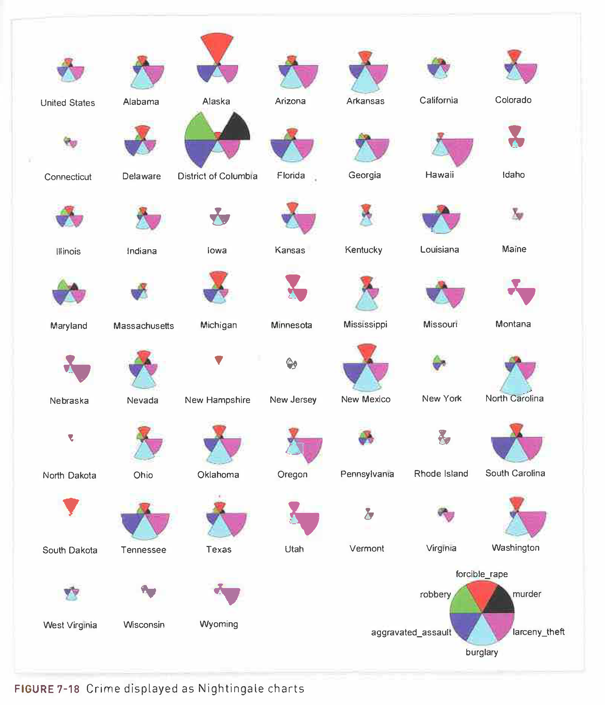

--- 
title: "COMP/STAT 112: Introduction to Data Science"
site: bookdown::bookdown_site
output:
  bookdown::gitbook:
    config:
      sharing:
        facebook: false
        twitter: false
documentclass: book
link-citations: yes
github-repo: JamesNormington/112_spring_2023/
cover-image: "images/logo.png"
description: "This is the class website for Introduction to Data Science (COMP/STAT 112) at Macalester College for Spring 2023."
---

# Welcome! {-}

*Note: This site is still in construction!*

This is the day-to-day course site for Introduction to Data Science (COMP/STAT 112) taught by Professor [James Normington](https://jamesnormington.github.io) at Macalester College for Spring 2023. 

This website was constructed by Professor [Brianna Heggeseth](https://bcheggeseth.github.io/), and has been modified for Professor Normington's Spring 2023 offering of COMP/STAT 112.

The activities here were developed by a variety of faculty in the [MSCS Department](https://macalester.edu/mscs) at [Macalester College](https://macalester.edu).


<br>
<br>
<br>


This work is licensed under a [Creative Commons Attribution-NonCommercial-ShareAlike 4.0 International License](https://creativecommons.org/licenses/by-nc-sa/4.0/).

<!--chapter:end:index.Rmd-->

# Course Schedule {-}

The schedule below is a *tentative* outline of our plans for the semester. This schedule will change throughout the semester, so check this often.

[Here](https://jamesnormington.github.io/files/COMP_STAT%20112%20Spring%202023%20Syllabus.pdf) is a link to the syllabus.

[Here](https://docs.google.com/spreadsheets/d/1g462sR6fCMG61lWvytmDMSWbjnjTKbERVaqADM2dSlc/edit?usp=sharing) is a link to the grading template we will use.

<br>

```{r echo=FALSE}
htmltools::includeHTML("schedule_table.html")
```

<!--chapter:end:schedule.Rmd-->

```{r 01_setup, include=FALSE}
knitr::opts_chunk$set(echo=TRUE, error=TRUE)
library(tufte)
library(tidyverse)
library(ggplot2)
library(ggmap)
library(tint)
#options(htmltools.dir.version = FALSE)
```

# (PART) Foundation {.unnumbered}

# Intro to R, RStudio, and R Markdown

## Learning Goals {.unnumbered}

-   Download and install the necessary tools (R, RStudio)
-   Develop comfort in navigating the tools in RStudio
-   Develop comfort in writing and knitting a R Markdown file
-   Identify the characteristics of tidy data
-   Use R code: as a calculator and to explore tidy data

## Getting Started in RStudio {.unnumbered}

As you might guess from the name, "Data Science" requires *data*. Working with modern (large, messy) data sets requires statistical software. We'll exclusively use **RStudio**. Why?

-   it's free\
-   it's open source (the code is free & anybody can contribute to it)
-   it has a huge online community (which is helpful for when you get stuck)\
-   it's one of the industry standards\
-   it can be used to create *reproducible* and lovely documents (In fact, the course materials that you're currently reading were constructed entirely within RStudio! [thank you Prof. Brianna Heggeseth!])

### Download R & RStudio {.unnumbered}

To get started, take the following two steps *in the given order*. Even if you already have R/RStudio, make sure to update to the most recent versions.

1.  Download and install the R statistical software at <https://mirror.las.iastate.edu/CRAN/>\
2.  Download and install the FREE version of RStudio at <https://www.rstudio.com/products/rstudio/download/#download>

If you are having issues with downloading, log on to <https://rstudio.macalester.edu/> (use Mac credentials) to use the RStudio server.

What's the difference between R and RStudio? RStudio requires R to run, but has more options and is easier to use than R. I like to think of RStudio as the car, and R as the engine. 

### A quick tour of RStudio {.unnumbered}

Open RStudio! You should see four panes, each serving a different purpose:

```{r fig-main,echo=FALSE,fig.cap="RStudio Interface"}
knitr::include_graphics("images/RStudioImage.jpg")
```

This short [video tour of RStudio](http://www.youtube.com/embed/JfIo2Ua_oqQ/) summarizes some basic features of the *console*.

```{exercise, name="Warm Up"}
Use RStudio as a simple calculator to do the following:
  
  1) Perform a simple calculation: calculate `90/3`.
  2) RStudio has built-in *functions* to which we supply the necessary *arguments*:  `function(arguments)`.  Use the built-in function `sqrt` to calculate the square root of 25.
  3) Use the built-in function `rep` to repeat the number "5" eight times.
  4) Use the `seq` function to create the vector `(0, 3, 6, 9, 12)`. Hint: `seq(0, 15, by = 5)` would create the vector `(0, 5, 10, 15)`.
  5) Create a new vector by concatenating three repetitions of the vector from the previous part.
```

<details>

<summary>Solution</summary>

```{r, collapse=TRUE}
90/3 

sqrt(25)

rep(5, times = 8)

seq(0, 12, by = 3)

rep(seq(0, 12, by = 3), times =  3)

rep(seq(0, 12, by = 3), each = 3) #notice the difference between times and each
```

</details>

\

```{exercise, name="Assignment", label="assignment"}
We often want to store our output for later use (why?).  The basic idea in RStudio:    
  
    `name <- output`
  
Copy and paste the following code into the console, line by line.  NOTE:  RStudio ignores any content after the `#`.  Thus we use this to 'comment' and organize our code.    
```

```{r eval=FALSE}
#type square_3
square_3
    
#calculate 3 squared
3^2    
    
#store this as "square_3"
square_3 <- 3^2    
    
#type square_3 again!
square_3
    
#do some math with square_3
square_3 + 2
```

### Data {.unnumbered}

Not only does "Data Science" require statistical software, it requires *DATA*! Consider the Google definition:

```{r echo=FALSE,fig.cap="A datum."}
knitr::include_graphics("images/datum.png")
```

With this definition in mind, which of the following are examples of data?

-   tables

```{r echo=FALSE, warning=FALSE, message=FALSE}
library(mosaic)
data(Galton)
head(Galton)
```

-   [photo](https://www.google.com/search?hl=en&biw=1439&bih=656&tbm=isch&sa=1&q=messy+college+dorm+rooms&oq=messy+college+dorm+rooms&gs_l=psy-ab.3...20720.21922.0.22183.6.6.0.0.0.0.143.552.4j2.6.0....0...1.1.64.psy-ab..1.1.142...0i13k1.uaj5gYQ4t50)

-   [video](https://www.youtube.com/watch?v=wMm7VdH05jY)

-   [text / tweets](https://twitter.com/data4blacklives?lang=en)

We'll mostly work with data that look like this:

```{r echo=FALSE, warning=FALSE, message=FALSE}
library(mosaic)
data(Galton)
head(Galton)
```

This isn't as restrictive as it seems. We can convert the above signals: photos, videos, and text to a data table format!

### Tidy Data {.unnumbered}

**Example:** After a scandal among FIFA officials, fivethirtyeight.com posted an analysis of FIFA viewership, ["How to Break FIFA"](https://fivethirtyeight.com/features/how-to-break-fifa/). Here's a snapshot of the data used in this article:

```{r echo=FALSE}
suppressPackageStartupMessages(library(fivethirtyeight))
data("fifa_audience")
suppressPackageStartupMessages(library(knitr))
kable(head(fifa_audience,10))
fifa <- fifa_audience
```

The data table above is in *tidy* format. *Tidy* data tables have three key features:

1.  Each row represents a **unit of observation** (also referred to as a case).\
2.  Each column represents a **variable** (ie. an attribute of the cases that can vary from case to case). Each variable is one of two types:\

-   **quantitative** = numerical\
-   **categorical** = discrete possibilities/categories\

3.  Each entry contains a single data value; no analysis, summaries, footnotes, comments, etc., and only one value per cell


```{exercise, name="Units of Observation and Variables"}
Consider the following in a group:   
```

a.  What are the units of observation in the FIFA data?\
b.  What are the variables? Which are quantitative? Which are categorical?\
c.  Are these *tidy* data?

<details>

<summary>Solution</summary>

a.  A FIFA member country
b.  country name, soccer or football confederation, country's share of global population (percentage), country's share of global world cup TV Audience (percentage), country's GDP-weighted audience share (percentage)
c.  Yes

</details>

\

```{exercise name="Tidy vs. Untidy"}
Check out the following data.  Explain to each other why they are untidy and how we can tidy them.    
  
  a. Data 1: FIFA    
    
              country  confederation  population share    tv_share
        ------------- -------------- ----------------- ----------- ------------------
        United States       CONCACAF     i don't know*       4.3%  *look up later      
                 Japan           AFC               1.9       4.9%
                 China           AFC              19.5      14.8%    
                                                        total=24%           
  
  b. Data 2: Gapminder life expectancies by country    
        
                          country  1952  1957  1962
        ------------ ------------ ----- ----- -----
                Asia  Afghanistan  28.8  30.3  32.0
                          Bahrain  50.9  53.8  56.9    
              Africa      Algeria  43.0  45.7  48.3    

```

<details>

<summary>Solution</summary>

a.  There are notes such as "I don't know" and "look up later" in columns with numeric values; the last row with the total is a summary. We could remove the text notes, replace it with the value if known, and remove the last row with the total summary.
b.  The first column does not have a row name. It should be continent. Additionally, Bahrain needs a value for the continent.

</details>

\

### Data Basics in RStudio {.unnumbered}

For now, we'll focus on *tidy* data. In a couple of weeks, you'll learn how to turn untidy data into tidy data.

```{exercise, name="Importing Package Data"}
The first step to working with data in RStudio is getting it in there!  How we do this depends on its format (eg: Excel spreadsheet, csv file, txt file) and storage locations (eg: online, within Wiki, desktop).  Luckily for us, the `fifa_audience` data are stored in the `fivethirtyeight` RStudio package. Copy and paste the following code into the Console and press Enter.
```

```{r eval=FALSE}
#download the data and information in the fivethirtyeight package (we only need to do this once)
install.packages('fivethirtyeight')

#load the fivethirtyeight package (we must do this every session of RStudio in which we want to use this package)
library(fivethirtyeight)
    
#load the fifa data
data("fifa_audience")
    
#store this under a shorter, easier name
fifa <- fifa_audience
```

```{exercise, name="Examining Data Structures"}
Before we can analyze our data, we must understand its structure.  Try out the following functions (copy and paste into the Console).  For each, make a note that describes its action.  
```

```{r eval=FALSE}
#(what does View do?)
View(fifa)  

#(what does head do?)
head(fifa)  

#(what does dim do?)
dim(fifa)           

#(what does names do?)
names(fifa)         
```

<details>

<summary>Solution</summary>

```{r, collapse=TRUE}
#View() opens up a new tab with a spreadsheet preview of the data to visually explore the data. It is commented out in the Rmarkdown file because this is an interactive feature
#View(fifa)  

#head() gives the first 6 (default number) rows of a data set
head(fifa)  

#dim() gives the number of rows and number of columns
dim(fifa)           

#names() gives the names of the columns/variables
names(fifa)   
```

</details>

\

```{exercise, name="Codebooks"}
Data are also only useful if we know what they measure!  The `fifa` data table is *tidy*; it doesn't have any helpful notes in the data itself.
```

Rather, information about the data is stored in a separate *codebook*. Codebooks can be stored in many ways (eg: Google docs, word docs, etc). Here the authors have made their codebook available in RStudio (under the original `fifa_audience` name). Check it out (run the following code in the console):

```{r eval=FALSE}
?fifa_audience
```

a.  What does `population_share` measure?
b.  What are the units of `population_share`?

<details>

<summary>Solution</summary>

a.  Country's share of global population
b.  Percentage between 0 and 100

</details>

 

```{exercise, name="Examining a Single Variable"}
Consider the following:
```

a.  We might want to access and focus on a single variable. To this end, we can use the `$` notation (see below). What are the values of `tv_audience_share`? Of `confederation`? Is it easy to figure out?

```{r eval=FALSE}
fifa$tv_audience_share
fifa$confederation
```

It's important to understand the format/class of each variable (quantitative, categorical, date, etc) in both its meaning and its structure within RStudio:

```{r eval=FALSE}
class(fifa$tv_audience_share)
class(fifa$confederation)
```

b.  If a variable is categorical (in `factor` format), we can determine its `levels` / category labels. What are the value of `confederation`?

```{r eval=FALSE}
levels(fifa$confederation) #it is in character format
levels(factor(fifa$confederation)) #we can convert to factor format
```

## R Markdown and Reproducible Research {.unnumbered}

> **Reproducible research** is the idea that data analyses, and more generally, scientific claims, are published with their data and software code so that others may verify the findings and build upon them. - [Reproducible Research, Coursera](https://www.coursera.org/learn/reproducible-research)

Useful Resources:

1.  [R Markdown Quick Tour](http://rmarkdown.rstudio.com/authoring_quick_tour.html)\
2.  [R Markdown Cheatsheet](https://github.com/rstudio/cheatsheets/raw/main/rmarkdown-2.0.pdf) 
3.  [R Markdown Reference Guide](https://www.rstudio.com/wp-content/uploads/2015/03/rmarkdown-reference.pdf) 

Research often makes claims that are difficult to verify. A recent [study of published psychology articles](http://science.sciencemag.org/content/349/6251/aac4716) found that less than half of published claims could be reproduced. One of the most common reasons claims cannot be reproduced is confusion about data analysis. It may be unclear exactly how data was prepared and analyzed, or there may be a mistake in the analysis.

In this course we will use an innovative format called R Markdown that dramatically increases the transparency of data analysis. R Markdown interleaves data, R code, graphs, tables, and text, packaging them into an easily publishable format.

To use R Markdown, you will write an R Markdown formatted file in RStudio and then ask RStudio to **knit** it into an HTML document (or occasionally a PDF or MS Word document).

```{exercise name="Deduce the R Markdown Format"}
Look at this [Sample RMarkdown](http://www.statpower.net/Content/310/R%20Stuff/SampleMarkdown.Rmd) and the [HTML webpage](http://www.statpower.net/Content/310/R%20Stuff/SampleMarkdown.html) it creates. Consider the following and discuss:
    
a) How are bullets, italics, and section headers represented in the R Markdown file?
b) How does R code appear in the R Markdown file?
c) In the HTML webpage, do you see the R code, the output of the R code, or both?
```

<details>

<summary>Solution</summary>

``` {collapse="TRUE"}
Bullets are represented with * and +
Italics are represented with * before and after a word or phrase
Section headers are represented with #

R code chunks are between 3 tick marks at the beginning and end; it is R code if there is an r in curly braces
  
If echo=FALSE in curly braces, the code is not shown. Otherwise, both code and output are shown by default.
```

</details>

 

Now take a look at the [R Markdown cheatsheet](https://github.com/rstudio/cheatsheets/raw/main/rmarkdown-2.0.pdf). Look up the R Markdown features from the previous question on the cheatsheet. There's a great deal more information there.

## Assignment 1 (due Wednesday, January 25 @ 11:59pm) {.unnumbered}

Complete the following. If you get stuck along the way, refer to the R Markdown cheatsheet linked above, search the web for answers, and/or ask for help!

```{exercise name="Your First R Markdown File"}
Create a new R Markdown about your favorite food.    

a. Create a new folder on your Desktop called `COMP_STAT_112`. 
b. Within that folder, create a subfolder called `Day_01`.
c. Create a new file in RStudio (File -> New File -> R Markdown) with a Title of `First_Markdown`. Save it in the `Day 01` subfolder. 
d. Make sure you can compile/render (Knit) the Markdown into a webpage (html file).  
e. Add a new line between `title` and `output` that reads: `author: Your Name`.
f. Create a very brief essay about your favorite food. Make sure to include:    
  * A picture from the web: (1) Download an image and save it in the same folder as your Markdown (.Rmd) file. 
Then, add the following code to your Markdown file: ``. For example, to add a photo of an elephant saved as elephant.png, you would put: ``
  * A bullet list    
  * A numbered list  
g. Compile (Knit) the document into an html file.
```

```{exercise name="New Data!"}
There's a data set named `comic_characters` in the `fivethirtyeightdata` package.
```

Install the package by running the following in the Console:

```
install.packages('fivethirtyeightdata', repos = 'https://fivethirtyeightdata.github.io/drat/', type = 'source')
```

Check out the codebook (hint: use ?) to understand what these data measure. Then add a second section to your R Markdown file, and then use code chunks and R commands to perform/answer the following tasks/questions:
  
  a. Load the data.    
  b. What are the units of observation?  How many observations are there?    
  c. In a new code chunk, print out the first 12 rows of the data set.
  d. Get a list of all variable names.  
  e. What's the class of the `date` variable?   
  f. List all of the unique entries in the `gsm` variable (no need to include NA).
  g. Compile the document into an html file.

## Appendix: R Functions {-}

### R as a calculator {-}


| Function/Operator       | Action           | Example  |
| ------------- |:-------------:| -----:|
| `/`           | Division     |    `90/30` |
| `*`           | Multiplication      |   `2*5`|
| `+`           | Addition      |   `1+1` |
| `-`           | Subtraction      |   `1-1` |
| `^`           | Exponent/Power to      |   `3^2` |
| `sqrt(x)`           | Square root      |   `sqrt(25)` |


### R Basics {-}


| Function/Operator       | Action           | Example  |
| ------------- |:-------------:| -----:|
| `install.packages('packagename')`           | Download a R package (function, data, etc.) from repository      |   `install.packages('fivethirtyeight')` |
| `library(packagename)`           | Access a downloaded R package    |   `library(fivethirtyeight)` |
| `?function_object_name`           | Opens the help/documentation for the function or object |   `?seq` |
| `rep(x, times, each)`           | Repeat x a # times    |    `rep(5,8)` |
| `seq(from,to,by)`           | Sequence generation      |   `2*5`|
| `name <- value_output`           | Assign value or output to a name      |   `squared_3 <- 3^2` |
| `View(x)`           | Open spreadsheet viewer of dataset   |   `View(fifa_audience)` |
| `head(x)`           | Print the first 6 rows of a dataset     |   `head(fifa_audience)` |
| `dim(x)`           | Print the dimensions (number of rows and columns) of a dataset    |   `dim(fifa_audience)` |
| `names(x)`           | Print the names of the variables in a dataset |   `names(fifa_audience)` |
| `$`           | Used to access one variable in a data set based on its name |   `fifa_audience$confederation` |
| `class(x)`           | Print the class types argument or input |   `class(fifa_audience$confederation)` |
| `factor(x)`           | Converts the argument or input to a factor class type (categorical variable) |   `factor(fifa_audience$confederation)` |
| `levels(x)`           | Prints the unique categories of a factor |   `levels(factor(fifa_audience$confederation))` |


<!--chapter:end:01-RStudio_Intro.Rmd-->

```{r 02_setup, include=FALSE}
knitr::opts_chunk$set(echo = TRUE, error = TRUE)
library(tufte)
library(tidyverse)
library(ggplot2)
library(ggmap)
library(tint)
library(mosaic)
# options(htmltools.dir.version = FALSE)
```

# (PART) Visualization {.unnumbered}

# Intro to Data Visualization

## Learning Goals {.unnumbered}

-   Understand the Grammar of Graphics
-   Use ggplot2 to create basic layers of graphics
-   Understand the different basic univariate visualizations for categorical and quantitative variables

You can download a template .Rmd of this activity [here](./template_rmd/02-Intro_Data_Viz_Assign.Rmd). Put this in a new folder called `Day_02` in your folder for `COMP_STAT_112`. 

## Benefits of Visualizations {.unnumbered}

-   Visualizations help us understand what we're working with:
    -   What are the scales of our variables?\
    -   Are there any outliers, i.e. unusual cases?\
    -   What are the patterns among our variables?\
-   This understanding will inform our next steps:
-   What method of analysis / model is appropriate?\
-   Once our analysis is complete, visualizations are a powerful way to communicate our findings and tell a story.

## Glyphs {.unnumbered}

In its original sense, in archaeology, a glyph is a carved symbol.

| Heiro**glyph**                 |                        Mayan **glyph** |
|--------------------------------|---------------------------------------:|
|  |  |

### Data Glyph {.unnumbered}

A data glyph is also a mark, e.g.

              

The features of a data glyph encodes the value of variables.

-   Some are very simple, e.g. a dot: 
-   Some combine different elements, e.g. a pointrange: 
-   Some are complicated, e.g. a dotplot: 

### Components of Graphics {.unnumbered}

```{r echo=FALSE,message=FALSE}
set.seed(102)
require(NHANES)
n <- 75
Tmp <-
  NHANES %>%
  mutate(
    smoker = derivedFactor(
      never = Smoke100 == "No",
      former = SmokeNow == "No",
      current = SmokeNow == "Yes",
      .ordered = TRUE
    ),
    sbp = BPSysAve,
    dbp = BPDiaAve,
    sex = Gender
  ) %>%
  select(sbp, dbp, sex, smoker) %>%
  sample_n(n) %>%
  filter(complete.cases(.)) %>%
  data.frame()
```

```{r fig-bp, echo=FALSE, fig.margin=TRUE,fig.cap="Blood pressure readings from a random subset of the NHANES data set."}
ggplot(data = Tmp) + geom_point(mapping = aes(x = sbp, y = dbp, shape = sex, color = smoker), size = 5, alpha = .8) + xlab("Systolic BP") + ylab("Diastolic BP") + scale_color_manual(values = c("#F8766D", "#00BFC4", "#00BA38"))
```

-   **frame**: The position scale describing how data are mapped to x and y
-   **glyph**: The basic graphical unit that represents one case.
    -   other terms used include *mark* and *symbol*.
-   **aesthetic**: a visual property of a glyph such as position, size, shape, color, etc.
    -   may be **mapped** based on data values: `smoker -> color`
    -   may be **set** to particular non-data related values: `color is black`
-   **facet**: a subplot that shows one subset of the data
    -   rather than represent `sex` by shape, we could split into two subplots
-   **scale**: A mapping that translates data values into aesthetics.
    -   example: never-\> <font color="#F8766D">pink</font>; former-\> <font color="#00BFC4">aqua</font>; current-\> <font color="#00BA38">green</font>
-   **guide**: An indication for the human viewer of the scale. This allows the viewer to translate aesthetics back into data values.
    -   examples: x- and y-axes, various sorts of legends

### Eye Training for the Layered Grammar of Graphics {.unnumbered}

```{exercise, name="Basic questions to ask of a data graphic"}
For your assigned graphic, discuss the following seven questions with your partner(s):

1. What variables constitute the frame?
2. What glyphs are used?
3. What are the aesthetics for those glyphs?
4. Which variable is mapped to each aesthetic?
5. Which variable, if any, is used for faceting?
6. Which scales are displayed with a guide?
7. What raw data would be required for this plot, and what form should it be in?

Here are the graphics examples, all taken from the New York Times website:

a. [Admissions gap](http://www.nytimes.com/interactive/2013/05/07/education/college-admissions-gap.html?_r=0)
#. [Medicare hospital charges](https://www.nytimes.com/interactive/2014/06/02/business/how-much-hospitals-charged-medicare-for-the-same-procedures.html)
#. [Football conferences](http://www.nytimes.com/newsgraphics/2013/11/30/football-conferences/)
#. [Housing prices](https://www.nytimes.com/interactive/2014/01/23/business/case-shiller-slider.html)
#. [Baseball pitching](http://www.nytimes.com/interactive/2013/03/29/sports/baseball/Strikeouts-Are-Still-Soaring.html)
#. [Phillips curve](http://www.nytimes.com/interactive/2013/10/09/us/yellen-fed-chart.html)
#. [School mathematics ratings](http://www.nytimes.com/interactive/2013/02/04/science/girls-lead-in-science-exam-but-not-in-the-united-states.html)
#. [Corporate taxes](http://www.nytimes.com/interactive/2013/05/25/sunday-review/corporate-taxes.html)

```

### Glyph-Ready Data {.unnumbered}

Note the mapping of data to aesthetics for Figure \@ref(fig:fig-bp):

       sbp [Systolic Blood Pressure] -> x      
       dbp [Diastolic Blood Pressure] -> y     
    smoker -> color
       sex -> shape

Glyph-ready data has this form:

-   There is one row for each glyph to be drawn.
-   The variables in that row are mapped to aesthetics of the glyph (including position).

```{r, echo=FALSE}
knitr::kable(
  Tmp[1:6, ], caption = 'A subset of the NHANES data set.'
)
```

## Data Visualization Workflow + `ggplot` {.unnumbered}

### Layers -- Building up Complex Plots {.unnumbered}

Using the `ggplot2` package, we can create graphics by building up layers, each of which may have its own data, glyphs, aesthetic mapping, etc. As an example, let's peel back the layers used to create Figure \@ref(fig:fig-bp).

The first layer just identifies the data set. It sets up a blank canvas, but does not actually plot anything:

```{r}
ggplot(data = Tmp)
```

Next, we add a geometry layer to identify the mapping of data to aesthetics for each of the glyphs:

```{r}
ggplot(data = Tmp) +
  geom_point(mapping = aes(x = sbp, y = dbp, shape = sex, color = smoker), size = 5, alpha = .8)
```

Next, we can add some axes labels as guides:

```{r}
ggplot(data = Tmp) +
  geom_point(mapping = aes(x = sbp, y = dbp, shape = sex, color = smoker), size = 5, alpha = .8) +
  xlab("Systolic BP") + ylab("Diastolic BP")
```

And, finally, we can change the scale of the color used for smoker status:

```{r}
ggplot(data = Tmp) +
  geom_point(mapping = aes(x = sbp, y = dbp, shape = sex, color = smoker), size = 5, alpha = .8) +
  xlab("Systolic BP") + ylab("Diastolic BP") +
  scale_color_manual(values = c("#F8766D", "#00BFC4", "#00BA38"))
```

If instead we wanted to facet into columns based on smoker status, we could add another layer for that:

```{r}
ggplot(data = Tmp) +
  geom_point(mapping = aes(x = sbp, y = dbp, shape = sex, color = smoker), size = 5, alpha = .8) +
  xlab("Systolic BP") + ylab("Diastolic BP") +
  scale_color_manual(values = c("#F8766D", "#00BFC4", "#00BA38")) +
  facet_grid(. ~ smoker)
```

For more information on all of the different types of layers we can add to graphics, see the [`ggplot2` reference page](https://ggplot2.tidyverse.org/reference/) and the [data visualization with `ggplot2` cheat sheet](https://raw.githubusercontent.com/rstudio/cheatsheets/main/data-visualization.pdf).

### Getting Started {.unnumbered}

There's no end to the number and type of visualizations you *could* make. Thus the process can feel overwhelming. [FlowingData](http://flowingdata.com/2017/01/24/one-dataset-visualized-25-ways/) makes good recommendations for data viz workflow:

-   **Ask the data questions.** Simple research questions will guide the types of visualizations that you should construct.\
-   **Start with the basics and work incrementally.** Before constructing complicated or multivariate or interactive graphics, start with simple visualizations. An understanding of the simple patterns provides a foundation upon which to build more advanced analyses and visualizations. This incremental process works particularly well with the layered grammar of graphics in `ggplot`.
-   **Focus.** Reporting a large number of visualizations can overwhelm the audience and obscure your conclusions. Instead, pick out a focused yet comprehensive set of visualizations. [Here](http://flowingdata.com/2017/01/24/one-dataset-visualized-25-ways/) is an example of one dataset visualized 25 different ways, each with a different focus and interpretation, and what can happen if you let the data ramble on without a focus.

In this course we'll largely construct visualizations using the `ggplot` function in RStudio. Though the `ggplot` learning curve can be steep, its "grammar" is intuitive and generalizable once mastered. The `ggplot` plotting function is stored in the `ggplot2` package:

```{r}
library(ggplot2)
```

The best way to learn about `ggplot` is to just play around. Focus on the *patterns* and *potential* of their application. It will be helpful to have the [RStudio Data Visualization cheat sheet](https://raw.githubusercontent.com/rstudio/cheatsheets/main/data-visualization.pdf) handy as you complete this activity.

### An Example {.unnumbered}

The "Bechdel test", named after cartoonist Alison Bechdel, tests whether movies meet the following criteria:

1.  There are $\ge$ 2 (named) female characters;\
2.  these women talk to each other...\
3.  about something other than a man.

In the fivethirtyeight.com article ["The Dollar-And-Cents Case Against Hollywood's Exclusion of Women"](http://fivethirtyeight.com/features/the-dollar-and-cents-case-against-hollywoods-exclusion-of-women/), the authors analyze which Hollywood movies do/don't pass the test. Their data are available in the `fivethirtyeight` package:

```{r eval=FALSE}
library(fivethirtyeight)
data(bechdel)
head(bechdel)
```

```{r echo=FALSE, warning=FALSE, message=FALSE}
library(fivethirtyeight)
library(knitr)
data(bechdel)
subb <- bechdel[, c(1, 2, 3, 5, 6, 11:13)]
# DT::datatable(subb, options = list(pageLength = 10))
suppressPackageStartupMessages(library(knitr))
kable(head(subb), font_size = 10)
```

```{exercise}
Before diving into any visualizations of these data, we first must understand its structure and contents. Discuss the following:  
  
  a. What are the units of observation and how many units are in this sample? 
  b. What are the levels of the `clean_test` and `binary` categorical variables?    
  c. Check out the codebook for `bechdel` (`?bechdel`).  What's the difference between `domgross_2013` and `domgross`?    
```

<details>

<summary>Solution</summary>

```{r,collapse=TRUE}
#units of observation are movies; there are 1794 movies in this sample
dim(bechdel)

#clean_test has values of "nowomen", "notalk", "men", "dubious", "ok"
#View(bchedel) and look at values or summarize like below
table(bechdel$clean_test)
levels(bechdel$clean_test)

#binary has values of PASS or FAIL
table(bechdel$binary)
levels(factor(bechdel$binary))

# domgross_2013 is the domestic gross in US dollars but it is inflation adjusted with respect to 2013
#?bechdel
```

</details>

\

```{exercise}
We'll consider *univariate* visualizations of the `clean_test` and `budget_2013` variables. Discuss the following:
  
  a. What features would we like a visualization of the *categorical* `clean_test` variable to capture?    
  b. What features would we like a visualization of the *quantitative* `budget_2013` variable to capture?    

```

<details>

<summary>Solution</summary>

a.  capture the frequency of each way a movie can fail or pass the Bechdel test
b.  capture the typical budget as well as how much variation there is across movies and if there are any outliers

</details>

\

### Categorical univariate visualization {.unnumbered}

We begin by stating a clear research question:

> Among the movies in our sample, what fraction pass the Bechdel test? Among those that fail the test, in which way do they fail (e.g., there are no women, there are women but they only talk about men,...)?

To answer the above research question, we can explore the categorical `clean_test` variable. A table provides a simple summary of the number of movies that fall into each `clean_test` category:

```{r}
table(bechdel$clean_test)
```

```{exercise}
Examine the table of `clean_test` data, and try to interpret it. What insights does it provide about the original research question?
```

<details>

<summary>Solution</summary>

Among the categories, the "ok" category was most frequent, meaning that 803 of the 1794 movies in the sample passed the Bechdel Test. However, among those 991 movies that did not pass the test, most of them (514 of them) did not pass because the women did not talk.

</details>

\

Because `clean_test` is a categorical variable, a **bar chart** provides an appropriate visualization of this table. In examining the bar chart, keep your eyes on the following.

-   **variability**: Are cases evenly spread out among the categories or are some categories more common than others?\
-   **contextual implications**: In the context of your research, what do you learn from the bar chart? How would you describe your findings to a broad audience?

```{exercise}
Try out the code below that builds up from a simple to a customized bar chart. At each step determine how each piece of code contributes to the plot.    
```

```{r eval=FALSE}
# plot 1: set up a plotting frame (a blank canvas)
ggplot(bechdel, aes(x = clean_test))

# plot 2: what changed / how did we change it?
ggplot(bechdel, aes(x = clean_test)) +
geom_bar()

# plot 3: what changed / how did we change it?
ggplot(bechdel, aes(x = clean_test)) +
geom_bar() +
labs(x = "Outcome of Bechdel Test", y = "Number of movies")

# plot 4: what changed / how did we change it?
ggplot(bechdel, aes(x = clean_test)) +
geom_bar(color = "purple") +
labs(x = "Outcome of Bechdel Test", y = "Number of movies")

# plot 5: what changed / how did we change it?
ggplot(bechdel, aes(x = clean_test)) +
geom_bar(fill = "purple") +
labs(x = "Outcome of Bechdel Test", y = "Number of movies")
```

<details>

<summary>Solution</summary>

```{r collapse = TRUE}
# plot 1: set up a plotting frame (a blank canvas)
ggplot(bechdel, aes(x = clean_test))

# plot 2: Added bars that reflect the count or frequency of the movies within each category
ggplot(bechdel, aes(x = clean_test)) +
geom_bar()

# plot 3: Added/changed the text labels for the x and y axes
ggplot(bechdel, aes(x = clean_test)) +
geom_bar() +
labs(x = "Outcome of Bechdel Test", y = "Number of movies")

# plot 4: Changed the outline color of the bars to purple
ggplot(bechdel, aes(x = clean_test)) +
geom_bar(color = "purple") +
labs(x = "Outcome of Bechdel Test", y = "Number of movies")

# plot 5: Changed the fill  color of the bars to purple
ggplot(bechdel, aes(x = clean_test)) +
geom_bar(fill = "purple") +
labs(x = "Outcome of Bechdel Test", y = "Number of movies")
```

</details>

\

```{exercise}
Summarize the visualization: what did you learn about the distribution of the `clean_test` variable?    

```

<details>

<summary>Solution</summary>

Among the categories, the "ok" category was most frequent. However, among those movies that did not pass the test, most of them did not pass because the women in the movie did not talk.

</details>

\

```{exercise}
Let's return to our research question: What percent of movies in the sample pass the Bechdel test? Among those that fail the test, in which way do they fail? 

```

<details>

<summary>Solution</summary>

```{r collapse=TRUE}
table(bechdel$binary)
803/(991 + 803)


table(bechdel$clean_test)[1:4]/991
```

</details>

\

### Quantitative univariate visualization {.unnumbered}

To motivate quantitative visualizations, consider a second research question

> Among the movies in our sample, what's the range of budgets? What's the typical budget? The largest/smallest?

We can answer the above research question by exploring the *quantitative* `budget_2013` variable. Quantitative variables require different summary tools than categorical variables. We'll explore two methods for graphing quantitative variables: histograms and density plots. Both of these has strengths/weaknesses in helping us visualize the distribution of observed values.

In their examination, keep your eyes on the following.

-   **center**: Where's the center of the distribution? What's a typical value of the variable?
-   **variability**: How spread out are the values? A lot or a little?
-   **shape**: How are values distributed along the observed range? Is the distribution symmetric, right-skewed, left-skewed, bi-modal, or uniform (flat)?\
-   **outliers**: Are there any *outliers*, ie. values that are unusually large/small relative to the bulk of other values?\
-   **contextual implications**: Interpret these features in the context of your research. How would you describe your findings to a broad audience?

#### Histograms {.unnumbered}

Histograms are constructed by (1) dividing up the observed range of the variable into 'bins' of equal width; and (2) counting up the number of cases that fall into each bin.

```{exercise}
Try out the code below.  At each step determine how each piece of code contributes to the plot.    

```

```{r eval=FALSE}
# plot 1: set up a plotting frame
ggplot(bechdel, aes(x = budget_2013))

# plot 2: what changed / how did we change it?
ggplot(bechdel, aes(x = budget_2013)) +
  geom_histogram()

# plot 3: what changed / how did we change it?
ggplot(bechdel, aes(x = budget_2013)) +
  geom_histogram() +
  labs(x = "Budget ($)", y = "Number of movies")

# plot 4: what changed / how did we change it?
ggplot(bechdel, aes(x = budget_2013)) +
  geom_histogram(color = "white") +
  labs(x = "Budget ($)", y = "Number of movies")

# plot 5: what changed / how did we change it?
ggplot(bechdel, aes(x = budget_2013)) +
  geom_histogram(fill = "white") +
  labs(x = "Budget ($)", y = "Number of movies")

# plot 6: what changed / how did we change it?
ggplot(bechdel, aes(x = budget_2013)) +
  geom_histogram(color = "white", binwidth = 500000) +
  labs(x = "Budget ($)", y = "Number of movies")

# plot 7: what changed / how did we change it?
ggplot(bechdel, aes(x = budget_2013)) +
  geom_histogram(color = "white", binwidth = 200000000) +
  labs(x = "Budget ($)", y = "Number of movies")
```

<details>

<summary>Solution</summary>

```{r eval=FALSE, collapse = TRUE}
# plot 1: set up a plotting frame
ggplot(bechdel, aes(x = budget_2013))

# plot 2: Added bars the represent the count of movies within budget intervals
ggplot(bechdel, aes(x = budget_2013)) +
  geom_histogram()

# plot 3: Updated the text on the x and y axis labels
ggplot(bechdel, aes(x = budget_2013)) +
  geom_histogram() +
  labs(x = "Budget ($)", y = "Number of movies")

# plot 4: The outline of the bars is now white
ggplot(bechdel, aes(x = budget_2013)) +
  geom_histogram(color = "white") +
  labs(x = "Budget ($)", y = "Number of movies")

# plot 5: The fill of the bars is now white
ggplot(bechdel, aes(x = budget_2013)) +
  geom_histogram(fill = "white") +
  labs(x = "Budget ($)", y = "Number of movies")

# plot 6: The width of the interval or bin is decreased to $500,000
ggplot(bechdel, aes(x = budget_2013)) +
  geom_histogram(color = "white", binwidth = 500000) +
  labs(x = "Budget ($)", y = "Number of movies")

# plot 7: The width of the interval or bin is increased to $200,000,000
ggplot(bechdel, aes(x = budget_2013)) +
  geom_histogram(color = "white", binwidth = 200000000) +
  labs(x = "Budget ($)", y = "Number of movies")
```

</details>

\

```{exercise}
Summarize the visualizations.    
  
  a. Describe the problem in choosing a bin width that's not too wide and not too narrow, but just right.    
  b. What did you learn about the distribution of the `budget_2013` variable?    
  c. Why does adding `color = "white"` improve the visualization?

```

<details>

<summary>Solution</summary>

a.  If the intervals (bars, bins) are too wide, then we lose information about the variation in the budget. Take it to the extreme with just 1 bar with the bar ranging from the minimum to the maximum. If the intervals are too small, then we have the frequency of the bars go up and down quite a bit. We might say that the shape of the bars isn't very smooth.

b.  Most of the movies have small budgets; the majority less of budgets are less than \$100,000,000 (in 2013 dollars) but there are some movies with upwards of \$300,000,000 (in 2013 dollars).

c.  Adding the white outline to the bars adds contrast and helps the viewer see where each bar starts and ends.

</details>

\

#### Density plots {.unnumbered}

**Density plots** are essentially smooth versions of the histogram. Instead of sorting cases into discrete bins, the "density" of cases is calculated across the entire range of values. The greater the number of cases, the greater the density! The density is then scaled so that the area under the density curve **always equals 1** and the area under any fraction of the curve represents the fraction of cases that lie in that range.

```{exercise}
Try the following code and assess what each line does.

```

```{r, eval=FALSE}
# plot 1: set up the plotting frame
ggplot(bechdel, aes(x = budget_2013))

# plot 2: what changed / how did we change it?
ggplot(bechdel, aes(x = budget_2013)) +
  geom_density()

# plot 3: what changed / how did we change it?
ggplot(bechdel, aes(x = budget_2013)) +
  geom_density() +
  labs(x = "Budget ($)")

# plot 4: what changed / how did we change it?
ggplot(bechdel, aes(x = budget_2013)) +
  geom_density(color = "red") +
  labs(x = "Budget ($)")

# plot 5: what changed / how did we change it?
ggplot(bechdel, aes(x = budget_2013)) +
  geom_density(fill = "red") +
  labs(x = "Budget ($)")
```

<details>

<summary>Solution</summary>

```{r, eval=FALSE, collapse = TRUE}
# plot 1: set up the plotting frame
ggplot(bechdel, aes(x = budget_2013))

# plot 2: add a smooth curve (shape of the histogram)
ggplot(bechdel, aes(x = budget_2013)) +
  geom_density()

# plot 3: updated the x axis label
ggplot(bechdel, aes(x = budget_2013)) +
  geom_density() +
  labs(x = "Budget ($)")

# plot 4: changed the color of the curve to red
ggplot(bechdel, aes(x = budget_2013)) +
  geom_density(color = "red") +
  labs(x = "Budget ($)")

# plot 5: filled the area under the curve to be red
ggplot(bechdel, aes(x = budget_2013)) +
  geom_density(fill = "red") +
  labs(x = "Budget ($)")
```

</details>

 

```{exercise}
The histogram and density plot both allow us to visualize the distribution of a quantitative variable.  What are the pros/cons of each?  Discuss.
```

## Assignment 2 (due Wednesday, Feb 1 at 11:59pm) {.unnumbered}

```{exercise}
In July 2016, fivethirtyeight.com published the article ["Hip-Hop is Turning on Donald Trump""](https://projects.fivethirtyeight.com/clinton-trump-hip-hop-lyrics/).  You can find the supporting data table `hiphop_cand_lyrics` in the `fivethirtyeight` package:    
  
```

```{r eval=FALSE}
library(fivethirtyeight)
data(hiphop_cand_lyrics)
```

a.  What are the *cases* in this data set?\
b.  Use RStudio functions to:\

-   summarize the number of cases in `hiphop_cand_lyrics`\
-   examine the first cases of `hiphop_cand_lyrics`\
-   list out the names of all variables in `hiphop_cand_lyrics`

```{exercise}
Let's start our investigation of hip hop data by asking "Who?"; that is, let's identify patterns in which 2016 presidential candidates popped up in hip hop lyrics.    
  
  a. Use an RStudio function to determine the category labels used for the `candidate` variable.    
  b. Use `table` to construct a table of the number of cases that fall into each `candidate` category.    
  c. Construct a single plot that allows you to investigate the prevalence of each candidate in hip hop.  Make the following modifications:    
    - change the axis labels    
    - change the fill colors    
  d. Summarize your findings about the 2016 candidates in hip hop.
        
```

```{exercise}
Next, consider the release dates of the hip hop songs.    
  
  a. Construct a histogram of the release dates with the following modifications:    
    - change the fill color of the bins    
    - change the bin width to a meaningful size    
  b. Construct a density plot of the release dates with the following modifications:    
    - change the fill color    
  c. Summarize your findings about release date

```

```{exercise}
No class will teach you everything you need to know about RStudio or programming in general. Thus, being able to find help online is an important skill.  To this end, make a single visualization that incorporates the following modifications to your density plot from above.  This will require a little Googling and/or use of the visualization cheat sheet.    

  - Add a title or caption.    
  - Add *transparency* to the fill color.    
  - Calculate the mean (ie. average) release date and median release date:

```

```{r eval=FALSE}
mean(hiphop_cand_lyrics$album_release_date)
median(hiphop_cand_lyrics$album_release_date)
```

Add two vertical lines to your plot: one representing the mean and the other representing the median. Use two different colors and/or line types.

-   Change the limits of the x-axis to range from 1980-2020.

## Appendix: R Functions {.unnumbered}

### Basic R functions {.unnumbered}

| Function/Operator |                 Action                 |                       Example |
|-------------------------|:---------------------------:|------------------:|
| `table(x)`        |   Frequency count of categories in x   |   `table(bechdel$clean_test)` |
| `mean(x)`         | Average or mean of numeric values in x |   `mean(bechdel$budget_2013)` |
| `median(x)`       |     Median of numeric values in x      | `median(bechdel$budget_2013)` |

### ggplot2 foundation functions {.unnumbered}

| Function/Operator          |                                           Action                                           |                                        Example |
|-------------------------|:---------------------------:|------------------:|
| `ggplot(data)`             |            Create a blank canvas that can create a visualization based on data             |                       `ggplot(data = bechdel)` |
| `ggplot(data,aes())`       | Create a blank canvas that can create a visualization based on data with aesthetic mapping | `ggplot(data = bechdel, aes(x = budget_2013))` |
| `+ geom_bar(aes(x))`       |                                       Add a bar plot                                       |                `geom_bar(aes(x = clean_test))` |
| `+ geom_point(aes(x,y))`   |                                     Add a scatterplot                                      |        `geom_bar(aes(x = year,y=budget_2013))` |
| `+ geom_histogram(aes(x))` |                                      Add a histogram                                       |         `geom_histogram(aes(x = budget_2013))` |
| `+ geom_density(aes(x))`   |                                     Add a density plot                                     |           `geom_density(aes(x = budget_2013))` |

### more ggplot2 functions {.unnumbered}

| Function/Operator        |                                            Action                                            |                                        Example |
|-------------------------|:---------------------------:|------------------:|
| `+ xlab()`               |                                 Add an label for the x-axis                                  |                               `xlab('X axis')` |
| `+ ylab()`               |                                 Add an label for the y-axis                                  |                               `ylab('Y axis')` |
| `+ labs(x,y)`            |                               Add labels for the x and y-axis                                |             `labs(y = 'Y axis', x = 'X axis')` |
| `+ scale_color_manual()` |                         Set a color palette for the color aesthetic                          | `scale_color_manual(values = c('blue','red'))` |
| `+ facet_grid()`         | Create subplots based on categorical variables, groupvar_along_yaxis \~ groupvar_along_xaxis |                     `+ facet_grid(. ~ smoker)` |

### ggplot2 aesthetic mapping options {.unnumbered}

| Function/Operator |                      Action                      |                   Example |
|-------------------------|:---------------------------:|------------------:|
| `x`               |               variable for x-axis                |     `aes(x = clean_test)` |
| `y`               |               variable for y-axis                |    `aes(y = budget_2013)` |
| `color`           | variable for colors of points or strokes/outline | `aes(color = clean_test)` |
| `fill`            |       variable for fill of bars or shapes        |  `aes(fill = clean_test)` |
| `size`            |             variable for size shapes             | `aes(size = budget_2013)` |
| `shape`           |             variable for shape type              | `aes(shape = clean_test)` |

<!--chapter:end:02-Intro_Data_Viz.Rmd-->

```{r 03_setup, include=FALSE}
knitr::opts_chunk$set(echo = TRUE, error = TRUE)
library(tufte)
library(tidyverse)
library(ggplot2)
library(ggmap)
library(tint)
library(fivethirtyeight)
library(babynames) 
library(readr)
knitr::opts_chunk$set(tidy = FALSE, message=FALSE, cache.extra = packageVersion('tufte'))
```

# Effective Visualizations

## Learning Goals {-}

- Understand and apply the guiding principles of effective visualizations

You can download a template .Rmd of this activity [here](template_rmd/03-Effective_Viz_Assign.Rmd). Put the file in a `Assignment_03` folder within your `COMP_STAT_112` folder.


## Effective Visualizations {-}

### Benefits of Visualizations {-}

Visualizations help us understand what we're working with: 

- What are the scales of our variables?  
- Are there any outliers, i.e. unusual cases?  
- What are the patterns among our variables?    

This understanding will inform our next steps: 

- What method of analysis / model is appropriate?    

Once our analysis is complete, visualizations are a powerful way to communicate our findings and **tell a story**.

### Analysis of Graphics {-}

There is not one right way to visualize a data set. 

However, there are guiding principles that distinguish between "good" and "bad" graphics. 

One of the best ways to learn is by reading graphics and determining which ways of arranging thing are better or worse. So before jumping directly into theoretical principles, let's try some critical analysis on specific examples. 

```{example}
For your assigned graphics or sets of graphics, identify the following:

1. the story the graphic is aiming to communicate to the audience
2. effective features of the graphic
3. areas for improvement
```


```{r,echo=FALSE, out.width = '50%',fig.show='hold',fig.cap="Source: http://viz.wtf/"}
knitr::include_graphics("images/badviz3.png")
```

\
\
\

```{r,echo=FALSE, out.width = '50%',fig.show='hold',fig.cap="Source: N. Yau, *Visualize This*, 2011, p. 223-225."}
knitr::include_graphics("images/trilogies.gif")
```

\
\
\

```{r,echo=FALSE, out.width = '60%',fig.show='hold',fig.cap="Source: N. Yau, *Visualize This*, 2011, p. 242."}

```

\
\
\

```{r,echo=FALSE, out.width = '70%',fig.show='hold',fig.cap="Gun deaths."}
knitr::include_graphics("images/badviz2.png")
```

\
\
\

```{r,echo=FALSE, out.width = '80%',fig.show='hold',fig.cap="Source: N. Yau, *Visualize This*, 2011, p. 150."}
knitr::include_graphics("images/obama1.png")
```

\
\
\

```{r,echo=FALSE, out.width = '80%',fig.show='hold',fig.cap="Source: C. N. Knaflic, *Storytelling with Data*, 2015, p. 142."}
knitr::include_graphics("images/breakup.png")
```

\
\
\

```{r,echo=FALSE, out.width = '60%',fig.show='hold',fig.cap="Source: S. Few, *Now You See It*, 2009, p. 45."}
knitr::include_graphics("images/heatmap.png")
```

\
\
\

```{r,echo=FALSE, out.width = '60%',fig.show='hold',fig.cap="Climate change."}
knitr::include_graphics("images/badviz1.png")
```

\
\
\

```{r,echo=FALSE, out.width = '50%',fig.show='hold',fig.cap="Source: C. N. Knaflic, *Storytelling with Data*, 2015, p. 48."}
knitr::include_graphics("images/slopegraph1.png")
```

\
\
\

```{r,echo=FALSE,fig.width=3.5,fig.height=3,fig.fullwidth=TRUE,fig.show='hold',fig.cap="Diamond data visualizations from [*R for Data Science*](http://r4ds.had.co.nz/data-visualisation.html#position-adjustments), 2017"}
ggplot(data = diamonds) + 
  geom_bar(mapping = aes(x = cut, fill = cut))
ggplot(data = diamonds) + 
  geom_bar(mapping = aes(x = cut, fill = clarity))
ggplot(data = diamonds, mapping = aes(x = cut, fill = clarity)) + 
  geom_bar(alpha = 1/5, position = "identity")
ggplot(data = diamonds) + 
  geom_bar(mapping = aes(x = cut, fill = clarity), position = "fill")
ggplot(data = diamonds) + 
  geom_bar(mapping = aes(x = cut, fill = clarity), position = "dodge")
```

\
\
\

```{r,echo=FALSE, out.width = '100%',fig.show='hold',fig.cap="Source: S. Few, *Now You See It*, 2009, p. 37."}

```

\
\
\

```{r,echo=FALSE, out.width = '70%',fig.show='hold',fig.cap="Source: N. Yau, *Visualize This*, 2011, p. 249."}

```

\
\
\

```{r,echo=FALSE, out.width = '80%',fig.show='hold',fig.cap="Source: S. Few, *Now You See It*, 2009, p. 61."}
knitr::include_graphics("images/compensation.png")
```

\
\
\

```{r,echo=FALSE, out.width = '100%',fig.show='hold',fig.cap="Source: C. N. Knaflic, *Storytelling with Data*, 2015, p. 68."}
knitr::include_graphics("images/employees.png")
```

\
\
\

```{r,echo=FALSE, out.width = '70%',fig.show='hold',fig.cap="Source: C. N. Knaflic, *Storytelling with Data*, 2015, p. 81."}
knitr::include_graphics("images/clutter.png")
```

\
\
\

```{r,echo=FALSE, out.width = '60%',fig.show='hold',fig.cap="Source: http://viz.wtf/"}
knitr::include_graphics("images/badviz4.png")
```

\
\
\

```{r,echo=FALSE, out.width = '85%',fig.show='hold',fig.cap="Source: A. Cairo, *The Functional Art*, 2013, p. 340."}
knitr::include_graphics("images/plagiarism.png")
```

\
\
\

```{r,echo=FALSE, out.width = '70%',fig.show='hold',fig.cap="Source: N. Yau, *Visualize This*, 2011, p. 220."}
knitr::include_graphics("images/tv-size-by-year1.png")
```

\
\
\

**More examples**:

- FlowingData: [blog](http://flowingdata.com/) and [Best visualizations of 2016](https://flowingdata.com/2016/12/29/best-data-visualization-projects-of-2016/)
- [WTF Visualizations](http://viz.wtf/)


### Properties of Effective Visualizations {-}

#### Storytelling / Context {-}

Remember ... 

> Graphics are designed by the human expert (you!) in order to reveal information that's in the data.

Your choices depend on what information you want to reveal and convey. So before you complete a graphic, you should clearly identify what story you want the graphic to tell to the audience, and double check that this story is being told.^[A "negative" result (e.g., there is no correlation between two variables) is a perfectly fine story to tell.]

[Here](https://fivethirtyeight.com/features/six-charts-to-help-americans-understand-the-upcoming-german-election/) is a nice example from `FiveThirtyEight` where each chart tells a story in answer to a particular question about the [then] upcoming German election. 

[Here](https://fivethirtyeight.com/features/gun-deaths/) is an interactive visualization that tells a story about gun violence. 

Another important contextual question to ask is whether the graphic is for an explanatory (*explain why*) or exploratory (*discovering something new*) analysis.

#### Accessibility {-}

In addition to considering the story you are telling, you need to consider what audiences can access your story. 

**Alternative (Alt) Text**: In order for data visualizations to be accessible to people who are blind and use screen readers, we can provide alt text. Alt text should concisely articulate (1) what your visualization is (e.g. a bar chart showing which the harvest rate of cucumbers), (2) a one sentence description of the what you think is the most important takeaway your visualization is showing, and (3) a link to your data source if it's not already in the caption (check out this [great resource on writing alt text for data visualizations](https://medium.com/nightingale/writing-alt-text-for-data-visualization-2a218ef43f81)). 

To add the alt text to your the HTML created from knitting the Rmd, you can include it as an option at the top of your r chunk. For example: \{r, fig.alt = "Bar chart showing the daily harvest of cucumbers. The peak cucumber collection day is August 18th"\}.  To see the alt text in the knitted html file, you can hover over the image.

**Color-blind friendly color palettes**: In order for data visualizations to be accessible to people with [color blindness](https://www.nei.nih.gov/learn-about-eye-health/eye-conditions-and-diseases/color-blindness#:~:text=What%20is%20color%20blindness%3F,and%20contact%20lenses%20can%20help.), we need to be thoughtful about the colors we use in our data visualizations. The most common variety of color-blindness makes it hard for individuals to detect differences between red and green. Some types make it hard detect differences between blue and yellow. Other types make it hard to see different shades of a color. 

This [Chromatic Vision Simulator](https://asada.website/webCVS/) can give you a sense of how this could impact your perception of colors (see image below). You could also upload a visualization to this simulator to see how well your chosen color palette works.

```{r fig.alt='Four images of the painting of Wheatfield with a Reaper by Vincent van Gogh under different types of color blindness. Source: https://asada.website/webCVS/', echo=FALSE}
knitr::include_graphics("images/colorblind.jpg")
```

Try to use a color-blind friendly / safe palette whenever possible. One easy way to do this is to include `+ scale_fill_viridis_d()` or `+ scale_color_viridis_d()` when you are filling or coloring by a discrete or categorical variable and `+ scale_fill_viridis_c()` or `+ scale_color_viridis_c()` when you are filling or coloring by a continuous or quantitative variable. There are many other color-blind friendly palettes in R; you can check out other resources [here](https://cran.r-project.org/web/packages/colorBlindness/vignettes/colorBlindness.html). 


#### Ethics {-}

Michael Correll of Tableau Research writes "Data visualizations have a potentially enormous influence on how
data are used to make decisions across all areas of human
endeavor." in his [article from 2018](https://arxiv.org/pdf/1811.07271.pdf).


Visualization operates at the intersection of science, communication, and data science & statistics. There are professional standards of ethics in these fields of the power they hold over other people as it relates to making data-driven decisions. 

Correll describes three ethical challenges of visualization work:

1. **Visibility** Make the invisible visible 

  * Visualize hidden labor 
  * Visualize hidden uncertainty 
  * Visualize hidden impacts 
  
*Visualizations can be complex and one must consider the accessibility of the visualization to the audience. Managing complexity is, therefore, a virtue in design that can be in direct opposition with the desire to visualize the invisible.*

2. **Privacy** Collect data with empathy 

  * Encourage Small Data 
  * Anthropomorphize data 
  * Obfuscate data to protect privacy 
  
*Restricting the type and amount of data that is collected has a direct impact on the quality and scope of the analyses hence obligation to provide context, and analytical power can, therefore, stand in direct opposition to the empathic collection of data.*

3. **Power** Challenge structures of power 

* Support data due process. 
* Act as data advocates. 
* Pressure unethical analytical behavior. 

*The goal of promoting truth and suppressing falsehood may require amplifying existing structures of expertise and power, and suppressing conflicts for the sake of rhetorical impact.*


At a minimum, you should always

1. Present data in a way that avoids misleading the audience. 

2. Always include your data source. Doing so attributes credit for labor, provides credibility to your work, and provides context for your graphic.


#### Design {-}

A basic principle is that a graphic is about *comparison*.  Good graphics make it easy for people to perceive things that are similar and things that are different.  Good graphics put the things to be compared "side-by-side," that is, in perceptual proximity to one another. The following aesthetics are listed in roughly descending order of human ability to perceive and compare nearby objects:^[This list is from B. S. Baumer, D. T. Kaplan, and N. J. Horton, *Modern Data Science with R*, 2017, p. 15. For more of the theory of perception, see also 
W.S. Cleveland and R. McGill, "[Graphical perception: Theory, experimentation, and application to the development of graphical methods](http://www.math.pku.edu.cn/teachers/xirb/Courses/biostatistics/Biostatistics2016/GraphicalPerception_Jasa1984.pdf)," *Journal of the American Statistical Association*, 1984.]

1. Position
2. Length
3. Angle
4. Direction
5. Shape (but only a very few different shapes)
6. Area
7. Volume
8. Shade
9. Color

Color is the most difficult, because it is a 3-dimensional quantity. We are pretty good at color gradients, but discrete colors must be selected carefully. We need to be particularly aware of red/green color blindness issues.    

**Visual perception and effective visualizations**

Here are some facts to keep in mind about visual perception from [Now You See It](https://www.amazon.com/Now-You-See-Visualization-Quantitative/dp/0970601980):

1. Visual perception is selective, and our attention is often drawn to constrasts from the norm.

```{r,echo=FALSE, out.width = '100%',fig.fullwidth=TRUE,fig.cap="Our attention is drawn to contrasts to the norm. What stands out in this example image?, which is originally from C. Ware, *Information Visualization: Perception for Design*, 2004? Source: S. Few, *Now You See It*, 2009, p. 33.",fig.alt="Black patterns on white background demonstrating visual perpection is drawn toward contrast. Originally from C. Ware, *Information Visualization: Perception for Design*, 2004? Source: S. Few, *Now You See It*, 2009, p. 33."}
knitr::include_graphics("images/contrast.png")
```

> **Implication**: We should design visualizations so that the features we want to highlight stand out in contrast from those that are not worth the audience's attention.

2. Our eyes are drawn to familiar patterns. We see what we know and expect.

```{r,echo=FALSE, out.width = '90%',fig.fullwidth=TRUE,fig.cap="Do you see anything embedded in this rose image from coolbubble.com? Source: S. Few, *Now You See It*, 2009, p. 34.",fig.alt="Rose with an embedded shadow of a dophin demonstraing that visual perpection focuses on familiar patterns. From coolbubble.com. Source: S. Few, *Now You See It*, 2009, p. 34."}
knitr::include_graphics("images/rose1.png")
```

> **Implication**: Visualizations work best when they display information as patterns that familiar and easy to spot.

3. Memory plays an important role in human cognition, but working memory is extremely limited.

> **Implication**: Visualizations must serve as external aids to augment working memory. If a visualization is unfamiliar, then it won't be as effective.

**Gestalt principles**

The Gestalt principles (more info [here](https://en.wikipedia.org/wiki/Principles_of_grouping) or  [here](https://www.smashingmagazine.com/2014/03/design-principles-visual-perception-and-the-principles-of-gestalt/)) were developed by psychologists including Max Wertheimer in the early 1900s to explain how humans perceive organized patterns and objects. 

In a design setting, they help us understand how to incorporate **preattentive features** into visualizations. The figure below shows some preattentive features, all of which are processed prior to conscious attention ("at a glance") and can help the reader focus on relevant information in a visualization.

```{r,echo=FALSE, out.width = '100%',fig.fullwidth=TRUE,fig.cap="Preattentive features based on the Gestalt principles. Source: I. Meirelles, *Design for Information*, 2013, p. 23.",fig.alt="Visual examples of preattentive features based on the Gestalt principles. Source: I. Meirelles, *Design for Information*, 2013, p. 23."}
knitr::include_graphics("images/gestalt.png")
```

**Other design tips** from [Visualize This](https://www.amazon.com/Visualize-This-FlowingData-Visualization-Statistics/dp/0470944889/) and [Storytelling with Data](https://www.amazon.com/Storytelling-Data-Visualization-Business-Professionals/dp/1119002257):

- Put yourself in a reader's shoes when you design data graphics. What parts of the data need explanation? We can minimize ambiguity by providing guides, label axes, etc.
- Data graphics are meant to shine a light on your data. Try to remove any elements that don't help you do that. That is, eliminate "chart junk" (distracting and unnecessary adornments). 
- Vary color and stroke styles to emphasize the parts in your graphic that are most important to the story you're telling 
- It is easier to judge length than it is to judge area or angles
- Be thoughtful about how your categories (levels) are ordered for categorical data. There may be a natural ordering
- Pie charts, donut charts, and 3D are evil


### Basic Rules for Constructing Graphics {-}

Instead of memorizing which plot is appropriate for which situation, it's best to simply start to recognize patterns in constructing graphics:

- Each quantitative variable requires a new axis.    
- Each categorical variable requires a new way to "group" the graphic (eg: using colors, shapes, separate facets, etc to capture the grouping).
- For visualizations in which overlap in glyphs or plots obscures the patterns, try faceting or transparency. 


### Still to Come {-}

While we will not cover all of visualization theory -- you can take a whole course on that at Macalester and it is a proper field in its own right -- we will touch on the following types of visualizations in the coming weeks:

- Univariate and bivariate visualizations
- Visualizations of higher dimensional data
- Temporal structures: timelines and flows
- Hierarchical structures: trees
- Relational structures: networks
- Spatial structures: maps
- Spatio-temporal structures
- Textual structures
- Interactive graphics (e.g., `gganimate`, `shiny`)


## Practice {-}


```{exercise}
Consider one of the more complicated data graphics listed at (http://mdsr-book.github.io/exercises.html#exercise_25):

a. What story does the data graphic tell? What is the main message that you take away from it?
b. Can the data graphic be described in terms of the Grammar of Graphics (frame, glyphs, aesthetics, facet, scale, guide)? If so, please describe.
c. Critique and/or praise the visualization choices made by the designer. Do they work? Are they misleading? Thought-provoking? Brilliant? Are there things that you would have done differently? Justify your response.
```

<!--chapter:end:03-Effective_Viz.Rmd-->

```{r 04_setup, include=FALSE}
knitr::opts_chunk$set(echo = TRUE, error = TRUE)
library(tufte)
library(tidyverse)
library(ggplot2)
library(ggmap)
library(tint)
library(fivethirtyeight)
library(babynames)
library(readr)
knitr::opts_chunk$set(tidy = FALSE, message = FALSE, cache.extra = packageVersion("tufte"))
# options(htmltools.dir.version = FALSE)
```

# Bivariate Visualizations

## Learning Goals {-}

- Identify appropriate types of bivariate visualizations, depending on the type of variables (categorical, quantitative)
- Create basic bivariate visualizations based on real data

You can download a template .Rmd of this activity [here](template_rmd/04-Bivariate_Viz_Assign.Rmd). Put the file in the existing `Assignment_03` folder within your `COMP_STAT_112` folder.

## Alterative Text for Visualizations {-}

You should write alt text for every visualization to create. 

From the last activity: Alt text should concisely articulate (1) what your visualization is (e.g. a bar chart showing which the harvest rate of cucumbers), (2) a one sentence description of the what you think is the most important takeaway your visualization is showing, and (3) a link to your data source if it's not already in the caption (check out this [great resource on writing alt text for data visualizations](https://medium.com/nightingale/writing-alt-text-for-data-visualization-2a218ef43f81)). 

To add the alt text to your the HTML created from knitting the Rmd, you can include it as an option at the top of your R chunk. For example: \{r, fig.alt = "Bar chart showing the daily harvest of cucumbers. The peak cucumber collection day is August 18th"\}. In this activity, there will be prompts in the template Rmd but you should try to continue doing this for future assignments.

## Bivariate Visualizations {-}

The outcome of the 2016 presidential election surprised many people.  In this activity we  will analyze data from the 2016 presidential election. To better understand it ourselves, we'll explore county-level election outcomes and demographics.  The data set, prepared by Prof. Alicia Johnson, combines 2008/2012/2016 county-level election returns from [Tony McGovern  on github](https://github.com/tonmcg/County_Level_Election_Results_12-16), county-level demographics from the `df_county_demographics` data set within the `choroplethr` R package, and red/purple/blue state designations from [http://www.270towin.com/](http://www.270towin.com/).

### Getting to know the dataset {-}

```{example}
Begin by loading the [election data](data/electionDemographics16.csv) from "https://jamesnormington.github.io/112_spring_2023/data/electionDemographics16.csv" and getting to know the data. Write out R functions to get to know the data using the prompts below to guide you.
```

```{r eval=FALSE}
# Load data from "https://jamesnormington.github.io/112_spring_2023/data/electionDemographics16.csv"
elect <- read_csv("https://jamesnormington.github.io/112_spring_2023/data/electionDemographics16.csv")

# Check out the first rows of elect.  What are the units of observation?


# How much data do we have?


# What are the names of the variables?
```

<details>
  <summary>Solution</summary>
```{r,collapse=TRUE}
# Load data from "https://jamesnormington.github.io/112_spring_2023/data/electionDemographics16.csv"
elect <- read_csv("https://jamesnormington.github.io/112_spring_2023/data/electionDemographics16.csv")

# Check out the first rows of elect.
# The units of observation are county election results
#  The variables are county name, vote counts for parties and total for presidential elections, and more
head(elect)

# There are 3,112 counties and 34 variables
dim(elect)

# See the long list below
names(elect)
```
</details>
\


```{example}
Explore the win column:
    The `winrep_2016` variable indicates whether or not the Republican (Trump) won the county in 2016, thus is *categorical*.  Let's construct both numerical and visual summaries of Trump wins/losses.  (Before you do, what do you anticipate?) 
```

```{r eval=FALSE}
# Construct a table (a numerical summary) of the number of counties that Trump won/lost
table(xxx) # fill in the xxx

# Attach a library needed for ggplots
library(xxx)

# Construct a bar chart (a visual summary) of this variable.
ggplot(xxx, aes(xxx)) +
  geom_xxx()
```

<details>
  <summary>Solution</summary>
```{r eval=TRUE}
# Construct a table (a numerical summary) of the number of counties that Trump won/lost
table(elect$winrep_2016)

# Attach a library needed for ggplots
library(ggplot2)
```

```{r eval=TRUE, fig.cap = 'Count of U.S. counties that Trump won (and lost) in 2016', fig.alt = 'Barplot of the count of U.S. counties that Trump won (represented by TRUE) or lost (represented by FALSE) in 2016. Trump won the vast majority of U.S. counties in 2016.'}
# Construct a bar chart (a visual summary) of this variable.
ggplot(elect, aes(x = winrep_2016)) +
  geom_bar()
```
</details>

\

```{example name="Explore Vote Percentages"}
The `perrep_2016` variable includes a bit more detail about Trump's support in each county.    

```

a. Since it's *quantitative* we need different tools to visually explore the variability in `perrep_2016`.  To this end, construct & interpret both a histogram and density plot of `perrep_2016`.  (Before you do, what do you anticipate?)    

```{r eval=FALSE}
# histogram
ggplot(elect, aes(xxx)) +
  geom_xxx(color = "white")

# density plot
ggplot(elect, aes(xxx)) +
  geom_xxx()
```    

<details>
  <summary>Solution</summary>
```{r eval=TRUE, fig.cap = c('Histogram of percentage of votes that were Republican within a U.S. county in 2016 presidential election.','Density plot of percentage of votes that were Republican within a U.S. county in 2016 presidential election.'), fig.alt = c('Histogram of percentage of votes that were Republican within a U.S. county in 2016 presidential election. Most counties had between 50 and 75% of the vote go Republican.','Density plot of percentage of votes that were Republican within a U.S. county in 2016 presidential election. Most counties had between 50 and 75% of the vote go Republican.')}
# histogram
ggplot(elect, aes(x = perrep_2016)) +
  geom_histogram(color = "white")

# density plot
ggplot(elect, aes(x = perrep_2016)) +
  geom_density()
```

The vast majority of counties in the U.S. had a Republican majority vote (> 50%) within that county. 


</details>


b. Thus far, we have a good sense for how Trump’s support varied from county to county. We don’t yet have a good sense for *why*. What other variables (ie. county features) might explain some of the variability in Trump’s support from county to county?  Which of these variables do you think will be the best predictors of support?  The worst?    


<details>
  <summary>Solution</summary>
Maybe past election history and information about the people that live there and the social culture and values. Let's see...
</details>


### Background on visualizing relationships {-}

We've come up with a list of variables that might explain some of the variability in Trump's support from county to county.  Thus we're interested in the relationship between:    

- **<span style="color:red">response variable</span>**: the variable whose variability we would like to explain (Trump's percent of the vote)    
- **<span style="color:red">predictors</span>**:  variables that might explain some of the variability in the response (percent white, per capita income, state color, etc)


Our goal is to construct visualizations that allow us to examine/identify the following features of the relationships among these variables:    

- relationship *trends* (direction and form)   
- relationship *strength* (degree of variability from the trend)    
- *outliers* in the relationship

Before constructing visualizations of the relationship among any set of these variables, we need to understand what features these should have.  As with univariate plots, the appropriate visualization also depends upon whether the variables are quantitative or categorical. 

Recall some **basic rules in constructing graphics:** 

- Each **quantitative variable** requires a new axis.  (We'll discuss later what to do when we run out of axes!)    
- Each **categorical variable** requires a new way to "group" the graphic (eg: using colors, shapes, separate facets, etc to capture the grouping)    
- For visualizations in which **overlap** in glyphs or plots obscures the patterns, try faceting or transparency. 


```{example, name="Mock-Ups"}
Consider a subset  of the variables: 

```

```{r echo=FALSE, warning=FALSE}
suppressPackageStartupMessages(library(dplyr))

fd <- elect %>%
  filter(region %in% c(8039, 28003, 40129, 29119, 13247, 27027)) %>%
  select(c(county, abb, perrep_2016, perrep_2012, winrep_2016, StateColor)) %>%
  mutate(perrep_2016 = round(perrep_2016, 2), perrep_2012 = round(perrep_2012, 2))
knitr::kable(fd)
```

In groups, sketch on paper a mock-up of a visualization of the relationship between the given pair of variables (i.e., what type of chart is appropriate to demonstrate the relationship?):

a. The relationship between `perrep_2016` (the response) and `perrep_2012` (the predictor).    

b. The relationship between `perrep_2016` (the response) and `StateColor` (the predictor).  Think: how might we modify the below density plot of `perrep_2016` to distinguish between counties in red/purple/blue states?    

    
```{r fig.width=2, fig.height=2, fig.alt = 'Density plot of percentage of votes that were Republican within a U.S. county in 2016 presidential election. Most counties had between 50 and 75% of the vote go Republican.'}
ggplot(elect, aes(x = perrep_2016)) +
  geom_density()
```    

c. The relationship between Trump's county-levels wins/losses `winrep_2016` (the response) and `StateColor` (the predictor).  Think: how might we modify the below bar plot of `winrep_2016` to distinguish between counties in red/purple/blue states? 

```{r fig.width=3, fig.height=2, fig.alt = 'Barplot of the count of U.S. counties that Trump won (represented by TRUE) or lost (represented by FALSE) in 2016. Trump won the vast majority of U.S. counties in 2016.'}
ggplot(elect, aes(x = winrep_2016)) +
  geom_bar()
```    

### Visualizing quantitiative vs quantitative relationships {-}

Let's start by exploring the relationship between Trump's 2016 support (`perrep_2016`) and Romney's 2012 support (`perrep_2012`), both quantitative variables.    

```{example name="Scatterplots and Glyphs"}
Both `perrep_2016` and `perrep_2012` are quantitative, thus require their own axes.  Traditionally, the response variable (what we are trying to predict or explain) is placed on the y-axis.  Once the axes are set up, each case is represented by a "glyph" at the coordinates defined by these axes.    

```

a. Make a scatterplot of `perrep_2016` vs `perrep_2012` with different glyphs: points or text.    
  
```{r eval=FALSE}
# just a graphics frame
ggplot(elect, aes(y = perrep_2016, x = perrep_2012))

# add a layer with "point" glyphs
ggplot(elect, aes(y = perrep_2016, x = perrep_2012)) +
  geom_point()

# add a layer with symbol glyphs
ggplot(elect, aes(y = perrep_2016, x = perrep_2012)) +
  geom_point(shape = 3)

# add a layer with "text" glyphs
ggplot(elect, aes(y = perrep_2016, x = perrep_2012)) +
  geom_text(aes(label = abb))
```    

<details>
  <summary>Solution</summary>
```{r eval=TRUE}
# just a graphics frame
ggplot(elect, aes(y = perrep_2016, x = perrep_2012))

# add a layer with "point" glyphs
ggplot(elect, aes(y = perrep_2016, x = perrep_2012)) +
  geom_point()

# add a layer with symbol glyphs
ggplot(elect, aes(y = perrep_2016, x = perrep_2012)) +
  geom_point(shape = 3)

# add a layer with "text" glyphs
ggplot(elect, aes(y = perrep_2016, x = perrep_2012)) +
  geom_text(aes(label = abb))
```   

</details>

\

b. Summarize the relationship between the Republican candidates' support in 2016 and 2012.  Be sure to comment on:    
        - the strength of the relationship (weak/moderate/strong)    
        - the direction of the relationship (positive/negative)    
        - outliers (In what state do counties deviate from the national trend?  Explain why this might be the case)    


<details>
  <summary>Solution</summary>

There is a strong positive relationship between the Republican support from 2012 to 2016, meaning that if a county highly favors a Republican candidate in 2012, they were likely to highly favor a Republican in 2016. Counties in Utah seems to not quite follow this pattern with lower support in 2016 than what you'd expect given the support in 2012. This is because the 2012 candidate was from Utah (data context!). 

</details>

\


```{example name="Capture the Trend with 'smooths'"}
The trend of the relationship between `perrep_2016` and `perrep_2012` is clearly positive and (mostly) linear.  We can highlight this trend by adding a model "smooth" to the plot.    

```

a. Add a layer with a model smooth:  
  
```{r eval=FALSE}
ggplot(elect, aes(y = perrep_2016, x = perrep_2012)) +
  geom_point() +
  geom_smooth()
```

<details>
  <summary>Solution</summary>
```{r eval=TRUE, fig.alt = 'Scatter plot of Republician vote percent in U.S. counties in 2012 and 2016 with a trend line. There is a strong positive relationship.'}
ggplot(elect, aes(y = perrep_2016, x = perrep_2012)) +
  geom_point() +
  geom_smooth()
``` 

</details>

\  

b. Construct a new plot that contains the model smooth but does not include the individual cases (eg: point glyphs).    

<details>
  <summary>Solution</summary>
```{r eval=TRUE, collapse = TRUE, fig.alt = 'Scatter plot of Republician vote percent in U.S. counties in 2012 and 2016 with a linear trend line. There is a strong positive relationship.'}
ggplot(elect, aes(y = perrep_2016, x = perrep_2012)) +
  geom_smooth()
```
</details>

\

c. Notice that there are gray bands surrounding the blue model smooth line.  What do these gray bars illustrate/capture and why are they widest at the "ends" of the model?  

<details>
  <summary>Solution</summary>
There are fewer data points at the "ends" so there is more uncertainty about the relationship.
</details>


d. By default, `geom_smooth` adds a smooth, localized model line.  To examine the "best" *linear model*, we can specify `method="lm"`:    
  
```{r eval=FALSE}
ggplot(elect, aes(y = perrep_2016, x = perrep_2012)) +
  geom_point() +
  geom_smooth(method = "lm")
```    

<details>
  <summary>Solution</summary>
```{r eval=TRUE, fig.alt = 'Postive trend line of Republician vote percent in U.S. counties in 2012 and 2016.'}
ggplot(elect, aes(y = perrep_2016, x = perrep_2012)) +
  geom_point() +
  geom_smooth(method = "lm")
```      
</details>

```{example name="Modify the Scatterplots"}
As with univariate plots, we can change the aesthetics of scatterplots.    

```

a. Add appropriate axis labels to your scatterplot.  Label the y-axis "Trump 2016 support (%)" and label the x-axis "Romney 2012 support (%)".    
b. Change the color of the points.    
c. Add some *transparency* to the points.  NOTE: `alpha` can be between 0 (complete transparency) and 1 (no transparency).      
d. Why is transparency useful in this particular graphic?
   
   
   
<details>
  <summary>Solution</summary>
```{r, eval=TRUE, fig.alt= 'Scatter plot of Republician vote percent in U.S. counties in 2012 and 2016. There is a strong positive relationship.'}
ggplot(elect, aes(y = perrep_2016, x = perrep_2012)) +
  geom_point(color = "red", alpha = 0.1) +
  labs(x = "Romney 2012 support (%)", y = "Trump 2016 support (%)") + 
  theme_classic()
```
</details>
 
 \
 
    
```{exercise name="More Scatterplots"}
2012 results aren't the only possible predictor of 2016 results.  Consider two more possibilities.    

```

a. Construct a scatterplot of `perrep_2016` and `median_rent`.  Summarize the relationship between these two variables.    
b. Construct a scatterplot of `perrep_2016` and `percent_white`.  Summarize the relationship between these two variables.    
c. Among `perrep_2012`, `median_rent` and `percent_white`, which is the best predictor of `perrep_2016`?  Why?    

### Visualizing quantitative vs. categorical relationships {-}

Consider a univariate histogram and density plot of `perrep_2016`:    

```{r echo=FALSE, warning=FALSE}
suppressPackageStartupMessages(library(gridExtra))
suppressPackageStartupMessages(library(ggplot2))
g1 <- ggplot(elect, aes(x = perrep_2016)) +
  geom_histogram(color = "white")
g2 <- ggplot(elect, aes(x = perrep_2016)) +
  geom_density(fill = "white")
grid.arrange(g1, g2, ncol = 2)
```     

To visualize the relationship between Trump's 2016 support (`perrep_2016`) and the `StateColor` (categorical) we need to incorporate a grouping mechanism.  Work through the several options below.    

```{example name="Side-by-Side Density Plots"}
We can show density plots for each state color next to each other:
```

a. Construct a density plot for each group. 

```{r eval=FALSE}
ggplot(elect, aes(x = perrep_2016, fill = StateColor)) +
  geom_density()
```    

b.  Notice that `ggplot` randomly assigns colors to group based on alphabetical order.  In this example, the random color doesn't match the group itself (red/purple/blue)!  We can fix this:    

```{r eval=FALSE}
ggplot(elect, aes(x = perrep_2016, fill = StateColor)) +
  geom_density() +
  scale_fill_manual(values = c("blue", "purple", "red"))
```    

c. The overlap between the groups makes it difficult to explore the features of each.  One option is to add *transparency* to the density plots:   

```{r eval=FALSE}
ggplot(elect, aes(x = perrep_2016, fill = StateColor)) +
  geom_density(alpha = 0.5) +
  scale_fill_manual(values = c("blue", "purple", "red"))
```    

d. Yet another option is to separate the density plots into separate "facets" defined by group:  

```{r eval=FALSE}
ggplot(elect, aes(x = perrep_2016, fill = StateColor)) +
  geom_density(alpha = 0.5) +
  scale_fill_manual(values = c("blue", "purple", "red")) +
  facet_wrap(~ StateColor)
```
    

```{exercise name="Side-by-Side Histograms"}
Let's try a similar strategy using histograms to illustrate the relationship between `perrep_2016` and `StateColor`.    
```

a. Start with the default histogram:    
```{r eval=FALSE}
ggplot(elect, aes(x = perrep_2016, fill = StateColor)) +
geom_histogram(color = "white")
```

b. That's not very helpful!  Separate the histograms into separate facets for each `StateColor` group.    

```{example name="More Options!"}
Density plots and histograms aren't the only type of viz we might use...    
```

a. Construct side-by-side violins and side-by-side boxplots (see description below).    

```{r eval=FALSE}
# violins instead
ggplot(elect, aes(y = perrep_2016, x = StateColor)) +
  geom_violin()

# boxes instead
ggplot(elect, aes(y = perrep_2016, x = StateColor)) +
  geom_boxplot()
```    

Box plots are constructed from five numbers - the minimum, 25th percentile, median, 75th percentile, and maximum value of a quantitative variable: 
    
```{r, out.width = "400px",echo=FALSE, fig.alt='Illustration of boxplot. Box represents 25th and 75th percentile of the data; middle line represented the median. The length of the box is the interquartile range (IQR). The points indiciate outliers (at least 1.5 times the IQR away from the box). '}
knitr::include_graphics("images/Boxplot.png")
```

b. In the future, we'll typically use *density plots* instead of histograms, violins, and boxes.  Explain at least one pro and one con of the density plot.    
  
```{exercise}
Let's not forget the most important purpose of these visualizations!  Summarize the relationship between Trump's 2016 county-level support among red/purple/blue states.  

```

### Visualizing categorical vs categorical relationships {-}

Finally, suppose that instead of Trump's percentage support, we simply want to explore his county-level wins/losses:    

```{r echo=FALSE,fig.width=4, fig.height=4}
ggplot(elect, aes(x = winrep_2016)) +
  geom_bar()
```


Specifically, let's explore the relationship between `winrep_2016` and `StateColor`, another categorical variable.  


```{exercise name="Side-by-side bar plots"}
We saw above that we can incorporate a new categorical variable into a visualization by using grouping features such as color or facets.  Let's add information about `StateColor` to our bar plot of `winrep_2016`.    

```

a. Construct the following 4 bar plot visualizations.    

    ```{r eval=FALSE}
# a stacked bar plot
ggplot(elect, aes(x = StateColor, fill = winrep_2016)) +
  geom_bar()

# a side-by-side bar plot
ggplot(elect, aes(x = StateColor, fill = winrep_2016)) +
  geom_bar(position = "dodge")

# a proportional bar plot
ggplot(elect, aes(x = StateColor, fill = winrep_2016)) +
  geom_bar(position = "fill")

# faceted bar plot
ggplot(elect, aes(x = StateColor, fill = winrep_2016)) +
  geom_bar() +
  facet_wrap(~winrep_2016)
    ```    

b. Name one pro and one con of using the "proportional bar plot" instead of one of the other three options.    

c. What's your favorite bar plot from part (a)?  Why?    
   
### Assignment 3: due Wednesday, Feb. 8th @ 11:59pm {-}

#### Hot Dogs {-}

In the annual Nathan's hot dog eating contest, people compete to eat as many hot dogs as possible in ten minutes.  Data on past competitions were compiled by Nathan Yau for "Visualize This: The FlowingData Guide to Design, Visualization, and Statistics": 

```{r, message=FALSE}
hotdogs <- read_csv("http://datasets.flowingdata.com/hot-dog-contest-winners.csv")
```   

```{exercise}
Address the following:
   
a. Construct a visualization of the winning number of hot dogs by year. THINK: Which is the response variable?      
b. Temporal trends are often visualized using a line plot.  Add a `geom_line()` layer to your plot from part (a).       
c. Summarize your observations about the temporal trends in the hot dog contest.    

```


```{exercise}
All but two of the past winners are from the U.S. or Japan:

```

```{r}
table(hotdogs$Country)
```    

Use the following code to *filter* out just the winners from U.S. and Japan and name this `hotdogsSub`.  (Don't worry about the code itself - we'll discuss similar syntax later in the semester!)    

```{r}
library(dplyr)
hotdogsSub <- hotdogs %>%
  filter(Country %in% c("Japan", "United States"))
```    

a. Using a density plot approach *without* facets, construct a visualization of how the number of hot dogs eaten varies by country.
b. Repeat part a using a density plot approach *with* facets.    
c. Repeat part a using *something other than* a density plot approach.  (There are a few options!)    
d. Summarize your observations about the number of hot dogs eaten by country.    


#### The Bechdel Test {-}

Recall the "Bechdel test" data from the previous activity.  As a reminder, the “Bechdel test” tests whether movies meet the following criteria:    

- there are $\ge$ 2 female characters    
- the female characters talk to each other    
- at least 1 time, they talk about something other than a male character    

In the fivethirtyeight.com article ["The Dollar-And-Cents Case Against Hollywood's Exclusion of Women"](http://fivethirtyeight.com/features/the-dollar-and-cents-case-against-hollywoods-exclusion-of-women/), the authors analyze which Hollywood movies do/don't pass the test.  Their data are available in the `fivethirtyeight` package:    

```{r}
library(fivethirtyeight)
data(bechdel)
```
    
In investigating budgets and profits, the authors "focus on films released from 1990 to 2013, since the data has significantly more depth since then."  Use the following code to filter out just the movies in these years and name the resulting data set `Beyond1990` (don't worry about the syntax):    

```{r}
library(dplyr)
Beyond1990 <- bechdel %>%
  filter(year >= 1990)
```

```{exercise}
Address the following:
  
a. Construct a visualization that addresses the following research question: Do bigger budgets (`budget_2013`) pay off with greater box office returns (`domgross_2013`)?  In constructing this visualization, add a smooth to highlight trends and pay attention to which of these variables is the response.       
b. Using your visualization as supporting evidence, answer the research question.          
c. Part of the fivethirtyeight article focuses on how budgets (`budget_2013`) differ among movies with different degrees of female character development (`clean_test`).  Construct a visualization that highlights the relationship between these two variables.  There are many options - some are better than others!       
d. Using your visualization as supporting evidence, address fivethirtyeight's concerns.  
```

```{r eval=FALSE, echo=FALSE}
# a
ggplot(Beyond1990, aes(y = domgross_2013, x = budget_2013)) +
  geom_point(alpha = 0.1) +
  geom_smooth()

# b
# profits tend to increase with budget but the relationship is fairly weak

# c
# one option:
ggplot(Beyond1990, aes(x = budget_2013, fill = clean_test)) +
  geom_density(alpha = 0.5) +
  facet_wrap(~clean_test)

# d
# Budgets tend to be smaller among movies the pass the Bechdel test.
```

```{exercise}
NOTE: The following exercise is inspired by a similar exercise proposed by Albert Kim, one of the `fivethirtyeight` package authors.    
    Return to the fivethirtyeight.com article and examine the plot titled "The Bechdel Test Over Time".    
```

a. Summarize the trends captured by this plot.  (How has the representation of women in movies evolved over time?)   
b. Recreate this plot from the article!  

To do so, you'll need to create a new data set named `newbechdel` in which the order of the Bechdel categories (`clean_test`) and the year categories (`yearCat`) match those used by fivethirtyeight.  Don't worry about the syntax:    
```{r}
library(dplyr)
newbechdel <- bechdel %>%
mutate(clean_test = factor(bechdel$clean_test, c("nowomen", "notalk", "men", "dubious", "ok"))) %>%
mutate(yearCat = cut(year, breaks = seq(1969, 2014, by = 5)))
```    

Further, you'll need to add the following layer in order to get a color scheme that's close to that in the article: 
    
```{r eval=FALSE}
scale_fill_manual(values = c("red", "salmon", "pink", "steelblue1", "steelblue4"))
```
    
NOTE: that your plot won't look *exactly* like the authors', but should be close to this:    
    
```{r, out.width = "800px",echo=FALSE, fig.alt='Proportional barplot of Bechdel test results across 5 year time periods. An increasing number of movies pass the Bechdel test over time but still only make up about 50% of the movies in the most recent time period.'}
knitr::include_graphics("images/bechdel_hist.jpeg")
```

## Appendix: R Functions {.unnumbered}

### Data Wrangling R functions {.unnumbered}

| Function/Operator |                 Action                 |                       Example |
|-------------------------|:---------------------------:|------------------:|
| `filter(data,condition)`        |   Provide rows of a data set that satisfy a condition   |   `bechdel %>% filter(year >= 1990)` |
| `mutate(data,varname =)`        |   Create a new variable  |   `bechdel %>% mutate(yearCat = cut(year, breaks = seq(1969, 2014, by = 5)))` |
| `cut(x,breaks)`        |   Cut a quantitative variable into categories by the break points  |   `bechdel %>% mutate(yearCat = cut(year, breaks = seq(1969, 2014, by = 5)))` |

### ggplot2 foundation functions {.unnumbered}

| Function/Operator          |                                           Action                                           |                                        Example |
|-------------------------|:---------------------------:|------------------:|
| `ggplot(data)`             |            Create a blank canvas that can create a visualization based on data             |                       `ggplot(data = elect)` |
| `+ geom_bar(aes(x))`       |                                       Add a bar plot                                       |                `geom_bar(aes(x = winrep_2016))` |
| `+ geom_bar(aes(x,fill),position='fill')`       |                                       Add a propotional bar plot                                       |                `geom_bar(aes(x = winrep_2016,fill = StateColor),position='fill')` |
| `+ geom_bar(aes(x,fill),position='dodge')`       |                                       Add a side-by-side bar plot                                       |                `geom_bar(aes(x = winrep_2016,fill = StateColor),position='dodge')` |
| `+ geom_smooth(aes(x,y))`   |                                     Add a smoothed average curve of scatterplot                                      |        `geom_smooth()` |
| `+ geom_smooth(aes(x,y),method='lm')`   |                                     Add a best fit line to a scatterplot                                      |        `geom_smooth(method='lm')` |
| `+ geom_point(aes(x,y))`   |                                     Add a scatterplot                                      |        `geom_bar(aes(x = year,y=budget_2013))` |
| `+ geom_text(aes(x,y,label))`   |                                     Add a text to a plot                                     |           `geom_text(aes(label=abb))` |
| `+ facet_wrap(~x)`   |                                     Facet a plot (break into subplots based on groups)                                    |           `facet_wrap(~StateColor)` |


<!--chapter:end:04-Bivariate_Viz.Rmd-->

