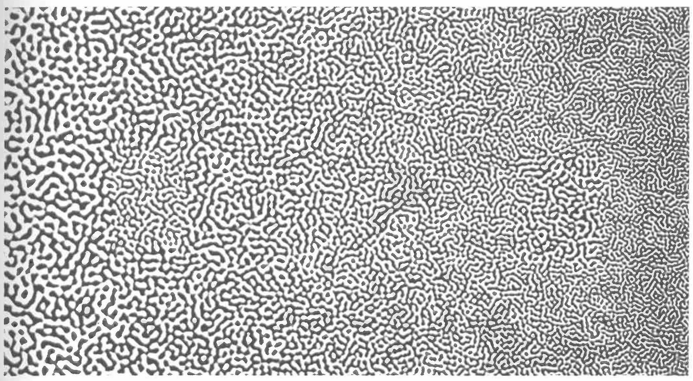
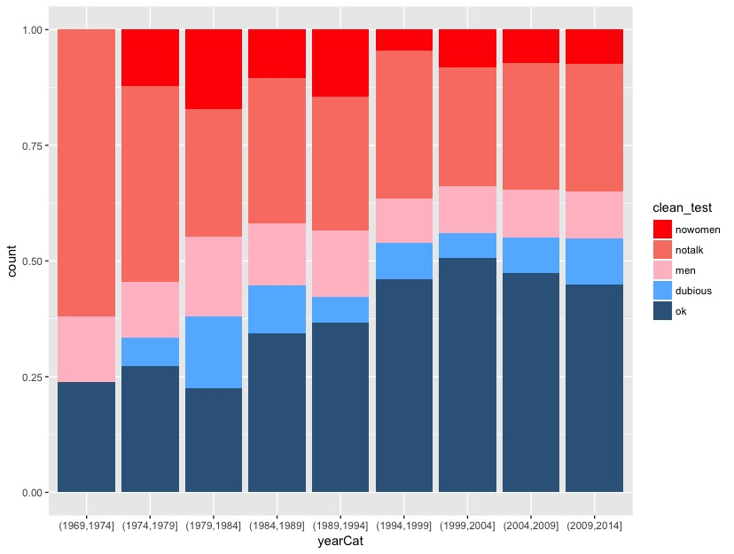
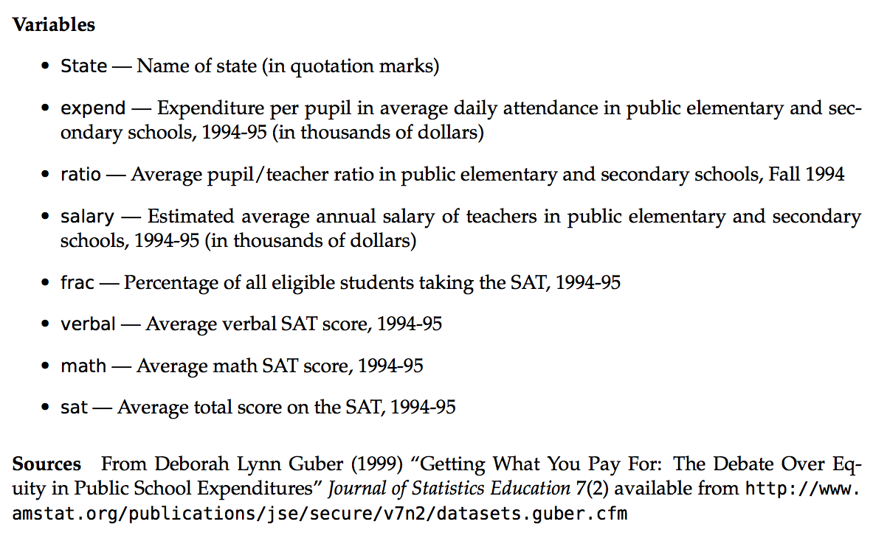
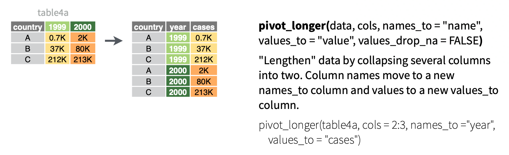

--- 
title: "COMP/STAT 112: Introduction to Data Science"
site: bookdown::bookdown_site
output:
  bookdown::gitbook:
    config:
      sharing:
        facebook: false
        twitter: false
documentclass: book
link-citations: yes
github-repo: bcheggeseth/112_fall_2022/
cover-image: "images/logo.png"
description: "This is the class website for Introduction to Data Science at Macalester College for Fall 2022."
---

# Welcome! {-}

<center>


<a href="https://www.flaticon.com/free-icons/data" title="data icons">Data icons created by Kiranshastry - Flaticon</a>
</center>

<br>
<br>

*Note: This site is still in construction!*

This is the day-to-day course site for Introduction to Data Science (COMP/STAT 112) taught by Professor [Brianna Heggeseth](https://bcheggeseth.github.io) at Macalester College for Fall 2022. The activities here were developed by a variety of faculty in the [MSCS Department](https://macalester.edu/mscs) at [Macalester College](https://macalester.edu).


<br>
<br>
<br>


This work is licensed under a [Creative Commons Attribution-NonCommercial-ShareAlike 4.0 International License](https://creativecommons.org/licenses/by-nc-sa/4.0/).

<!--chapter:end:index.Rmd-->

# Course Schedule {-}

The schedule below is a tentative outline of our plans for the semester.

**For each class period, please start by actively reviewing the associated [Learning Goals](learning-goals.html), review/finish the daily activity (turn in by deadline), and watch/read the indicated videos/readings to supplement your understanding. **

<br>

```{r echo=FALSE}
htmltools::includeHTML("schedule_table.html")
```

<!--chapter:end:schedule.Rmd-->

# Learning Goals {.unnumbered}

The goal of this course is for you to gain confidence in carrying out the entire data science pipeline, 

- from research question formulation, 
- to data collection/scraping,
- to wrangling, 
- to modeling, 
- to visualization, 
- to presentation and communication


Specific course topics and general skills are listed below.

## General Skills {.unnumbered}

**Data Communication**

-   In written and oral formats:

    -   Inform and justify data cleaning and analysis process and the resulting conclusions with clear, organized, logical, and compelling details that adapt to the background, values, and motivations of the audience and context in which communication occurs.

**Collaborative Learning**

-   Understand and demonstrate characteristics of effective collaboration (team roles, interpersonal communication, self-reflection, awareness of social dynamics, advocating for yourself and others).
-   Develop a common purpose and agreement on goals.
-   Be able to contribute questions or concerns in a respectful way.
-   Share and contribute to the group's learning in an equitable manner.
-   Develop a familiarity and comfort in using collaboration tools such as Git and Github. 

## Course Topics {.unnumbered}

Specific learning objectives for our course topics are listed below. Use these to guide your synthesis of course material for specific topics. Note that the topics are covered in the order of the **data science pipeline**, not the order in which we will cover them in class.

### Foundation {.unnumbered}

**Intro to R, RStudio, and R Markdown**

- Download and install the necessary tools (R, RStudio)
- Develop comfort in navigating the tools in RStudio
- Develop comfort in writing and knitting a R Markdown file
- Identify the characteristics of tidy data
- Use R code: as a calculator and to explore tidy data

<br>

### Data Acquisition & Cleaning {.unnumbered}

**Data Import and Basic Cleaning**

- Be able to find an existing data set to import into R
- Be able to import data of a variety of file types into R
- Understand and implement the data cleaning process to make values consistent
- Understand the implications of different ways of dealing with missing values with `replace_na` and `drop_na`

<br>

**Wrangling Text using Regular Expression**

- Be able to work with strings of text data 
- Use regular expressions to search and replace, detect patterns, locate patterns, extract patterns, and separate text with the `stringr` package.


<br>

### Data Wrangling {.unnumbered}

**Six Main Wrangling Verbs**

- Understand and be able to use the following verbs appropriate: `select`, `mutate`, `filter`, `arrange`, `summarize`, `group_by`
- Develop working knowledge of working with dates and `lubridate` functions 

<br>


**Reshaping Data**

- Understand the difference between wide and long data format and distinguish the case (unit of observation) for a given data set
- Be able to use `pivot_wider` and `pivot_longer` in the `tidyr` package

<br>

**Joining Data**

- Understand the concept of keys and variables that uniquely identify rows or cases
- Understand the different types of joins, different ways of combining two data frames together
- Be able to use mutating joins: `left_join`, `inner_join` and `full_join` in the `dplyr` package
- Be able to use filtering joins: `semi_join`, `anti_join` in the `dplyr` package

<br>

**Categorical Variables as Factors**

- Understand the difference between a variable stored as a `character` vs. a `factor`
- Be able to convert a `character` variable to a `factor`
- Be able to manipulate the order and values of a factor with the `forcats` package to improve summaries and visualizations.

<br>


**Mini-Project**

- Apply data wrangling and visualization skills to a new data set
- Be able to tell a story about data through visualization

<br>


### Data Visualization {.unnumbered}

*The learning goals may be adjusted before we start the material of this section.*


**Introduction to Data Visualization**

- Understand the Grammar of Graphics
- Use `ggplot2` functions to create basic layers of graphics
- Understand the different basic univariate visualizations for categorical and quantiative variables

<br>


**Effective Visualization**

- Understand and apply the guiding principles of effective visualizations


<br>

**Bivariate**

- Identify appropriate types of bivariate visualizations, depending on the type of variables (categorical, quantitative)
- Create basic bivariate visualizations based on real data with `ggplot2` functions

<br>

**Multivariate**

- Understand how we can use additional aesthetics such as color and size to incorporate a third (or more variables) to a bivariate plot with `ggplot2` functions
- Be able to with creating and interpreting heat maps and star plots, which allow you to look for patterns in variation in many variables. 

<br>

**Spatial**

- Plot data points on top of a map using the `ggmap()` function along with `ggplot2` functions      
- Create choropleth maps using `geom_map()`      
- Add points and other `ggplot2` features to a map created from `geom_map()`   
- Understand the basics of creating a map using `leaflet`, including adding points and choropleths to a base map 

<br>


### Data Modeling {.unnumbered}

*The learning goals may be adjusted before we start the material of this section.*

**EDA**

- Understand the first steps that should be taken when you encounter a new data set
- Develop comfort in knowing how to explore data to understand it
- Develop comfort in formulating research questions

<br>


<!--chapter:end:learning_objectives.Rmd-->

```{r 01_setup, include=FALSE}
knitr::opts_chunk$set(echo=TRUE, error=TRUE)
library(tufte)
library(tidyverse)
library(ggplot2)
library(ggmap)
library(tint)
#options(htmltools.dir.version = FALSE)
```

# (PART) Foundation {.unnumbered}

# Intro to R, RStudio, and R Markdown

## Learning Goals {.unnumbered}

-   Download and install the necessary tools (R, RStudio)
-   Develop comfort in navigating the tools in RStudio
-   Develop comfort in writing and knitting a R Markdown file
-   Identify the characteristics of tidy data
-   Use R code: as a calculator and to explore tidy data

## Getting Started in RStudio {.unnumbered}

As you might guess from the name, "Data Science" requires *data*. Working with modern (large, messy) data sets requires statistical software. We'll exclusively use **RStudio**. Why?

-   it's free\
-   it's open source (the code is free & anybody can contribute to it)
-   it has a huge online community (which is helpful for when you get stuck)\
-   it's one of the industry standards\
-   it can be used to create *reproducible* and lovely documents (In fact, the course materials that you're currently reading were constructed entirely within RStudio!)

### Download R & RStudio {.unnumbered}

To get started, take the following two steps *in the given order*. Even if you already have R/RStudio, make sure to update to the most recent versions.

1.  Download and install the R statistical software at <https://mirror.las.iastate.edu/CRAN/>\
2.  Download and install the FREE version of RStudio at <https://www.rstudio.com/products/rstudio/download/#download>

If you are having issues with downloading, log on to <https://rstudio.macalester.edu/> (use Mac credentials) to use the RStudio server.

What's the difference between R and RStudio? Mainly, RStudio requires R -- thus it does everything R does *and more*. We will be using RStudio exclusively.

### A quick tour of RStudio {.unnumbered}

Open RStudio! You should see four panes, each serving a different purpose:

```{r fig-main,echo=FALSE,fig.cap="RStudio Interface"}
knitr::include_graphics("images/RStudioImage.jpg")
```

This short [video tour of RStudio](http://www.youtube.com/embed/JfIo2Ua_oqQ/) summarizes some basic features of the *console*.

```{exercise, name="Warm Up"}
Use RStudio as a simple calculator to do the following:
  
  1) Perform a simple calculation: calculate `90/3`.
  2) RStudio has built-in *functions* to which we supply the necessary *arguments*:  `function(arguments)`.  Use the built-in function `sqrt` to calculate the square root of 25.
  3) Use the built-in function `rep` to repeat the number "5" eight times.
  4) Use the `seq` function to create the vector `(0, 3, 6, 9, 12)`.  (The video doesnt cover this!)
  5) Create a new vector by concatenating three repetitions of the vector from the previous part.
```

<details>

<summary>Solution</summary>

```{r, collapse=TRUE}
90/3 

sqrt(25)

rep(5, times = 8)

seq(0, 12, by = 3)

rep(seq(0, 12, by = 3), times =  3)

rep(seq(0, 12, by = 3), each = 3) #notice the difference between times and each
```

</details>

\

```{exercise, name="Assignment", label="assignment"}
We often want to store our output for later use (why?).  The basic idea in RStudio:    
  
    `name <- output`
  
Copy and paste the following code into the console, line by line.  NOTE:  RStudio ignores any content after the `#`.  Thus we use this to 'comment' and organize our code.    
```

```{r eval=FALSE}
#type square_3
square_3
    
#calculate 3 squared
3^2    
    
#store this as "square_3"
square_3 <- 3^2    
    
#type square_3 again!
square_3
    
#do some math with square_3
square_3 + 2
```

### Data {.unnumbered}

Not only does "Data Science" require statistical software, it requires *DATA*! Consider the Google definition:

```{r echo=FALSE,fig.cap="A datum."}

```

With this definition in mind, which of the following are examples of data?

-   tables

```{r echo=FALSE, warning=FALSE, message=FALSE}
library(mosaic)
data(Galton)
head(Galton)
```

-   [photo](https://www.google.com/search?hl=en&biw=1439&bih=656&tbm=isch&sa=1&q=messy+college+dorm+rooms&oq=messy+college+dorm+rooms&gs_l=psy-ab.3...20720.21922.0.22183.6.6.0.0.0.0.143.552.4j2.6.0....0...1.1.64.psy-ab..1.1.142...0i13k1.uaj5gYQ4t50)

-   [video](https://www.youtube.com/watch?v=wMm7VdH05jY)

-   [text / tweets](https://twitter.com/data4blacklives?lang=en)

We'll mostly work with data that look like this:

```{r echo=FALSE, warning=FALSE, message=FALSE}
library(mosaic)
data(Galton)
head(Galton)
```

This isn't as restrictive as it seems. We can convert the above signals: photos, videos, and text to a data table format!

### Tidy Data {.unnumbered}

**Example:** After a scandal among FIFA officials, fivethirtyeight.com posted an analysis of FIFA viewership, ["How to Break FIFA"](https://fivethirtyeight.com/features/how-to-break-fifa/). Here's a snapshot of the data used in this article:

```{r echo=FALSE}
suppressPackageStartupMessages(library(fivethirtyeight))
data("fifa_audience")
suppressPackageStartupMessages(library(knitr))
kable(head(fifa_audience,10))
fifa <- fifa_audience
```

The data table above is in *tidy* format. *Tidy* data tables have three key features:

1.  Each row represents a **unit of observation** (also referred to as a case).\
2.  Each column represents a **variable** (ie. an attribute of the cases that can vary from case to case). Each variable is one of two types:\

-   **quantitative** = numerical\
-   **categorical** = discrete possibilities/categories\

3.  Each entry contains a single data value; no analysis, summaries, footnotes, comments, etc., and only one value per cell


```{exercise, name="Units of Observation and Variables"}
Consider the following in a group:   
```

a.  What are the units of observation in the FIFA data?\
b.  What are the variables? Which are quantitative? Which are categorical?\
c.  Are these *tidy* data?

<details>

<summary>Solution</summary>

a.  A FIFA member country
b.  country name, soccer or football confederation, country's share of global population (percentage), country's share of global world cup TV Audience (percentage), country's GDP-weighted audience share (percentage)
c.  Yes

</details>

\

```{exercise name="Tidy vs. Untidy"}
Check out the following data.  Explain to each other why they are untidy and how we can tidy them.    
  
  a. Data 1: FIFA    
    
              country  confederation  population share    tv_share
        ------------- -------------- ----------------- ----------- ------------------
        United States       CONCACAF     i don't know*       4.3%  *look up later      
                 Japan           AFC               1.9       4.9%
                 China           AFC              19.5      14.8%    
                                                        total=24%           
  
  b. Data 2: Gapminder life expectancies by country    
        
                          country  1952  1957  1962
        ------------ ------------ ----- ----- -----
                Asia  Afghanistan  28.8  30.3  32.0
                          Bahrain  50.9  53.8  56.9    
              Africa      Algeria  43.0  45.7  48.3    

```

<details>

<summary>Solution</summary>

a.  There are notes such as "I don't know" and "look up later" in columns with numeric values; the last row with the total is a summary. We could remove the text notes, replace it with the value if known, and remove the last row with the total summary.
b.  The first column does not have a row name. It should be continent. Additionally, Bahrain needs a value for the continent.

</details>

\

### Data Basics in RStudio {.unnumbered}

For now, we'll focus on *tidy* data. In a couple of weeks, you'll learn how to turn untidy data into tidy data.

```{exercise, name="Importing Package Data"}
The first step to working with data in RStudio is getting it in there!  How we do this depends on its format (eg: Excel spreadsheet, csv file, txt file) and storage locations (eg: online, within Wiki, desktop).  Luckily for us, the `fifa_audience` data are stored in the `fivethirtyeight` RStudio package. Copy and paste the following code into the Console and press Enter.
```

```{r eval=FALSE}
#download the data and information in the fivethirtyeight package (we only need to do this once)
install.packages('fivethirtyeight')

#load the fivethirtyeight package
library(fivethirtyeight)
    
#load the fifa data
data("fifa_audience")
    
#store this under a shorter, easier name
fifa <- fifa_audience
```

```{exercise, name="Examining Data Structures"}
Before we can analyze our data, we must understand its structure.  Try out the following functions (copy and paste into the Console).  For each, make a note that describes its action.  
```

```{r eval=FALSE}
#(what does View do?)
View(fifa)  

#(what does head do?)
head(fifa)  

#(what does dim do?)
dim(fifa)           

#(what does names do?)
names(fifa)         
```

<details>

<summary>Solution</summary>

```{r, collapse=TRUE}
#View() opens up a new tab with a spreadsheet preview of the data to visually explore the data. It is commented out in the Rmarkdown file because this is an interactive feature
#View(fifa)  

#head() gives the first 6 (default number) rows of a data set
head(fifa)  

#dim() gives the number of rows and number of columns
dim(fifa)           

#names() gives the names of the columns/variables
names(fifa)   
```

</details>

\

```{exercise, name="Codebooks"}
Data are also only useful if we know what they measure!  The `fifa` data table is *tidy*; it doesn't have any helpful notes in the data itself.
```

Rather, information about the data is stored in a separate *codebook*. Codebooks can be stored in many ways (eg: Google docs, word docs, etc). Here the authors have made their codebook available in RStudio (under the original `fifa_audience` name). Check it out (run the following code in the console):

```{r eval=FALSE}
?fifa_audience
```

a.  What does `population_share` measure?
b.  What are the units of `population_share`?

<details>

<summary>Solution</summary>

a.  Country's share of global population
b.  Percentage between 0 and 100

</details>

 

```{exercise, name="Examining a Single Variable"}
Consider the following:
```

a.  We might want to access and focus on a single variable. To this end, we can use the `$` notation (see below). What are the values of `tv_audience_share`? Of `confederation`? Is it easy to figure out?

```{r eval=FALSE}
fifa$tv_audience_share
fifa$confederation
```

It's important to understand the format/class of each variable (quantitative, categorical, date, etc) in both its meaning and its structure within RStudio:

```{r eval=FALSE}
class(fifa$tv_audience_share)
class(fifa$confederation)
```

b.  If a variable is categorical (in `factor` format), we can determine its `levels` / category labels. What are the value of `confederation`?

```{r eval=FALSE}
levels(fifa$confederation) #it is in character format
levels(factor(fifa$confederation)) #we can convert to factor format
```

## R Markdown and Reproducible Research {.unnumbered}

> **Reproducible research** is the idea that data analyses, and more generally, scientific claims, are published with their data and software code so that others may verify the findings and build upon them. - [Reproducible Research, Coursera](https://www.coursera.org/learn/reproducible-research)

Useful Resources:

1.  [R Markdown Quick Tour](http://rmarkdown.rstudio.com/authoring_quick_tour.html)\
2.  [R Markdown Cheatsheet](https://github.com/rstudio/cheatsheets/raw/main/rmarkdown-2.0.pdf) 
3.  [R Markdown Reference Guide](https://www.rstudio.com/wp-content/uploads/2015/03/rmarkdown-reference.pdf) 

Research often makes claims that are difficult to verify. A recent [study of published psychology articles](http://science.sciencemag.org/content/349/6251/aac4716) found that less than half of published claims could be reproduced. One of the most common reasons claims cannot be reproduced is confusion about data analysis. It may be unclear exactly how data was prepared and analyzed, or there may be a mistake in the analysis.

In this course we will use an innovative format called R Markdown that dramatically increases the transparency of data analysis. R Markdown interleaves data, R code, graphs, tables, and text, packaging them into an easily publishable format.

To use R Markdown, you will write an R Markdown formatted file in RStudio and then ask RStudio to **knit** it into an HTML document (or occasionally a PDF or MS Word document).

```{exercise name="Deduce the R Markdown Format"}
Look at this [Sample RMarkdown](http://www.statpower.net/Content/310/R%20Stuff/SampleMarkdown.Rmd) and the [HTML webpage](http://www.statpower.net/Content/310/R%20Stuff/SampleMarkdown.html) it creates. Consider the following and discuss:
    
a) How are bullets, italics, and section headers represented in the R Markdown file?
b) How does R code appear in the R Markdown file?
c) In the HTML webpage, do you see the R code, the output of the R code, or both?
```

<details>

<summary>Solution</summary>

``` {collapse="TRUE"}
Bullets are represented with * and +
Italics are represented with * before and after a word or phrase
Section headers are represented with #

R code chunks are between 3 tick marks at the beginning and end; it is R code if there is an r in curly braces
  
If echo=FALSE in curly braces, the code is not shown. Otherwise, both code and output are shown by default.
```

</details>

 

Now take a look at the [R Markdown cheatsheet](https://github.com/rstudio/cheatsheets/raw/main/rmarkdown-2.0.pdf). Look up the R Markdown features from the previous question on the cheatsheet. There's a great deal more information there.

## Practice {.unnumbered}

Complete the following. If you get stuck along the way, refer to the R Markdown cheatsheet linked above, search the web for answers, and/or ask for help!

```{exercise name="Your First R Markdown File"}
Create a new R Markdown about your favorite food.    

a. Create a new file in RStudio (File -> New File -> R Markdown) with a Title of `First_Markdown`. Save it to a new folder on your Desktop called `COMP_STAT_112`; within that new folder, create another new folder called `Day_01`.  
b. Make sure you can compile/render (Knit) the Markdown into a webpage (html file).  
c. Add a new line between `title` and `output` that reads: `author: Your Name`.
d. Create a very brief essay about your favorite food. Make sure to include:    
  * A picture from the web    
  * A bullet list    
  * A numbered list  
e. Compile (Knit) the document into an html file.
```

```{exercise name="New Data!"}
There's a data set named `comic_characters` in the `fivethirtyeightdata` package.
```

Install the package by running the following in the Console:

```
install.packages('fivethirtyeightdata', repos = 'https://fivethirtyeightdata.github.io/drat/', type = 'source')
```

Check out the codebook (hint: use ?) to understand what these data measure. Then add a second section to your R Markdown file, and then use code chunks and R commands to perform/answer the following tasks/questions:
  
  a. Load the data.    
  b. What are the units of observation?  How many observations are there?    
  c. In a new code chunk, print out the first 12 rows of the data set.
  d. Get a list of all variable names.  
  e. What's the class of the `date` variable?   
  f. List all of the unique entries in the `gsm` variable (no need to include NA).
  g. Compile the document into an html file.

## Appendix: R Functions {-}

### R as a calculator {-}


| Function/Operator       | Action           | Example  |
| ------------- |:-------------:| -----:|
| `/`           | Division     |    `90/30` |
| `*`           | Multiplication      |   `2*5`|
| `+`           | Addition      |   `1+1` |
| `-`           | Subtraction      |   `1-1` |
| `^`           | Exponent/Power to      |   `3^2` |
| `sqrt(x)`           | Square root      |   `sqrt(25)` |


### R Basics {-}


| Function/Operator       | Action           | Example  |
| ------------- |:-------------:| -----:|
| `install.packages('packagename')`           | Download a R package (function, data, etc.) from repository      |   `install.packages('fivethirtyeight')` |
| `library(packagename)`           | Access a downloaded R package    |   `library(fivethirtyeight)` |
| `?function_object_name`           | Opens the help/documentation for the function or object |   `?seq` |
| `rep(x, times, each)`           | Repeat x a # times    |    `rep(5,8)` |
| `seq(from,to,by)`           | Sequence generation      |   `2*5`|
| `name <- value_output`           | Assign value or output to a name      |   `squared_3 <- 3^2` |
| `View(x)`           | Open spreadsheet viewer of dataset   |   `View(fifa_audience)` |
| `head(x)`           | Print the first 6 rows of a dataset     |   `head(fifa_audience)` |
| `dim(x)`           | Print the dimensions (number of rows and columns) of a dataset    |   `dim(fifa_audience)` |
| `names(x)`           | Print the names of the variables in a dataset |   `names(fifa_audience)` |
| `$`           | Used to access one variable in a data set based on its name |   `fifa_audience$confederation` |
| `class(x)`           | Print the class types argument or input |   `class(fifa_audience$confederation)` |
| `factor(x)`           | Converts the argument or input to a factor class type (categorical variable) |   `factor(fifa_audience$confederation)` |
| `levels(x)`           | Prints the unique categories of a factor |   `levels(factor(fifa_audience$confederation))` |


<!--chapter:end:01-RStudio_Intro.Rmd-->

```{r 02_setup, include=FALSE}
knitr::opts_chunk$set(echo = TRUE, error = TRUE)
library(tufte)
library(tidyverse)
library(ggplot2)
library(ggmap)
library(tint)
library(mosaic)
# options(htmltools.dir.version = FALSE)
```

# (PART) Visualization {.unnumbered}

# Intro to Data Visualization

## Learning Goals {.unnumbered}

-   Understand the Grammar of Graphics
-   Use ggplot2 to create basic layers of graphics
-   Understand the different basic univariate visualizations for categorical and quantitative variables

You can download a template .Rmd of this activity [here](./template_rmd/02-Intro_Data_Viz_Assign.Rmd). Put this in a new folder called `Day_02` in your folder for `COMP_STAT_112`. 

## Benefits of Visualizations {.unnumbered}

-   Visualizations help us understand what we're working with:
    -   What are the scales of our variables?\
    -   Are there any outliers, i.e. unusual cases?\
    -   What are the patterns among our variables?\
-   This understanding will inform our next steps:
-   What method of analysis / model is appropriate?\
-   Once our analysis is complete, visualizations are a powerful way to communicate our findings and tell a story.

## Glyphs {.unnumbered}

In its original sense, in archaeology, a glyph is a carved symbol.

| Heiro**glyph**                 |                        Mayan **glyph** |
|--------------------------------|---------------------------------------:|
|  |  |

### Data Glyph {.unnumbered}

A data glyph is also a mark, e.g.

              

The features of a data glyph encodes the value of variables.

-   Some are very simple, e.g. a dot: 
-   Some combine different elements, e.g. a pointrange: 
-   Some are complicated, e.g. a dotplot: 

### Components of Graphics {.unnumbered}

```{r echo=FALSE,message=FALSE}
set.seed(102)
require(NHANES)
n <- 75
Tmp <-
  NHANES %>%
  mutate(
    smoker = derivedFactor(
      never = Smoke100 == "No",
      former = SmokeNow == "No",
      current = SmokeNow == "Yes",
      .ordered = TRUE
    ),
    sbp = BPSysAve,
    dbp = BPDiaAve,
    sex = Gender
  ) %>%
  select(sbp, dbp, sex, smoker) %>%
  sample_n(n) %>%
  filter(complete.cases(.)) %>%
  data.frame()
```

```{r fig-bp, echo=FALSE, fig.margin=TRUE,fig.cap="Blood pressure readings from a random subset of the NHANES data set."}
ggplot(data = Tmp) + geom_point(mapping = aes(x = sbp, y = dbp, shape = sex, color = smoker), size = 5, alpha = .8) + xlab("Systolic BP") + ylab("Diastolic BP") + scale_color_manual(values = c("#F8766D", "#00BFC4", "#00BA38"))
```

-   **frame**: The position scale describing how data are mapped to x and y
-   **glyph**: The basic graphical unit that represents one case.
    -   other terms used include *mark* and *symbol*.
-   **aesthetic**: a visual property of a glyph such as position, size, shape, color, etc.
    -   may be **mapped** based on data values: `smoker -> color`
    -   may be **set** to particular non-data related values: `color is black`
-   **facet**: a subplot that shows one subset of the data
    -   rather than represent `sex` by shape, we could split into two subplots
-   **scale**: A mapping that translates data values into aesthetics.
    -   example: never-\> <font color="#F8766D">pink</font>; former-\> <font color="#00BFC4">aqua</font>; current-\> <font color="#00BA38">green</font>
-   **guide**: An indication for the human viewer of the scale. This allows the viewer to translate aesthetics back into data values.
    -   examples: x- and y-axes, various sorts of legends

### Eye Training for the Layered Grammar of Graphics {.unnumbered}

```{exercise, name="Basic questions to ask of a data graphic"}
For your assigned graphic, discuss the following seven questions with your partner(s):

1. What variables constitute the frame?
2. What glyphs are used?
3. What are the aesthetics for those glyphs?
4. Which variable is mapped to each aesthetic?
5. Which variable, if any, is used for faceting?
6. Which scales are displayed with a guide?
7. What raw data would be required for this plot, and what form should it be in?

Here are the graphics examples, all taken from the New York Times website:

a. [Admissions gap](http://www.nytimes.com/interactive/2013/05/07/education/college-admissions-gap.html?_r=0)
#. [Medicare hospital charges](https://www.nytimes.com/interactive/2014/06/02/business/how-much-hospitals-charged-medicare-for-the-same-procedures.html)
#. [Football conferences](http://www.nytimes.com/newsgraphics/2013/11/30/football-conferences/)
#. [Housing prices](https://www.nytimes.com/interactive/2014/01/23/business/case-shiller-slider.html)
#. [Baseball pitching](http://www.nytimes.com/interactive/2013/03/29/sports/baseball/Strikeouts-Are-Still-Soaring.html)
#. [Phillips curve](http://www.nytimes.com/interactive/2013/10/09/us/yellen-fed-chart.html)
#. [School mathematics ratings](http://www.nytimes.com/interactive/2013/02/04/science/girls-lead-in-science-exam-but-not-in-the-united-states.html)
#. [Corporate taxes](http://www.nytimes.com/interactive/2013/05/25/sunday-review/corporate-taxes.html)

```

### Glyph-Ready Data {.unnumbered}

Note the mapping of data to aesthetics for Figure \@ref(fig:fig-bp):

       sbp [Systolic Blood Pressure] -> x      
       dbp [Diastolic Blood Pressure] -> y     
    smoker -> color
       sex -> shape

Glyph-ready data has this form:

-   There is one row for each glyph to be drawn.
-   The variables in that row are mapped to aesthetics of the glyph (including position).

```{r, echo=FALSE}
knitr::kable(
  Tmp[1:6, ], caption = 'A subset of the NHANES data set.'
)
```

## Data Visualization Workflow + `ggplot` {.unnumbered}

### Layers -- Building up Complex Plots {.unnumbered}

Using the `ggplot2` package, we can create graphics by building up layers, each of which may have its own data, glyphs, aesthetic mapping, etc. As an example, let's peel back the layers used to create Figure \@ref(fig:fig-bp).

The first layer just identifies the data set. It sets up a blank canvas, but does not actually plot anything:

```{r}
ggplot(data = Tmp)
```

Next, we add a geometry layer to identify the mapping of data to aesthetics for each of the glyphs:

```{r}
ggplot(data = Tmp) +
  geom_point(mapping = aes(x = sbp, y = dbp, shape = sex, color = smoker), size = 5, alpha = .8)
```

Next, we can add some axes labels as guides:

```{r}
ggplot(data = Tmp) +
  geom_point(mapping = aes(x = sbp, y = dbp, shape = sex, color = smoker), size = 5, alpha = .8) +
  xlab("Systolic BP") + ylab("Diastolic BP")
```

And, finally, we can change the scale of the color used for smoker status:

```{r}
ggplot(data = Tmp) +
  geom_point(mapping = aes(x = sbp, y = dbp, shape = sex, color = smoker), size = 5, alpha = .8) +
  xlab("Systolic BP") + ylab("Diastolic BP") +
  scale_color_manual(values = c("#F8766D", "#00BFC4", "#00BA38"))
```

If instead we wanted to facet into columns based on smoker status, we could add another layer for that:

```{r}
ggplot(data = Tmp) +
  geom_point(mapping = aes(x = sbp, y = dbp, shape = sex, color = smoker), size = 5, alpha = .8) +
  xlab("Systolic BP") + ylab("Diastolic BP") +
  scale_color_manual(values = c("#F8766D", "#00BFC4", "#00BA38")) +
  facet_grid(. ~ smoker)
```

For more information on all of the different types of layers we can add to graphics, see the [`ggplot2` reference page](https://ggplot2.tidyverse.org/reference/) and the [data visualization with `ggplot2` cheat sheet](https://raw.githubusercontent.com/rstudio/cheatsheets/main/data-visualization.pdf).

### Getting Started {.unnumbered}

There's no end to the number and type of visualizations you *could* make. Thus the process can feel overwhelming. [FlowingData](http://flowingdata.com/2017/01/24/one-dataset-visualized-25-ways/) makes good recommendations for data viz workflow:

-   **Ask the data questions.** Simple research questions will guide the types of visualizations that you should construct.\
-   **Start with the basics and work incrementally.** Before constructing complicated or multivariate or interactive graphics, start with simple visualizations. An understanding of the simple patterns provides a foundation upon which to build more advanced analyses and visualizations. This incremental process works particularly well with the layered grammar of graphics in `ggplot`.
-   **Focus.** Reporting a large number of visualizations can overwhelm the audience and obscure your conclusions. Instead, pick out a focused yet comprehensive set of visualizations. [Here](http://flowingdata.com/2017/01/24/one-dataset-visualized-25-ways/) is an example of one dataset visualized 25 different ways, each with a different focus and interpretation, and what can happen if you let the data ramble on without a focus.

In this course we'll largely construct visualizations using the `ggplot` function in RStudio. Though the `ggplot` learning curve can be steep, its "grammar" is intuitive and generalizable once mastered. The `ggplot` plotting function is stored in the `ggplot2` package:

```{r}
library(ggplot2)
```

The best way to learn about `ggplot` is to just play around. Focus on the *patterns* and *potential* of their application. It will be helpful to have the [RStudio Data Visualization cheat sheet](https://raw.githubusercontent.com/rstudio/cheatsheets/main/data-visualization.pdf) handy as you complete this activity.

### An Example {.unnumbered}

The "Bechdel test", named after cartoonist Alison Bechdel, tests whether movies meet the following criteria:

1.  There are $\ge$ 2 (named) female characters;\
2.  these women talk to each other...\
3.  about something other than a man.

In the fivethirtyeight.com article ["The Dollar-And-Cents Case Against Hollywood's Exclusion of Women"](http://fivethirtyeight.com/features/the-dollar-and-cents-case-against-hollywoods-exclusion-of-women/), the authors analyze which Hollywood movies do/don't pass the test. Their data are available in the `fivethirtyeight` package:

```{r eval=FALSE}
library(fivethirtyeight)
data(bechdel)
head(bechdel)
```

```{r echo=FALSE, warning=FALSE, message=FALSE}
library(fivethirtyeight)
library(knitr)
data(bechdel)
subb <- bechdel[, c(1, 2, 3, 5, 6, 11:13)]
# DT::datatable(subb, options = list(pageLength = 10))
suppressPackageStartupMessages(library(knitr))
kable(head(subb), font_size = 10)
```

```{exercise}
Before diving into any visualizations of these data, we first must understand its structure and contents. Discuss the following:  
  
  a. What are the units of observation and how many units are in this sample? 
  b. What are the levels of the `clean_test` and `binary` categorical variables?    
  c. Check out the codebook for `bechdel` (`?bechdel`).  What's the difference between `domgross_2013` and `domgross`?    
```

<details>

<summary>Solution</summary>

```{r,collapse=TRUE}
#units of observation are movies; there are 1794 movies in this sample
dim(bechdel)

#clean_test has values of "nowomen", "notalk", "men", "dubious", "ok"
#View(bchedel) and look at values or summarize like below
table(bechdel$clean_test)
levels(bechdel$clean_test)

#binary has values of PASS or FAIL
table(bechdel$binary)
levels(factor(bechdel$binary))

# domgross_2013 is the domestic gross in US dollars but it is inflation adjusted with respect to 2013
#?bechdel
```

</details>

\

```{exercise}
We'll consider *univariate* visualizations of the `clean_test` and `budget_2013` variables. Discuss the following:
  
  a. What features would we like a visualization of the *categorical* `clean_test` variable to capture?    
  b. What features would we like a visualization of the *quantitative* `budget_2013` variable to capture?    

```

<details>

<summary>Solution</summary>

a.  capture the frequency of each way a movie can fail or pass the Bechdel test
b.  capture the typical budget as well as how much variation there is across movies and if there are any outliers

</details>

\

### Categorical univariate visualization {.unnumbered}

We begin by stating a clear research question:

> Among the movies in our sample, what fraction pass the Bechdel test? Among those that fail the test, in which way do they fail (e.g., there are no women, there are women but they only talk about men,...)?

To answer the above research question, we can explore the categorical `clean_test` variable. A table provides a simple summary of the number of movies that fall into each `clean_test` category:

```{r}
table(bechdel$clean_test)
```

```{exercise}
Examine the table of `clean_test` data, and try to interpret it. What insights does it provide about the original research question?
```

<details>

<summary>Solution</summary>

Among the categories, the "ok" category was most frequent, meaning that 803 of the 1794 movies in the sample passed the Bechdel Test. However, among those 991 movies that did not pass the test, most of them (514 of them) did not pass because the women did not talk.

</details>

\

Because `clean_test` is a categorical variable, a **bar chart** provides an appropriate visualization of this table. In examining the bar chart, keep your eyes on the following.

-   **variability**: Are cases evenly spread out among the categories or are some categories more common than others?\
-   **contextual implications**: In the context of your research, what do you learn from the bar chart? How would you describe your findings to a broad audience?

```{exercise}
Try out the code below that builds up from a simple to a customized bar chart. At each step determine how each piece of code contributes to the plot.    
```

```{r eval=FALSE}
# plot 1: set up a plotting frame (a blank canvas)
ggplot(bechdel, aes(x = clean_test))

# plot 2: what changed / how did we change it?
ggplot(bechdel, aes(x = clean_test)) +
geom_bar()

# plot 3: what changed / how did we change it?
ggplot(bechdel, aes(x = clean_test)) +
geom_bar() +
labs(x = "Outcome of Bechdel Test", y = "Number of movies")

# plot 4: what changed / how did we change it?
ggplot(bechdel, aes(x = clean_test)) +
geom_bar(color = "purple") +
labs(x = "Outcome of Bechdel Test", y = "Number of movies")

# plot 5: what changed / how did we change it?
ggplot(bechdel, aes(x = clean_test)) +
geom_bar(fill = "purple") +
labs(x = "Outcome of Bechdel Test", y = "Number of movies")
```

<details>

<summary>Solution</summary>

```{r collapse = TRUE}
# plot 1: set up a plotting frame (a blank canvas)
ggplot(bechdel, aes(x = clean_test))

# plot 2: Added bars that reflect the count or frequency of the movies within each category
ggplot(bechdel, aes(x = clean_test)) +
geom_bar()

# plot 3: Added/changed the text labels for the x and y axes
ggplot(bechdel, aes(x = clean_test)) +
geom_bar() +
labs(x = "Outcome of Bechdel Test", y = "Number of movies")

# plot 4: Changed the outline color of the bars to purple
ggplot(bechdel, aes(x = clean_test)) +
geom_bar(color = "purple") +
labs(x = "Outcome of Bechdel Test", y = "Number of movies")

# plot 5: Changed the fill  color of the bars to purple
ggplot(bechdel, aes(x = clean_test)) +
geom_bar(fill = "purple") +
labs(x = "Outcome of Bechdel Test", y = "Number of movies")
```

</details>

\

```{exercise}
Summarize the visualization: what did you learn about the distribution of the `clean_test` variable?    

```

<details>

<summary>Solution</summary>

Among the categories, the "ok" category was most frequent. However, among those movies that did not pass the test, most of them did not pass because the women in the movie did not talk.

</details>

\

```{exercise}
Let's return to our research question: What percent of movies in the sample pass the Bechdel test? Among those that fail the test, in which way do they fail? 

```

<details>

<summary>Solution</summary>

```{r collapse=TRUE}
table(bechdel$binary)
803/(991 + 803)


table(bechdel$clean_test)[1:4]/991
```

</details>

\

### Quantitative univariate visualization {.unnumbered}

To motivate quantitative visualizations, consider a second research question

> Among the movies in our sample, what's the range of budgets? What's the typical budget? The largest/smallest?

We can answer the above research question by exploring the *quantitative* `budget_2013` variable. Quantitative variables require different summary tools than categorical variables. We'll explore two methods for graphing quantitative variables: histograms and density plots. Both of these has strengths/weaknesses in helping us visualize the distribution of observed values.

In their examination, keep your eyes on the following.

-   **center**: Where's the center of the distribution? What's a typical value of the variable?
-   **variability**: How spread out are the values? A lot or a little?
-   **shape**: How are values distributed along the observed range? Is the distribution symmetric, right-skewed, left-skewed, bi-modal, or uniform (flat)?\
-   **outliers**: Are there any *outliers*, ie. values that are unusually large/small relative to the bulk of other values?\
-   **contextual implications**: Interpret these features in the context of your research. How would you describe your findings to a broad audience?

#### Histograms {.unnumbered}

Histograms are constructed by (1) dividing up the observed range of the variable into 'bins' of equal width; and (2) counting up the number of cases that fall into each bin.

```{exercise}
Try out the code below.  At each step determine how each piece of code contributes to the plot.    

```

```{r eval=FALSE}
# plot 1: set up a plotting frame
ggplot(bechdel, aes(x = budget_2013))

# plot 2: what changed / how did we change it?
ggplot(bechdel, aes(x = budget_2013)) +
  geom_histogram()

# plot 3: what changed / how did we change it?
ggplot(bechdel, aes(x = budget_2013)) +
  geom_histogram() +
  labs(x = "Budget ($)", y = "Number of movies")

# plot 4: what changed / how did we change it?
ggplot(bechdel, aes(x = budget_2013)) +
  geom_histogram(color = "white") +
  labs(x = "Budget ($)", y = "Number of movies")

# plot 5: what changed / how did we change it?
ggplot(bechdel, aes(x = budget_2013)) +
  geom_histogram(fill = "white") +
  labs(x = "Budget ($)", y = "Number of movies")

# plot 6: what changed / how did we change it?
ggplot(bechdel, aes(x = budget_2013)) +
  geom_histogram(color = "white", binwidth = 500000) +
  labs(x = "Budget ($)", y = "Number of movies")

# plot 7: what changed / how did we change it?
ggplot(bechdel, aes(x = budget_2013)) +
  geom_histogram(color = "white", binwidth = 200000000) +
  labs(x = "Budget ($)", y = "Number of movies")
```

<details>

<summary>Solution</summary>

```{r eval=FALSE, collapse = TRUE}
# plot 1: set up a plotting frame
ggplot(bechdel, aes(x = budget_2013))

# plot 2: Added bars the represent the count of movies within budget intervals
ggplot(bechdel, aes(x = budget_2013)) +
  geom_histogram()

# plot 3: Updated the text on the x and y axis labels
ggplot(bechdel, aes(x = budget_2013)) +
  geom_histogram() +
  labs(x = "Budget ($)", y = "Number of movies")

# plot 4: The outline of the bars is now white
ggplot(bechdel, aes(x = budget_2013)) +
  geom_histogram(color = "white") +
  labs(x = "Budget ($)", y = "Number of movies")

# plot 5: The fill of the bars is now white
ggplot(bechdel, aes(x = budget_2013)) +
  geom_histogram(fill = "white") +
  labs(x = "Budget ($)", y = "Number of movies")

# plot 6: The width of the interval or bin is decreased to $500,000
ggplot(bechdel, aes(x = budget_2013)) +
  geom_histogram(color = "white", binwidth = 500000) +
  labs(x = "Budget ($)", y = "Number of movies")

# plot 7: The width of the interval or bin is increased to $200,000,000
ggplot(bechdel, aes(x = budget_2013)) +
  geom_histogram(color = "white", binwidth = 200000000) +
  labs(x = "Budget ($)", y = "Number of movies")
```

</details>

\

```{exercise}
Summarize the visualizations.    
  
  a. Describe the problem in choosing a bin width that's not too wide and not too narrow, but just right.    
  b. What did you learn about the distribution of the `budget_2013` variable?    
  c. Why does adding `color = "white"` improve the visualization?

```

<details>

<summary>Solution</summary>

a.  If the intervals (bars, bins) are too wide, then we lose information about the variation in the budget. Take it to the extreme with just 1 bar with the bar ranging from the minimum to the maximum. If the intervals are too small, then we have the frequency of the bars go up and down quite a bit. We might say that the shape of the bars isn't very smooth.

b.  Most of the movies have small budgets; the majority less of budgets are less than \$100,000,000 (in 2013 dollars) but there are some movies with upwards of \$300,000,000 (in 2013 dollars).

c.  Adding the white outline to the bars adds contrast and helps the viewer see where each bar starts and ends.

</details>

\

#### Density plots {.unnumbered}

**Density plots** are essentially smooth versions of the histogram. Instead of sorting cases into discrete bins, the "density" of cases is calculated across the entire range of values. The greater the number of cases, the greater the density! The density is then scaled so that the area under the density curve **always equals 1** and the area under any fraction of the curve represents the fraction of cases that lie in that range.

```{exercise}
Try the following code and assess what each line does.

```

```{r, eval=FALSE}
# plot 1: set up the plotting frame
ggplot(bechdel, aes(x = budget_2013))

# plot 2: what changed / how did we change it?
ggplot(bechdel, aes(x = budget_2013)) +
  geom_density()

# plot 3: what changed / how did we change it?
ggplot(bechdel, aes(x = budget_2013)) +
  geom_density() +
  labs(x = "Budget ($)")

# plot 4: what changed / how did we change it?
ggplot(bechdel, aes(x = budget_2013)) +
  geom_density(color = "red") +
  labs(x = "Budget ($)")

# plot 5: what changed / how did we change it?
ggplot(bechdel, aes(x = budget_2013)) +
  geom_density(fill = "red") +
  labs(x = "Budget ($)")
```

<details>

<summary>Solution</summary>

```{r, eval=FALSE, collapse = TRUE}
# plot 1: set up the plotting frame
ggplot(bechdel, aes(x = budget_2013))

# plot 2: add a smooth curve (shape of the histogram)
ggplot(bechdel, aes(x = budget_2013)) +
  geom_density()

# plot 3: updated the x axis label
ggplot(bechdel, aes(x = budget_2013)) +
  geom_density() +
  labs(x = "Budget ($)")

# plot 4: changed the color of the curve to red
ggplot(bechdel, aes(x = budget_2013)) +
  geom_density(color = "red") +
  labs(x = "Budget ($)")

# plot 5: filled the area under the curve to be red
ggplot(bechdel, aes(x = budget_2013)) +
  geom_density(fill = "red") +
  labs(x = "Budget ($)")
```

</details>

 

```{exercise}
The histogram and density plot both allow us to visualize the distribution of a quantitative variable.  What are the pros/cons of each?  Discuss.
```

## Additional exercises {.unnumbered}

```{exercise}
In July 2016, fivethirtyeight.com published the article ["Hip-Hop is Turning on Donald Trump""](https://projects.fivethirtyeight.com/clinton-trump-hip-hop-lyrics/).  You can find the supporting data table `hiphop_cand_lyrics` in the `fivethirtyeight` package:    
  
```

```{r eval=FALSE}
library(fivethirtyeight)
data(hiphop_cand_lyrics)
```

a.  What are the *cases* in this data set?\
b.  Use RStudio functions to:\

-   summarize the number of cases in `hiphop_cand_lyrics`\
-   examine the first cases of `hiphop_cand_lyrics`\
-   list out the names of all variables in `hiphop_cand_lyrics`

```{exercise}
Let's start our investigation of hip hop data by asking "Who?"; that is, let's identify patterns in which 2016 presidential candidates popped up in hip hop lyrics.    
  
  a. Use an RStudio function to determine the category labels used for the `candidate` variable.    
  b. Use `table` to construct a table of the number of cases that fall into each `candidate` category.    
  c. Construct a single plot that allows you to investigate the prevalence of each candidate in hip hop.  Make the following modifications:    
    - change the axis labels    
    - change the fill colors    
  d. Summarize your findings about the 2016 candidates in hip hop.
        
```

```{exercise}
Next, consider the release dates of the hip hop songs.    
  
  a. Construct a histogram of the release dates with the following modifications:    
    - change the fill color of the bins    
    - change the bin width to a meaningful size    
  b. Construct a density plot of the release dates with the following modifications:    
    - change the fill color    
  c. Summarize your findings about release date

```

```{exercise}
No class will teach you everything you need to know about RStudio or programming in general. Thus, being able to find help online is an important skill.  To this end, make a single visualization that incorporates the following modifications to your density plot from above.  This will require a little Googling and/or use of the visualization cheat sheet.    

  - Add a title or caption.    
  - Add *transparency* to the fill color.    
  - Calculate the mean (ie. average) release date and median release date:

```

```{r eval=FALSE}
mean(hiphop_cand_lyrics$album_release_date)
median(hiphop_cand_lyrics$album_release_date)
```

Add two vertical lines to your plot: one representing the mean and the other representing the median. Use two different colors and/or line types.

-   Change the limits of the x-axis to range from 1980-2020.

## Appendix: R Functions {.unnumbered}

### Basic R functions {.unnumbered}

| Function/Operator |                 Action                 |                       Example |
|-------------------------|:---------------------------:|------------------:|
| `table(x)`        |   Frequency count of categories in x   |   `table(bechdel$clean_test)` |
| `mean(x)`         | Average or mean of numeric values in x |   `mean(bechdel$budget_2013)` |
| `median(x)`       |     Median of numeric values in x      | `median(bechdel$budget_2013)` |

### ggplot2 foundation functions {.unnumbered}

| Function/Operator          |                                           Action                                           |                                        Example |
|-------------------------|:---------------------------:|------------------:|
| `ggplot(data)`             |            Create a blank canvas that can create a visualization based on data             |                       `ggplot(data = bechdel)` |
| `ggplot(data,aes())`       | Create a blank canvas that can create a visualization based on data with aesthetic mapping | `ggplot(data = bechdel, aes(x = budget_2013))` |
| `+ geom_bar(aes(x))`       |                                       Add a bar plot                                       |                `geom_bar(aes(x = clean_test))` |
| `+ geom_point(aes(x,y))`   |                                     Add a scatterplot                                      |        `geom_bar(aes(x = year,y=budget_2013))` |
| `+ geom_histogram(aes(x))` |                                      Add a histogram                                       |         `geom_histogram(aes(x = budget_2013))` |
| `+ geom_density(aes(x))`   |                                     Add a density plot                                     |           `geom_density(aes(x = budget_2013))` |

### more ggplot2 functions {.unnumbered}

| Function/Operator        |                                            Action                                            |                                        Example |
|-------------------------|:---------------------------:|------------------:|
| `+ xlab()`               |                                 Add an label for the x-axis                                  |                               `xlab('X axis')` |
| `+ ylab()`               |                                 Add an label for the y-axis                                  |                               `ylab('Y axis')` |
| `+ labs(x,y)`            |                               Add labels for the x and y-axis                                |             `labs(y = 'Y axis', x = 'X axis')` |
| `+ scale_color_manual()` |                         Set a color palette for the color aesthetic                          | `scale_color_manual(values = c('blue','red'))` |
| `+ facet_grid()`         | Create subplots based on categorical variables, groupvar_along_yaxis \~ groupvar_along_xaxis |                     `+ facet_grid(. ~ smoker)` |

### ggplot2 aesthetic mapping options {.unnumbered}

| Function/Operator |                      Action                      |                   Example |
|-------------------------|:---------------------------:|------------------:|
| `x`               |               variable for x-axis                |     `aes(x = clean_test)` |
| `y`               |               variable for y-axis                |    `aes(y = budget_2013)` |
| `color`           | variable for colors of points or strokes/outline | `aes(color = clean_test)` |
| `fill`            |       variable for fill of bars or shapes        |  `aes(fill = clean_test)` |
| `size`            |             variable for size shapes             | `aes(size = budget_2013)` |
| `shape`           |             variable for shape type              | `aes(shape = clean_test)` |

<!--chapter:end:02-Intro_Data_Viz.Rmd-->

```{r 03_setup, include=FALSE}
knitr::opts_chunk$set(echo = TRUE, error = TRUE)
library(tufte)
library(tidyverse)
library(ggplot2)
library(ggmap)
library(tint)
library(fivethirtyeight)
library(babynames) 
library(readr)
knitr::opts_chunk$set(tidy = FALSE, message=FALSE, cache.extra = packageVersion('tufte'))
# options(htmltools.dir.version = FALSE)
```

# Effective Visualizations

## Learning Goals {-}

- Understand and apply the guiding principles of effective visualizations

You can download a template .Rmd of this activity [here](template_rmd/03-Effective_Viz_Assign.Rmd). Put the file in a `Day_03` folder within your `COMP_STAT_112` folder.


## Effective Visualizations {-}

### Benefits of Visualizations {-}

Visualizations help us understand what we're working with: 

- What are the scales of our variables?  
- Are there any outliers, i.e. unusual cases?  
- What are the patterns among our variables?    

This understanding will inform our next steps: 

- What method of analysis / model is appropriate?    

Once our analysis is complete, visualizations are a powerful way to communicate our findings and **tell a story**.

### Analysis of Graphics {-}

There is not one right way to visualize a data set. 

However, there are guiding principles that distinguish between "good" and "bad" graphics. 

One of the best ways to learn is by reading graphics and determining which ways of arranging thing are better or worse. So before jumping directly into theoretical principles, let's try some critical analysis on specific examples. 

```{exercise}
For your assigned graphics or sets of graphics, identify the following:

1. the story the graphic is aiming to communicate to the audience
2. effective features of the graphic
3. areas for improvement
```


```{r,echo=FALSE, out.width = '50%',fig.show='hold',fig.cap="Source: http://viz.wtf/"}
knitr::include_graphics("images/badviz3.png")
```

\
\
\

```{r,echo=FALSE, out.width = '50%',fig.show='hold',fig.cap="Source: N. Yau, *Visualize This*, 2011, p. 223-225."}
knitr::include_graphics("images/trilogies.gif")
```

\
\
\

```{r,echo=FALSE, out.width = '60%',fig.show='hold',fig.cap="Source: N. Yau, *Visualize This*, 2011, p. 242."}
knitr::include_graphics("images/chernoff.png")
```

\
\
\

```{r,echo=FALSE, out.width = '70%',fig.show='hold',fig.cap="Gun deaths."}
knitr::include_graphics("images/badviz2.png")
```

\
\
\

```{r,echo=FALSE, out.width = '80%',fig.show='hold',fig.cap="Source: N. Yau, *Visualize This*, 2011, p. 150."}
knitr::include_graphics("images/obama1.png")
```

\
\
\

```{r,echo=FALSE, out.width = '80%',fig.show='hold',fig.cap="Source: C. N. Knaflic, *Storytelling with Data*, 2015, p. 142."}
knitr::include_graphics("images/breakup.png")
```

\
\
\

```{r,echo=FALSE, out.width = '60%',fig.show='hold',fig.cap="Source: S. Few, *Now You See It*, 2009, p. 45."}
knitr::include_graphics("images/heatmap.png")
```

\
\
\

```{r,echo=FALSE, out.width = '60%',fig.show='hold',fig.cap="Climate change."}
knitr::include_graphics("images/badviz1.png")
```

\
\
\

```{r,echo=FALSE, out.width = '50%',fig.show='hold',fig.cap="Source: C. N. Knaflic, *Storytelling with Data*, 2015, p. 48."}
knitr::include_graphics("images/slopegraph1.png")
```

\
\
\

```{r,echo=FALSE,fig.width=3.5,fig.height=3,fig.fullwidth=TRUE,fig.show='hold',fig.cap="Diamond data visualizations from [*R for Data Science*](http://r4ds.had.co.nz/data-visualisation.html#position-adjustments), 2017"}
ggplot(data = diamonds) + 
  geom_bar(mapping = aes(x = cut, fill = cut))
ggplot(data = diamonds) + 
  geom_bar(mapping = aes(x = cut, fill = clarity))
ggplot(data = diamonds, mapping = aes(x = cut, fill = clarity)) + 
  geom_bar(alpha = 1/5, position = "identity")
ggplot(data = diamonds) + 
  geom_bar(mapping = aes(x = cut, fill = clarity), position = "fill")
ggplot(data = diamonds) + 
  geom_bar(mapping = aes(x = cut, fill = clarity), position = "dodge")
```

\
\
\

```{r,echo=FALSE, out.width = '100%',fig.show='hold',fig.cap="Source: S. Few, *Now You See It*, 2009, p. 37."}
knitr::include_graphics("images/piechart.png")
```

\
\
\

```{r,echo=FALSE, out.width = '70%',fig.show='hold',fig.cap="Source: N. Yau, *Visualize This*, 2011, p. 249."}
knitr::include_graphics("images/Nightingale.png")
```

\
\
\

```{r,echo=FALSE, out.width = '80%',fig.show='hold',fig.cap="Source: S. Few, *Now You See It*, 2009, p. 61."}

```

\
\
\

```{r,echo=FALSE, out.width = '100%',fig.show='hold',fig.cap="Source: C. N. Knaflic, *Storytelling with Data*, 2015, p. 68."}
knitr::include_graphics("images/employees.png")
```

\
\
\

```{r,echo=FALSE, out.width = '70%',fig.show='hold',fig.cap="Source: C. N. Knaflic, *Storytelling with Data*, 2015, p. 81."}
knitr::include_graphics("images/clutter.png")
```

\
\
\

```{r,echo=FALSE, out.width = '60%',fig.show='hold',fig.cap="Source: http://viz.wtf/"}
knitr::include_graphics("images/badviz4.png")
```

\
\
\

```{r,echo=FALSE, out.width = '85%',fig.show='hold',fig.cap="Source: A. Cairo, *The Functional Art*, 2013, p. 340."}

```

\
\
\

```{r,echo=FALSE, out.width = '70%',fig.show='hold',fig.cap="Source: N. Yau, *Visualize This*, 2011, p. 220."}
knitr::include_graphics("images/tv-size-by-year1.png")
```

\
\
\

**More examples**:

- FlowingData: [blog](http://flowingdata.com/) and [Best visualizations of 2016](https://flowingdata.com/2016/12/29/best-data-visualization-projects-of-2016/)
- [WTF Visualizations](http://viz.wtf/)


### Properties of Effective Visualizations {-}

#### Storytelling / Context {-}

Remember ... 

> Graphics are designed by the human expert (you!) in order to reveal information that's in the data.

Your choices depend on what information you want to reveal and convey. So before you complete a graphic, you should clearly identify what story you want the graphic to tell to the audience, and double check that this story is being told.^[A "negative" result (e.g., there is no correlation between two variables) is a perfectly fine story to tell.]

[Here](https://fivethirtyeight.com/features/six-charts-to-help-americans-understand-the-upcoming-german-election/) is a nice example from `FiveThirtyEight` where each chart tells a story in answer to a particular question about the [then] upcoming German election. 

[Here](https://fivethirtyeight.com/features/gun-deaths/) is an interactive visualization that tells a story about gun violence. 

Another important contextual question to ask is whether the graphic is for an explanatory (*explain why*) or exploratory (*discovering something new*) analysis.

#### Ethics {-}

Michael Correll of Tableau Research writes "Data visualizations have a potentially enormous influence on how
data are used to make decisions across all areas of human
endeavor." in his [article from 2018](https://arxiv.org/pdf/1811.07271.pdf).


Visualization operates at the intersection of science, communication, and data science & statistics. There are professional standards of ethics in these fields of the power they hold over other people as it relates to making data-driven decisions. 

Correll describes three ethical challenges of visualization work:

1. **Visibility** Make the invisible visible 

  * Visualize hidden labor 
  * Visualize hidden uncertainty 
  * Visualize hidden impacts 
  
*Visualizations can be complex and one must consider the accessibility of the visualization to the audience. Managing complexity is, therefore, a virtue in design that can be in direct opposition with the desire to visualize the invisible.*

2. **Privacy** Collect data with empathy 

  * Encourage Small Data 
  * Anthropomorphize data 
  * Obfuscate data to protect privacy 
  
*Restricting the type and amount of data that is collected has a direct impact on the quality and scope of the analyses hence obligation to provide context, and analytical power can, therefore, stand in direct opposition to the empathic collection of data.*

3. **Power** Challenge structures of power 

* Support data due process. 
* Act as data advocates. 
* Pressure unethical analytical behavior. 

*The goal of promoting truth and suppressing falsehood may require amplifying existing structures of expertise and power, and suppressing conflicts for the sake of rhetorical impact.*


At a minimum, you should always

1. Present data in a way that avoids misleading the audience. 

2. Always include your data source. Doing so attributes credit for labor, provides credibility to your work, and provides context for your graphic.


#### Design {-}

A basic principle is that a graphic is about *comparison*.  Good graphics make it easy for people to perceive things that are similar and things that are different.  Good graphics put the things to be compared "side-by-side," that is, in perceptual proximity to one another. The following aesthetics are listed in roughly descending order of human ability to perceive and compare nearby objects:^[This list is from B. S. Baumer, D. T. Kaplan, and N. J. Horton, *Modern Data Science with R*, 2017, p. 15. For more of the theory of perception, see also 
W.S. Cleveland and R. McGill, "[Graphical perception: Theory, experimentation, and application to the development of graphical methods](http://www.math.pku.edu.cn/teachers/xirb/Courses/biostatistics/Biostatistics2016/GraphicalPerception_Jasa1984.pdf)," *Journal of the American Statistical Association*, 1984.]

1. Position
2. Length
3. Angle
4. Direction
5. Shape (but only a very few different shapes)
6. Area
7. Volume
8. Shade
9. Color

Color is the most difficult, because it is a 3-dimensional quantity. We are pretty good at color gradients, but discrete colors must be selected carefully. We need to be particularly aware of red/green color blindness issues.    

**Visual perception and effective visualizations**

Here are some facts to keep in mind about visual perception from [Now You See It](https://www.amazon.com/Now-You-See-Visualization-Quantitative/dp/0970601980):

1. Visual perception is selective, and our attention is often drawn to constrasts from the norm.

```{r,echo=FALSE, out.width = '100%',fig.fullwidth=TRUE,fig.cap="Our attention is drawn to contrasts to the norm. What stands out in this example image?, which is originally from C. Ware, *Information Visualization: Perception for Design*, 2004? Source: S. Few, *Now You See It*, 2009, p. 33."}

```

> **Implication**: We should design visualizations so that the features we want to highlight stand out in contrast from those that are not worth the audience's attention.

2. Our eyes are drawn to familiar patterns. We see what we know and expect.

```{r,echo=FALSE, out.width = '90%',fig.fullwidth=TRUE,fig.cap="Do you see anything embedded in this rose image from coolbubble.com? Source: S. Few, *Now You See It*, 2009, p. 34."}

```

> **Implication**: Visualizations work best when they display information as patterns that familiar and easy to spot.

3. Memory plays an important role in human cognition, but working memory is extremely limited.

> **Implication**: Visualizations must serve as external aids to augment working memory. If a visualization is unfamiliar, then it won't be as effective.

**Gestalt principles**

The Gestalt principles (more info [here](https://en.wikipedia.org/wiki/Principles_of_grouping) or  [here](https://www.smashingmagazine.com/2014/03/design-principles-visual-perception-and-the-principles-of-gestalt/)) were developed by psychologists including Max Wertheimer in the early 1900s to explain how humans perceive organized patterns and objects. 

In a design setting, they help us understand how to incorporate **preattentive features** into visualizations. The figure below shows some preattentive features, all of which are processed prior to conscious attention ("at a glance") and can help the reader focus on relevant information in a visualization.

```{r,echo=FALSE, out.width = '100%',fig.fullwidth=TRUE,fig.cap="Preattentive features based on the Gestalt principles. Source: I. Meirelles, *Design for Information*, 2013, p. 23."}
knitr::include_graphics("images/gestalt.png")
```

**Other design tips** from [Visualize This](https://www.amazon.com/Visualize-This-FlowingData-Visualization-Statistics/dp/0470944889/) and [Storytelling with Data](https://www.amazon.com/Storytelling-Data-Visualization-Business-Professionals/dp/1119002257):

- Put yourself in a reader's shoes when you design data graphics. What parts of the data need explanation? We can minimize ambiguity by providing guides, label axes, etc.
- Data graphics are meant to shine a light on your data. Try to remove any elements that don't help you do that. That is, eliminate "chart junk" (distracting and unnecessary adornments). 
- Vary color and stroke styles to emphasize the parts in your graphic that are most important to the story you're telling 
- It is easier to judge length than it is to judge area or angles
- Be thoughtful about how your categories (levels) are ordered for categorical data. There may be a natural ordering
- Pie charts, donut charts, and 3D are evil


### Basic Rules for Constructing Graphics {-}

Instead of memorizing which plot is appropriate for which situation, it's best to simply start to recognize patterns in constructing graphics:

- Each quantitative variable requires a new axis.    
- Each categorical variable requires a new way to "group" the graphic (eg: using colors, shapes, separate facets, etc to capture the grouping).
- For visualizations in which overlap in glyphs or plots obscures the patterns, try faceting or transparency. 


### Still to Come {-}

While we will not cover all of visualization theory -- you can take a whole course on that at Macalester and it is a proper field in its own right -- we will touch on the following types of visualizations in the coming weeks:

- Univariate and bivariate visualizations
- Visualizations of higher dimensional data
- Temporal structures: timelines and flows
- Hierarchical structures: trees
- Relational structures: networks
- Spatial structures: maps
- Spatio-temporal structures
- Textual structures
- Interactive graphics (e.g., `gganimate`, `shiny`)


## Exercises {-}


```{exercise}
Consider one of the more complicated data graphics listed at (http://mdsr-book.github.io/exercises.html#exercise_25):

a. What story does the data graphic tell? What is the main message that you take away from it?
b. Can the data graphic be described in terms of the Grammar of Graphics (frame, glyphs, aesthetics, facet, scale, guide)? If so, please describe.
c. Critique and/or praise the visualization choices made by the designer. Do they work? Are they misleading? Thought-provoking? Brilliant? Are there things that you would have done differently? Justify your response.
```

<!--chapter:end:03-Effective_Viz.Rmd-->

```{r 04_setup, include=FALSE}
knitr::opts_chunk$set(echo = TRUE, error = TRUE)
library(tufte)
library(tidyverse)
library(ggplot2)
library(ggmap)
library(tint)
library(fivethirtyeight)
library(babynames)
library(readr)
knitr::opts_chunk$set(tidy = FALSE, message = FALSE, cache.extra = packageVersion("tufte"))
# options(htmltools.dir.version = FALSE)
```

# Bivariate Visualizations

## Learning Goals {-}

- Identify appropriate types of bivariate visualizations, depending on the type of variables (categorical, quantitative)
- Create basic bivariate visualizations based on real data

You can download a template .Rmd of this activity [here](template_rmd/04-Bivariate_Viz_Assign.Rmd). Put the file in a `Day_04` folder within your `COMP_STAT_112` folder.

## Bivariate Visualizations {-}

The outcome of the 2016 presidential election surprised many people.  In this activity we  will analyze data from the 2016 presidential election. To better understand it ourselves, we'll explore county-level election outcomes and demographics.  The data set, prepared by Alicia Johnson, combines 2008/2012/2016 county-level election returns from [Tony McGovern  on github](https://github.com/tonmcg/County_Level_Election_Results_12-16), county-level demographics from the `df_county_demographics` data set within the `choroplethr` R package, and red/purple/blue state designations from [http://www.270towin.com/](http://www.270towin.com/).

### Getting to know the dataset {-}

```{exercise}
Begin by loading the data from "https://www.macalester.edu/~ajohns24/data/electionDemographics16.csv" and getting to know the data. Follow the prompts below to guide you.
```

```{r eval=FALSE}
# Load data from "https://www.macalester.edu/~ajohns24/data/electionDemographics16.csv"
elect <- read_csv("https://www.macalester.edu/~ajohns24/data/electionDemographics16.csv")

# Check out the first rows of elect.  What are the units of observation?


# How much data do we have?


# What are the names of the variables?
```

<details>
  <summary>Solution</summary>
```{r,collapse=TRUE}
# Load data from "https://www.macalester.edu/~ajohns24/data/electionDemographics16.csv"
elect <- read_csv("https://www.macalester.edu/~ajohns24/data/electionDemographics16.csv")

# Check out the first rows of elect.
# The units of observation are county election results
#  The variables are county name, vote counts for parties and total for presidential elections, and more
head(elect)

# There are 3,112 counties and 34 variables
dim(elect)

# See the long list below
names(elect)
```
</details>
\


```{exercise}
Explore the win column:
    The `winrep_2016` variable indicates whether or not the Republican (Trump) won the county in 2016, thus is *categorical*.  Let's construct both numerical and visual summaries of Trump wins/losses.  (Before you do, what do you anticipate?) 
```

```{r eval=FALSE}
# Construct a table (a numerical summary) of the number of counties that Trump won/lost
table(xxx) # fill in the xxx

# Attach a library needed for ggplots
library(xxx)

# Construct a bar chart (a visual summary) of this variable.
ggplot(xxx, aes(xxx)) +
  geom_xxx()
```

<details>
  <summary>Solution</summary>
```{r eval=TRUE}
# Construct a table (a numerical summary) of the number of counties that Trump won/lost
table(elect$winrep_2016)

# Attach a library needed for ggplots
library(ggplot2)

# Construct a bar chart (a visual summary) of this variable.
ggplot(elect, aes(x = winrep_2016)) +
  geom_bar()
```
</details>

\

```{exercise name="Explore Vote Percentages"}
The `perrep_2016` variable includes a bit more detail about Trump's support in each county.    

```

a. Since it's *quantitative* we need different tools to visually explore the variability in `perrep_2016`.  To this end, construct & interpret both a histogram and density plot of `perrep_2016`.  (Before you do, what do you anticipate?)    

```{r eval=FALSE}
# histogram
ggplot(elect, aes(xxx)) +
  geom_xxx(color = "white")

# density plot
ggplot(elect, aes(xxx)) +
  geom_xxx()
```    

<details>
  <summary>Solution</summary>
```{r eval=TRUE}
# histogram
ggplot(elect, aes(x = perrep_2016)) +
  geom_histogram(color = "white")

# density plot
ggplot(elect, aes(x = perrep_2016)) +
  geom_density()
```

The vast majority of counties in the U.S. had a Republican majority vote (> 50%) within that county. 


</details>


b. Thus far, we have a good sense for how Trump’s support varied from county to county. We don’t yet have a good sense for *why*. What other variables (ie. county features) might explain some of the variability in Trump’s support from county to county?  Which of these variables do you think will be the best predictors of support?  The worst?    


<details>
  <summary>Solution</summary>
Maybe past election history and information about the people that live there and the social culture and values. Let's see...
</details>


### Background on visualizing relationships {-}

We've come up with a list of variables that might explain some of the variability in Trump's support from county to county.  Thus we're interested in the relationship between:    

- **<span style="color:red">response variable</span>**: the variable whose variability we would like to explain (Trump's percent of the vote)    
- **<span style="color:red">predictors</span>**:  variables that might explain some of the variability in the response (percent white, per capita income, state color, etc)


Our goal is to construct visualizations that allow us to examine/identify the following features of the relationships among these variables:    

- relationship *trends* (direction and form)   
- relationship *strength* (degree of variability from the trend)    
- *outliers* in the relationship

Before constructing visualizations of the relationship among any set of these variables, we need to understand what features these should have.  As with univariate plots, the appropriate visualization also depends upon whether the variables are quantitative or categorical. 

Recall some **basic rules in constructing graphics:** 

- Each **quantitative variable** requires a new axis.  (We'll discuss later what to do when we run out of axes!)    
- Each **categorical variable** requires a new way to "group" the graphic (eg: using colors, shapes, separate facets, etc to capture the grouping)    
- For visualizations in which **overlap** in glyphs or plots obscures the patterns, try faceting or transparency. 


```{exercise, name="Mock-Ups"}
Consider a subset  of the variables: 

```

```{r echo=FALSE, warning=FALSE}
suppressPackageStartupMessages(library(dplyr))

fd <- elect %>%
  filter(region %in% c(8039, 28003, 40129, 29119, 13247, 27027)) %>%
  select(c(county, abb, perrep_2016, perrep_2012, winrep_2016, StateColor)) %>%
  mutate(perrep_2016 = round(perrep_2016, 2), perrep_2012 = round(perrep_2012, 2))
knitr::kable(fd)
```

In groups, sketch on paper a mock-up of a visualization of the relationship between the given pair of variables (i.e., what type of chart is appropriate to demonstrate the relationship?):

a. The relationship between `perrep_2016` (the response) and `perrep_2012` (the predictor).    

b. The relationship between `perrep_2016` (the response) and `StateColor` (the predictor).  Think: how might we modify the below density plot of `perrep_2016` to distinguish between counties in red/purple/blue states?    

    
```{r fig.width=2, fig.height=2}
ggplot(elect, aes(x = perrep_2016)) +
  geom_density()
```    

c. The relationship between Trump's county-levels wins/losses `winrep_2016` (the response) and `StateColor` (the predictor).  Think: how might we modify the below bar plot of `winrep_2016` to distinguish between counties in red/purple/blue states? 

```{r fig.width=3, fig.height=2}
ggplot(elect, aes(x = winrep_2016)) +
  geom_bar()
```    

### Visualizing quantitiative vs quantitative relationships {-}

Let's start by exploring the relationship between Trump's 2016 support (`perrep_2016`) and Romney's 2012 support (`perrep_2012`), both quantitative variables.    

```{exercise name="Scatterplots and Glyphs"}
Both `perrep_2016` and `perrep_2012` are quantitative, thus require their own axes.  Traditionally, the response variable (what we are trying to predict or explain) is placed on the y-axis.  Once the axes are set up, each case is represented by a "glyph" at the coordinates defined by these axes.    

```

a. Make a scatterplot of `perrep_2016` vs `perrep_2012` with different glyphs: points or text.    
  
```{r eval=FALSE}
# just a graphics frame
ggplot(elect, aes(y = perrep_2016, x = perrep_2012))

# add a layer with "point" glyphs
ggplot(elect, aes(y = perrep_2016, x = perrep_2012)) +
  geom_point()

# add a layer with symbol glyphs
ggplot(elect, aes(y = perrep_2016, x = perrep_2012)) +
  geom_point(shape = 3)

# add a layer with "text" glyphs
ggplot(elect, aes(y = perrep_2016, x = perrep_2012)) +
  geom_text(aes(label = abb))
```    

<details>
  <summary>Solution</summary>
```{r eval=TRUE}
# just a graphics frame
ggplot(elect, aes(y = perrep_2016, x = perrep_2012))

# add a layer with "point" glyphs
ggplot(elect, aes(y = perrep_2016, x = perrep_2012)) +
  geom_point()

# add a layer with symbol glyphs
ggplot(elect, aes(y = perrep_2016, x = perrep_2012)) +
  geom_point(shape = 3)

# add a layer with "text" glyphs
ggplot(elect, aes(y = perrep_2016, x = perrep_2012)) +
  geom_text(aes(label = abb))
```   

</details>

\

b. Summarize the relationship between the Republican candidates' support in 2016 and 2012.  Be sure to comment on:    
        - the strength of the relationship (weak/moderate/strong)    
        - the direction of the relationship (positive/negative)    
        - outliers (In what state do counties deviate from the national trend?  Explain why this might be the case)    


<details>
  <summary>Solution</summary>

There is a strong positive relationship between the Republican support from 2012 to 2016, meaning that if a county highly favors a Republican candidate in 2012, they were likely to highly favor a Republican in 2016. Counties in Utah seems to not quite follow this pattern with lower support in 2016 than what you'd expect given the support in 2012. This is because the 2012 candidate was from Utah (data context!). 

</details>

\


```{exercise name="Capture the Trend with 'smooths'"}
The trend of the relationship between `perrep_2016` and `perrep_2012` is clearly positive and (mostly) linear.  We can highlight this trend by adding a model "smooth" to the plot.    

```

a. Add a layer with a model smooth:  
  
```{r eval=FALSE}
ggplot(elect, aes(y = perrep_2016, x = perrep_2012)) +
  geom_point() +
  geom_smooth()
```

<details>
  <summary>Solution</summary>
```{r eval=TRUE}
ggplot(elect, aes(y = perrep_2016, x = perrep_2012)) +
  geom_point() +
  geom_smooth()
``` 

</details>

\  

b. Construct a new plot that contains the model smooth but does not include the individual cases (eg: point glyphs).    

<details>
  <summary>Solution</summary>
```{r eval=TRUE, collapse = TRUE}
ggplot(elect, aes(y = perrep_2016, x = perrep_2012)) +
  geom_smooth()
```
</details>

\

c. Notice that there are gray bands surrounding the blue model smooth line.  What do these gray bars illustrate/capture and why are they widest at the "ends" of the model?  

<details>
  <summary>Solution</summary>
There are fewer data points at the "ends" so there is more uncertainty about the relationship.
</details>


d. By default, `geom_smooth` adds a smooth, localized model line.  To examine the "best" *linear model*, we can specify `method="lm"`:    
  
```{r eval=FALSE}
ggplot(elect, aes(y = perrep_2016, x = perrep_2012)) +
  geom_point() +
  geom_smooth(method = "lm")
```    

<details>
  <summary>Solution</summary>
```{r eval=TRUE}
ggplot(elect, aes(y = perrep_2016, x = perrep_2012)) +
  geom_point() +
  geom_smooth(method = "lm")
```      
</details>

```{exercise name="Modify the Scatterplots"}
As with univariate plots, we can change the aesthetics of scatterplots.    

```

a. Add appropriate axis labels to your scatterplot.  Label the y-axis "Trump 2016 support (%)" and label the x-axis "Romney 2012 support (%)".    
b. Change the color of the points.    
c. Add some *transparency* to the points.  NOTE: `alpha` can be between 0 (complete transparency) and 1 (no transparency).      
d. Why is transparency useful in this particular graphic?
   
   
   
<details>
  <summary>Solution</summary>
```{r, eval=TRUE}
ggplot(elect, aes(y = perrep_2016, x = perrep_2012)) +
  geom_point(color = "red", alpha = 0.1) +
  labs(x = "Romney 2012 support (%)", y = "Trump 2016 support (%)") + 
  theme_classic()
```
</details>
 
 \
 
    
```{exercise name="More Scatterplots"}
2012 results aren't the only possible predictor of 2016 results.  Consider two more possibilities.    

```

a. Construct a scatterplot of `perrep_2016` and `median_rent`.  Summarize the relationship between these two variables.    
b. Construct a scatterplot of `perrep_2016` and `percent_white`.  Summarize the relationship between these two variables.    
c. Among `perrep_2012`, `median_rent` and `percent_white`, which is the best predictor of `perrep_2016`?  Why?    

### Visualizing quantitative vs. categorical relationships {-}

Consider a univariate histogram and density plot of `perrep_2016`:    

```{r echo=FALSE, warning=FALSE}
suppressPackageStartupMessages(library(gridExtra))
suppressPackageStartupMessages(library(ggplot2))
g1 <- ggplot(elect, aes(x = perrep_2016)) +
  geom_histogram(color = "white")
g2 <- ggplot(elect, aes(x = perrep_2016)) +
  geom_density(fill = "white")
grid.arrange(g1, g2, ncol = 2)
```     

To visualize the relationship between Trump's 2016 support (`perrep_2016`) and the `StateColor` (categorical) we need to incorporate a grouping mechanism.  Work through the several options below.    

```{exercise name="Side-by-Side Density Plots"}
We can show density plots for each state color next to each other:
```

a. Construct a density plot for each group.     
```{r eval=FALSE}
ggplot(elect, aes(x = perrep_2016, fill = StateColor)) +
  geom_density()
```    

b.  Notice that `ggplot` randomly assigns colors to group based on alphabetical order.  In this example, the random color doesn't match the group itself (red/purple/blue)!  We can fix this:    

```{r eval=FALSE}
ggplot(elect, aes(x = perrep_2016, fill = StateColor)) +
  geom_density() +
  scale_fill_manual(values = c("blue", "purple", "red"))
```    

c. The overlap between the groups makes it difficult to explore the features of each.  One option is to add *transparency* to the density plots:   

```{r eval=FALSE}
ggplot(elect, aes(x = perrep_2016, fill = StateColor)) +
  geom_density(alpha = 0.5) +
  scale_fill_manual(values = c("blue", "purple", "red"))
```    

d. Yet another option is to separate the density plots into separate "facets" defined by group:  

```{r eval=FALSE}
ggplot(elect, aes(x = perrep_2016, fill = StateColor)) +
  geom_density(alpha = 0.5) +
  scale_fill_manual(values = c("blue", "purple", "red")) +
  facet_wrap(~ StateColor)
```
    

```{exercise name="Side-by-Side Histograms"}
Let's try a similar strategy using histograms to illustrate the relationship between `perrep_2016` and `StateColor`.    
```

a. Start with the default histogram:    
```{r eval=FALSE}
ggplot(elect, aes(x = perrep_2016, fill = StateColor)) +
geom_histogram(color = "white")
```

b. That's not very helpful!  Separate the histograms into separate facets for each `StateColor` group.    

```{exercise name="More Options!"}
Density plots and histograms aren't the only type of viz we might use...    
```

a. Construct side-by-side violins and side-by-side boxplots (see description below).    
```{r eval=FALSE}
# violins instead
ggplot(elect, aes(y = perrep_2016, x = StateColor)) +
  geom_violin()

# boxes instead
ggplot(elect, aes(y = perrep_2016, x = StateColor)) +
  geom_boxplot()
```    

Box plots are constructed from five numbers - the minimum, 25th percentile, median, 75th percentile, and maximum value of a quantitative variable: 
    
```{r, out.width = "400px",echo=FALSE}
knitr::include_graphics("images/Boxplot.png")
```

b. In the future, we'll typically use *density plots* instead of histograms, violins, and boxes.  Explain at least one pro and one con of the density plot.    
  
```{exercise}
Let's not forget the most important purpose of these visualizations!  Summarize the relationship between Trump's 2016 county-level support among red/purple/blue states.  

```

### Visualizing categorical vs categorical relationships {-}

Finally, suppose that instead of Trump's percentage support, we simply want to explore his county-level wins/losses:    

```{r echo=FALSE,fig.width=4, fig.height=4}
ggplot(elect, aes(x = winrep_2016)) +
  geom_bar()
```


Specifically, let's explore the relationship between `winrep_2016` and `StateColor`, another categorical variable.  


```{exercise name="Side-by-side bar plots"}
We saw above that we can incorporate a new categorical variable into a visualization by using grouping features such as color or facets.  Let's add information about `StateColor` to our bar plot of `winrep_2016`.    

```

a. Construct the following 4 bar plot visualizations.    

    ```{r eval=FALSE}
# a stacked bar plot
ggplot(elect, aes(x = StateColor, fill = winrep_2016)) +
  geom_bar()

# a side-by-side bar plot
ggplot(elect, aes(x = StateColor, fill = winrep_2016)) +
  geom_bar(position = "dodge")

# a proportional bar plot
ggplot(elect, aes(x = StateColor, fill = winrep_2016)) +
  geom_bar(position = "fill")

# faceted bar plot
ggplot(elect, aes(x = StateColor, fill = winrep_2016)) +
  geom_bar() +
  facet_wrap(~winrep_2016)
    ```    

b. Name one pro and one con of using the "proportional bar plot" instead of one of the other three options.    

c. What's your favorite bar plot from part (a)?  Why?    
   
### Practice {-}

#### Hot Dogs {-}

In the annual Nathan's hot dog eating contest, people compete to eat as many hot dogs as possible in ten minutes.  Data on past competitions were compiled by Nathan Yau for "Visualize This: The FlowingData Guide to Design, Visualization, and Statistics": 

```{r, message=FALSE}
hotdogs <- read_csv("http://datasets.flowingdata.com/hot-dog-contest-winners.csv")
```   

```{exercise}
Address the following:
   
a. Construct a visualization of the winning number of hot dogs by year. THINK: Which is the response variable?      
b. Temporal trends are often visualized using a line plot.  Add a `geom_line()` layer to your plot from part (a).       
c. Summarize your observations about the temporal trends in the hot dog contest.    

```


```{exercise}
All but two of the past winners are from the U.S. or Japan:

```

```{r}
table(hotdogs$Country)
```    

Use the following code to *filter* out just the winners from U.S. and Japan and name this `hotdogsSub`.  (Don't worry about the code itself - we'll discuss similar syntax later in the semester!)    

```{r}
library(dplyr)
hotdogsSub <- hotdogs %>%
  filter(Country %in% c("Japan", "United States"))
```    

a. Using a density plot approach *without* facets, construct a visualization of how the number of hot dogs eaten varies by country.
b. Repeat part a using a density plot approach *with* facets.    
c. Repeat part a using *something other than* a density plot approach.  (There are a few options!)    
d. Summarize your observations about the number of hot dogs eaten by country.    


#### The Bechdel Test {-}

Recall the "Bechdel test" data from the previous activity.  As a reminder, the “Bechdel test” tests whether movies meet the following criteria:    

- there are $\ge$ 2 female characters    
- the female characters talk to each other    
- at least 1 time, they talk about something other than a male character    

In the fivethirtyeight.com article ["The Dollar-And-Cents Case Against Hollywood's Exclusion of Women"](http://fivethirtyeight.com/features/the-dollar-and-cents-case-against-hollywoods-exclusion-of-women/), the authors analyze which Hollywood movies do/don't pass the test.  Their data are available in the `fivethirtyeight` package:    

```{r}
library(fivethirtyeight)
data(bechdel)
```
    
In investigating budgets and profits, the authors "focus on films released from 1990 to 2013, since the data has significantly more depth since then."  Use the following code to filter out just the movies in these years and name the resulting data set `Beyond1990` (don't worry about the syntax):    

```{r}
library(dplyr)
Beyond1990 <- bechdel %>%
  filter(year >= 1990)
```

```{exercise}
Address the following:
  
a. Construct a visualization that addresses the following research question: Do bigger budgets (`budget_2013`) pay off with greater box office returns (`domgross_2013`)?  In constructing this visualization, add a smooth to highlight trends and pay attention to which of these variables is the response.       
b. Using your visualization as supporting evidence, answer the research question.          
c. Part of the fivethirtyeight article focuses on how budgets (`budget_2013`) differ among movies with different degrees of female character development (`clean_test`).  Construct a visualization that highlights the relationship between these two variables.  There are many options - some are better than others!       
d. Using your visualization as supporting evidence, address fivethirtyeight's concerns.  
```

```{r eval=FALSE, echo=FALSE}
# a
ggplot(Beyond1990, aes(y = domgross_2013, x = budget_2013)) +
  geom_point(alpha = 0.1) +
  geom_smooth()

# b
# profits tend to increase with budget but the relationship is fairly weak

# c
# one option:
ggplot(Beyond1990, aes(x = budget_2013, fill = clean_test)) +
  geom_density(alpha = 0.5) +
  facet_wrap(~clean_test)

# d
# Budgets tend to be smaller among movies the pass the Bechdel test.
```

```{exercise}
NOTE: The following exercise is inspired by a similar exercise proposed by Albert Kim, one of the `fivethirtyeight` package authors.    
    Return to the fivethirtyeight.com article and examine the plot titled "The Bechdel Test Over Time".    
```

a. Summarize the trends captured by this plot.  (How has the representation of women in movies evolved over time?)   
b. Recreate this plot from the article!  

To do so, you'll need to create a new data set named `newbechdel` in which the order of the Bechdel categories (`clean_test`) and the year categories (`yearCat`) match those used by fivethirtyeight.  Don't worry about the syntax:    
```{r}
library(dplyr)
newbechdel <- bechdel %>%
mutate(clean_test = factor(bechdel$clean_test, c("nowomen", "notalk", "men", "dubious", "ok"))) %>%
mutate(yearCat = cut(year, breaks = seq(1969, 2014, by = 5)))
```    

Further, you'll need to add the following layer in order to get a color scheme that's close to that in the article: 
    
```{r eval=FALSE}
scale_fill_manual(values = c("red", "salmon", "pink", "steelblue1", "steelblue4"))
```
    
NOTE: that your plot won't look *exactly* like the authors', but should be close to this:    
    
```{r, out.width = "800px",echo=FALSE}

```

## Appendix: R Functions {.unnumbered}

### Data Wrangling R functions {.unnumbered}

| Function/Operator |                 Action                 |                       Example |
|-------------------------|:---------------------------:|------------------:|
| `filter(data,condition)`        |   Provide rows of a data set that satisfy a condition   |   `bechdel %>% filter(year >= 1990)` |
| `mutate(data,varname =)`        |   Create a new variable  |   `bechdel %>% mutate(yearCat = cut(year, breaks = seq(1969, 2014, by = 5)))` |
| `cut(x,breaks)`        |   Cut a quantitative variable into categories by the break points  |   `bechdel %>% mutate(yearCat = cut(year, breaks = seq(1969, 2014, by = 5)))` |

### ggplot2 foundation functions {.unnumbered}

| Function/Operator          |                                           Action                                           |                                        Example |
|-------------------------|:---------------------------:|------------------:|
| `ggplot(data)`             |            Create a blank canvas that can create a visualization based on data             |                       `ggplot(data = elect)` |
| `+ geom_bar(aes(x))`       |                                       Add a bar plot                                       |                `geom_bar(aes(x = winrep_2016))` |
| `+ geom_bar(aes(x,fill),position='fill')`       |                                       Add a propotional bar plot                                       |                `geom_bar(aes(x = winrep_2016,fill = StateColor),position='fill')` |
| `+ geom_bar(aes(x,fill),position='dodge')`       |                                       Add a side-by-side bar plot                                       |                `geom_bar(aes(x = winrep_2016,fill = StateColor),position='dodge')` |
| `+ geom_smooth(aes(x,y))`   |                                     Add a smoothed average curve of scatterplot                                      |        `geom_smooth()` |
| `+ geom_smooth(aes(x,y),method='lm')`   |                                     Add a best fit line to a scatterplot                                      |        `geom_smooth(method='lm')` |
| `+ geom_point(aes(x,y))`   |                                     Add a scatterplot                                      |        `geom_bar(aes(x = year,y=budget_2013))` |
| `+ geom_text(aes(x,y,label))`   |                                     Add a text to a plot                                     |           `geom_text(aes(label=abb))` |
| `+ facet_wrap(~x)`   |                                     Facet a plot (break into subplots based on groups)                                    |           `facet_wrap(~StateColor)` |


<!--chapter:end:04-Bivariate_Viz.Rmd-->

```{r 05_setup, include=FALSE}
knitr::opts_chunk$set(echo = TRUE, error = TRUE, tidy = FALSE, message = FALSE, cache.extra = packageVersion("tufte"))
library(tidyverse)
library(ggplot2)
library(gplots)
```

# Multivariate Visualizations

## Learning Goals {-}

- Understand how we can use additional aesthetics such as color and size to incorporate a third (or more variables) to a bivariate plot
- Develop comfort with interpreting heat maps and star plots, which allow you to look for patterns in variation in many variables. 

You can download a template .Rmd of this activity [here](template_rmd/05-Multivariate_Viz_Assign.Rmd). Put this in a new folder called `Day_05` in your folder for `COMP_STAT_112`. 

## Adding More Aesthetic Attributes {-}

### Exploring SAT Scores {-}

Though far from a perfect assessment of academic preparedness, SAT scores have historically been used as one measurement of a state's education system.  The `education` data stored at [https://www.macalester.edu/~ajohns24/data/sat.csv](https://www.macalester.edu/~ajohns24/data/sat.csv) contain various education variables for each state:

```{r}
education <- read.csv("https://www.macalester.edu/~ajohns24/data/sat.csv")
```

```{r, echo=FALSE}
knitr::kable(
  education[1:6, ],
  caption = "The first few rows of the SAT data."
)
```

A codebook is provided by Danny Kaplan who also made these data accessible:

```{r, echo=FALSE,out.width="750px",fig.cap="Codebook for SAT data. Source: https://www.macalester.edu/~kaplan/ISM/datasets/data-documentation.pdf"}

```

To examine the variability in average SAT scores from state to state, let's start with a univariate density plot:

```{r, fig.width=6,fig.height=3}
ggplot(education, aes(x = sat)) +
  geom_density(fill = "blue", alpha = .5)
```

The first question we'd like to answer is to what degree do per pupil spending (`expend`) and teacher `salary` *explain* this variability? We can start by plotting each against `sat`, along with a best fit linear regression model:

```{r, fig.width=3,fig.height=3,fig.fullwidth=TRUE,fig.show='hold'}
ggplot(education, aes(y = sat, x = salary)) +
  geom_point() +
  geom_smooth(se = FALSE, method = "lm") + 
  theme_classic()

ggplot(education, aes(y = sat, x = expend)) +
  geom_point() +
  geom_smooth(se = FALSE, method = "lm") + 
  theme_classic()
```

```{exercise}
Is there anything that surprises you in the above plots? What are the relationship trends?
```

<details>

<summary>Solution</summary>

These seem to suggest that spending more money on students or teacher salaries correlates with lower SAT scores. Say it ain't so!


</details>

\

```{exercise}
Make a single scatterplot visualization that demonstrates the relationship between `sat`, `salary`, and `expend`. Summarize the trivariate relationship between `sat`, `salary`, and `expend`. 
```
*Hints: 1. Try using the color or size aesthetics to incorporate the expenditure data. 2. Include some model smooths with `geom_smooth()` to help highlight the trends.*

<details>

<summary>Solution</summary>

Below are four different plots. There seems to be a high correlation between `expend` and `salary`, and both seem to be negatively correlated with `sat`.

```{r, fig.width=8, fig.fullwidth=TRUE}

#plot 1
g1 <- ggplot(education, aes(y=sat, x=salary, color=expend)) + 
    geom_point() + 
    geom_smooth(se=FALSE, method="lm") + theme_classic()
    
#plot 2
g2 <- ggplot(education, aes(y=sat, x=salary, size=expend)) + 
    geom_point() + 
    geom_smooth(se=FALSE, method="lm") + theme_classic()

#plot 3
g3 <- ggplot(education, aes(y=sat, x=salary, color=cut(expend,2))) + 
    geom_point() + 
    geom_smooth(se=FALSE, method="lm") + theme_classic()

#plot 4
g4 <- ggplot(education, aes(y=sat, x=salary, color=cut(expend,3))) + 
    geom_point() + 
    geom_smooth(se=FALSE, method="lm") + theme_classic()

library(gridExtra)
grid.arrange(g1, g2, g3, g4, ncol=2)
```

</details>

\


```{exercise}
The `fracCat` variable in the `education` data categorizes the fraction of the state's students that take the SAT into `low` (below 15%), `medium` (15-45%), and `high` (at least 45%).
```

a. Make a univariate visualization of the `fracCat` variable to better understand how many states fall into each category.   
b. Make a bivariate visualization that demonstrates the relationship between `fracCat` and `sat`. What story does your graphic tell?
c. Make a trivariate visualization that demonstrates the relationship between `fracCat`, `sat`, and `expend`. Incorporate `fracCat` as the color of each point, and use a single call to `geom_smooth` to add three trendlines (one for each `fracCat`). What story does your graphic tell?   
d. Putting all of this together, explain this example of **Simpson’s Paradox**. That is, why does it appear that SAT scores decrease as spending increases even though the opposite is true?   


## Other Multivariate Visualization Techniques {-}

### Heat maps {-}    

Note that each variable (column) is scaled to indicate states (rows) with high values (yellow) to low values (purple/blue).  With this in mind you can scan across rows & across columns to visually assess which states & variables are related, respectively. You can also play with the color scheme. Type `?cm.colors` in the console to see various options.    

```{r, fig.width=10, fig.height=20, cache=TRUE}
ed <- as.data.frame(education) # convert from tibble to data frame

# convert to a matrix with State names as the row names
row.names(ed) <- ed$State 
ed <- ed[, 2:8]
ed_mat <- data.matrix(ed)

heatmap.2(ed_mat,
  Rowv = NA, Colv = NA, scale = "column",
  keysize = 0.7, density.info = "none",
  col = hcl.colors(256), margins = c(10, 20),
  colsep = c(1:7), rowsep = (1:50), sepwidth = c(0.05, 0.05),
  sepcolor = "white", cexRow = 2, cexCol = 2, trace = "none",
  dendrogram = "none"
)
```    

```{exercise}
What do you notice? What insight do you gain about the variation across U.S. states?
```


**Heat map with row clusters** 

It can be tough to identify interesting patterns by visually comparing across rows and columns.  Including *dendrograms* helps to identify interesting clusters.

```{r, fig.width=10, fig.height=20,cache=TRUE}
heatmap.2(ed_mat,
  Colv = NA, scale = "column", keysize = .7,
  density.info = "none", col = hcl.colors(256),
  margins = c(10, 20),
  colsep = c(1:7), rowsep = (1:50), sepwidth = c(0.05, 0.05),
  sepcolor = "white", cexRow = 2, cexCol = 2, trace = "none",
  dendrogram = "row"
)
```  

```{exercise}
What do you notice? What new insight do you gain about the variation across U.S. states, now that states are grouped and ordered to represent similarity?
```


**Heat map with column clusters** 

We can also construct a heat map which identifies interesting clusters of columns (variables).

```{r, fig.width=10, fig.height=20, cache=TRUE}
heatmap.2(ed_mat,
  Rowv = NA, scale = "column", keysize = .7,
  density.info = "none", col = hcl.colors(256),
  margins = c(10, 20),
  colsep = c(1:7), rowsep = (1:50), sepwidth = c(0.05, 0.05),
  sepcolor = "white", cexRow = 2, cexCol = 2, trace = "none",
  dendrogram = "column"
)
```   

```{exercise}
What do you notice? What new insight do you gain about the variation across U.S. states, now that variables are grouped and ordered to represent similarity?
```


### Star plots  {-}  

There's more than one way to visualize multivariate patterns. Like heat maps, these star plot visualizations indicate the relative scale of each variable for each state.  With this in mind, you can use the star maps to identify which state is the most "unusual." You can also do a quick scan of the second image to try to cluster states. How does that clustering compare to the one generated in the heat map with row clusters above?    

```{r, fig.width=15, fig.height=18, cache=TRUE}
stars(ed_mat,
  flip.labels = FALSE,
  key.loc = c(15, 1.5), cex = 1.5
)
stars(ed_mat,
  flip.labels = FALSE,
  key.loc = c(15, 1.5), cex = 1.5, draw.segments = TRUE
)
```   

```{exercise}
What do you notice? What new insight do you gain about the variation across U.S. states with the star plots?
```
    
    

<!--chapter:end:05-Multivariate_Viz.Rmd-->

```{r 06_setup, include=FALSE}
knitr::opts_chunk$set(echo = TRUE, error = TRUE, tidy = FALSE, message = FALSE, cache.extra = packageVersion("tufte"),warning=FALSE)
library(tidyverse) # for data cleaning and plotting
library(lubridate) # for date manipulation
library(openintro) # for the abbr2state() function
library(maps) # for map data
library(ggmap) # for mapping points on maps
library(gplots) # for col2hex() function
library(RColorBrewer) # for color palettes
library(sf) # for working with spatial data
library(leaflet) # for highly customizable mapping
library(ggthemes) # for more themes (including theme_map())
library(socviz) # for the US county map
library(usmap) # for plot_usmap
# library(choroplethr)   # another option to make choropleths
library(downloadthis) # for including download buttons for files
library(flair) # for highlighting code
```

# Spatial Visualization

## Learning Goals {-}

- Plot data points on top of a map using the `ggmap()` function along with `ggplot2` functions      
- Create choropleth maps using `geom_map()`      
- Add points and other `ggplot2` features to a map created from `geom_map()`   
- Understand the basics of creating a map using `leaflet`, including adding points and choropleths to a base map 

You can download a template .Rmd of this activity [here](template_rmd/06-Spatial_Viz_Assign.Rmd). Put this in a new folder called `Day_06` in your folder for `COMP_STAT_112`. 


##  Motivation {-}

Take a look at these to get motivated/inspired to make your own:

* [NYT article on effects of redlining](https://www.nytimes.com/interactive/2020/08/24/climate/racism-redlining-cities-global-warming.html?fbclid=IwAR1iX20gZcHt-HERYeJs0t2fjSXRJh2aBYYSfSkpc50dBvfByBCWezTSXbw) 
* [NY Times mayoral primaries](http://www.nytimes.com/projects/elections/2013/nyc-primary/mayor/map.html)
* [Super zip shiny app](http://shiny.rstudio.com/gallery/superzip-example.html)


## Plotting Points on a Map {-}

There are many ways we could visually represent data on a map. The first we'll talk about it in terms of points in a coordinate system (longitudinal, latitude). 

### Starbucks Example {-}

The `Starbucks` data, compiled by Danny Kaplan, contains information about every Starbucks in the world at the time the data were collected. It includes the `Latitude` and `Longitude` of each location.  Let's start by using familiar ggplot plotting tools.

```{r}
# Starbucks locations
Starbucks <- read_csv("https://www.macalester.edu/~ajohns24/data/starbucks.csv")


ggplot(data = Starbucks) +
  geom_point(aes(x = Longitude, y = Latitude),
    alpha = 0.2,
    size = 0.2
  ) +
  theme_classic()
```

The code for a point pattern probably looks familiar.  To highlight the geographical nature of this scatterplot, we can superimpose the points on top of a background map, using the `ggmap()` function from the `ggmap` library. 

*NOTE: We used to be able to easily bring in Google maps. As of mid-2018, in order to bring those in, you need to have a registered API key with Google. If you want to do that, see `google_key` in the help. Then, see the documentation for `get_map()`. We will bring in other types of maps since Google maps are harder to do now and require you to submit credit card information.*

We will use a stamen map as our background. You can also take a look at stamen maps on their [website](http://maps.stamen.com/#watercolor/12/37.7706/-122.3782). First, let's look at an example. 

```{r starbucks-map, cache=TRUE, message=FALSE}
# Get the map information
world <- get_stamenmap(
  bbox = c(left = -180, bottom = -57, right = 179, top = 82.1),
  maptype = "terrain",
  zoom = 2
)

# Plot the points on the map
ggmap(world) + # creates the map "background"
  geom_point(
    data = Starbucks,
    aes(x = Longitude, y = Latitude),
    alpha = .3,
    size = 0.2
  ) +
  theme_map()
```

Next, we will walk through the `get_stamenmap()` function inputs or arguments. The code below is what was used to get the world map information.

```{r get_stamenmap-code, eval=FALSE}
get_stamenmap(
  bbox = c(left = -180, bottom = -57, right = 179, top = 82.1),
  maptype = "terrain",
  zoom = 2
)
```

**`bbox`**

```{r, echo=FALSE}
decorate_chunk("get_stamenmap-code", eval = FALSE) %>%
  flair("bbox = ") %>%
  knit_print.with_flair()
```


The `bbox` argument tells it the minimum and maximum latitude and longitude points. So, left is the minimum longitude, right is the maximum longitude, bottom is the minimum latitude, and top is the maximum latitude. One helpful trick is to go to [openstreetmap](https://www.openstreetmap.org): zoom in on the area of interest, click export, and you will see all the values you need. You may have to modify them slightly, which you can do after your initial plot.

**`maptype`**

```{r, echo=FALSE}
decorate_chunk("get_stamenmap-code", eval = FALSE) %>%
  flair("maptype = ") %>%
  knit_print.with_flair()
```

The `maptype` tells it the style of the map. Check out the different options by looking in the `get_stamenmap` help (type `?get_stamenmap` in the console).

**`zoom`**

```{r, echo=FALSE}
decorate_chunk("get_stamenmap-code", eval = FALSE) %>%
  flair("zoom = ") %>%
  knit_print.with_flair()
```

When you make a large area, you need to decrease the zoom, otherwise it will take too long to load. So, it's a good idea to start with a small zoom and you can always make it bigger if you want. This might seem counter-intuitive at first. Think of the zoom level as the level of detail. So, smaller numbers show less detail and larger numbers more detail. A good trick is to go to the stamanmaps webpage and search for the location you are mapping. Then, in the URL, you can see the zoom number. For example, this link  is a map of St. Paul: [http://maps.stamen.com/#terrain/12/44.9531/-93.0904](http://maps.stamen.com/#terrain/12/44.9531/-93.0904). Notice the number `12` next to  `/#terrain/`. That means it is zoomed in at 12. 

**`ggmap()`**

We save the the map information from `get_stamenmap()` to a named value and then use it in `ggmap()`:

```{r, echo=FALSE}
decorate_chunk("starbucks-map", eval = FALSE) %>%
  flair("world <-") %>%
  flair("world") %>%
  knit_print.with_flair()
```

The `ggmap()` function will print the "background" map. Think of it as the providing the canvas on which we will plot. This takes the place of our usual `ggplot()`.

```{r}
ggmap(world)
```

After that, we can use the `geom_XXX()` functions from `ggplot2` that we are used to in order to put points, lines, etc. on top of the map. But, we need to remember to also provide the data we are using in the `geom_XXX()` function(s) we use since we do not have the `ggplot()` function in which to provide it. 

```{r, echo=FALSE}
decorate_chunk("starbucks-map", eval = FALSE) %>%
  flair("data = Starbucks") %>%
  knit_print.with_flair()
```


**`theme_map()`**

The last line of the code is `theme_map()`. This is optional, but it often makes it look nice.

```{r, echo=FALSE}
decorate_chunk("starbucks-map") %>%
  flair("theme_map()") %>%
  knit_print.with_flair()
```

So, the final map as a world map as the background with points plotted on top that show the Starbucks locations. The points are 20 percent (0.2) of their usual size and have a transparency level of 0.3. 

### Resources {-}

* [Prof. Lendway's demo video](https://www.youtube.com/embed/2k8O-Y_uiRU)
* [ggmap examples](https://github.com/dkahle/ggmap) from `ggmap` maintainer David Kahle  
* [`ggmap` cheatsheet](https://www.nceas.ucsb.edu/sites/default/files/2020-04/ggmapCheatsheet.pdf)

### Exercise: More with Starbucks {-}

```{exercise}
Now it is your turn to work with the Starbucks data. 
```

a. Add an aesthetic to the world map that sets the color of the points according to the ownership type. What, if anything, can you deduce from this visualization? 
b. Construct a new map of Starbucks locations in the Twin Cities metro area (approximately the five county metro area).     
c. In the Twin Cities plot, play with the zoom number. What does it do?  (just describe what it does - don't actually include more than one map).     
d. Try a couple different map types (see `get_stamenmap()` in help and look at `maptype`). Include a map with one of the other map types.
e. Add a point to the map that indicates Macalester College and label it appropriately. There are many ways you can do this, but it may be easiest with the `annotate()` function (see `ggplot2` cheatsheet).

<details>

<summary>Solution</summary>

```{r}
# a)
ggmap(world) +
  geom_point(
    data = Starbucks,
    aes(
      x = Longitude,
      y = Latitude,
      color = `Ownership Type`
    ),
    alpha = .5,
    size = .2
  ) +
  scale_color_manual(values = c("blue", "red", "black", "purple")) +
  theme_map() +
  theme(legend.background = element_blank())
```

a. It appears that most of the locations in the western hemisphere are company owned or licensed, while franchising is more common in western Europe and joint ventures are more common in eastern Asia.   


```{r}
# b)
TwinCities <- get_stamenmap(
  bbox = c(left = -94, bottom = 44.5, right = -92.5, top = 45.5),
  maptype = "toner",
  zoom = 10
)

ggmap(TwinCities) +
  geom_point(
    data = Starbucks,
    aes(x = Longitude, y = Latitude),
    alpha = .5, size = .7,
    color = "green"
  )
```

c. A higher zoom number leads to more detail.

```{r}
# d)

TwinCities2 <- get_stamenmap(
  bbox = c(left = -94.5, bottom = 44.3, right = -91.94, top = 45.5),
  maptype = "watercolor",
  zoom = 10
)

ggmap(TwinCities2) +
  geom_point(
    data = Starbucks,
    aes(x = Longitude, y = Latitude),
    alpha = .7, size = 1,
    color = "#00704A"
  )
```

```{r}
# e)

ggmap(TwinCities) +
  geom_point(
    data = Starbucks,
    aes(x = Longitude, y = Latitude),
    alpha = .7, size = 1,
    color = "#00704A"
  ) +
  annotate(
    geom = "point",
    x = -93.1712321,
    y = 44.9378965,
    color = "orange"
  ) +
  annotate(
    geom = "text",
    x = -93.1712321,
    y = 44.91,
    color = "darkorange",
    label = "MAC"
  ) +
  theme_map() +
  theme(legend.background = element_blank())
```
</details>

\

## Contour Maps {-}

The `geom_density_2d` and `stat_density_2d` functions are great for plotting distributions over spatial regions. Here is an example that shows the densities of Starbucks in the North America.

```{r, cache=TRUE}
US_map2 <- get_stamenmap(
  bbox = c(left = -132, bottom = 20, right = -65, top = 55),
  maptype = "terrain",
  zoom = 4
)

ggmap(US_map2) +
  geom_density_2d(data = Starbucks, aes(x = Longitude, y = Latitude), size = 0.3) +
  stat_density_2d(
    data = Starbucks,
    aes(x = Longitude, y = Latitude, fill = stat(level)),
    size = 0.1, alpha = .2, bins = 20, geom = "polygon", color = 'darkblue'
  ) +
  scale_alpha(guide = 'none') +
  scale_fill_gradient(
    low = "darkblue", high = "red",
    guide = 'none'
  )
```


## Choropleths {-}

Geographical data needn't be expressed by latitude and longitude. For choropleth maps, instead of visualizing our data as points with different aesthetics (size, color, transparency, etc.), we color different regions (or mathematically, polygons) on the maps based on data values. To do this we need to specify both the geometric regions on which the data resides (counties, states, zip codes, etc.), and then wrangle the data so that there is one value per region. 

Let's return to the Starbucks data. First, we will create a new dataset, `starbucks_us_by_state` that limits the data to the US, finds the number of Starbucks in each state, and creates a state name that is in all lowercase letters that matches the state name in the `region` variable of the `states_map` dataset.

The `states_map` dataset gives information about creating the borders of the US states. The data is retrieved using the `map_data()` function. Run `?map_data` in the console to see more information about what other maps are available. There are also other packages that provide different types of maps.

Then, we can use `geom_map()` to create a choropleth map. Let's take a look at the map and we'll go through the details after.

```{r}
# Create a new Starbucks dataset that
# - filters to the US
# - summarizes the number of Starbucks in each state
# - has full names of states in lowercase letters (to match to states_map data created next)

starbucks_us_by_state <- Starbucks %>%
  filter(Country == "US") %>%
  count(`State/Province`) %>%
  mutate(state_name = str_to_lower(abbr2state(`State/Province`)))

# US states map information - coordinates used to draw borders
states_map <- map_data("state")

# map that colors state by number of Starbucks
starbucks_us_by_state %>%
  ggplot() +
  geom_map(
    map = states_map,
    aes(
      map_id = state_name,
      fill = n
    )
  ) +
  # This assures the map looks decently nice:
  expand_limits(x = states_map$long, y = states_map$lat) +
  theme_map()
```

Now, let's look more closely at what each piece of the code below is doing.

```{r starbucks-chor-map, eval=FALSE}
starbucks_us_by_state %>%
  ggplot() +
  geom_map(
    map = states_map,
    aes(
      map_id = state_name,
      fill = n
    )
  ) +
  expand_limits(x = states_map$long, y = states_map$lat) +
  theme_map()
```

### Choose a Map {-}

The `map` argument tells R at which level to create the map. Really, it tells it how to draw all the borders This is a very special data set. According to the `geom_map()` documentation, it is a "data frame that contains the map coordinates ... It **must** contain columns x or long, y or lat, and region or id." We are using the `map_data()` function to create the map file (see above for more details. You can open the map data, `states_map`, and see that it adheres to the rules.

```{r, echo=FALSE}
decorate_chunk("starbucks-chor-map", eval = FALSE) %>%
  flair("map = ") %>%
  knit_print.with_flair()
```

### Connect Map ID/Region Variable to Data Being Plotted {-}

The `map_id` inside of `aes()` is a required aesthetic for the `geom_map()` geom. It tells R which variable is the region/id variable, in this case the state. It connects the `region` or `id` from the map (`region` variable in `states_map` dataset, in this example) to the dataset being plotted (`state_name` in `starbucks_us_by_state`, in this example). So `state_name` needs to have the same form as `region`, which is why we modified the state names in `starbucks_us_by_state`.

```{r, echo=FALSE}
decorate_chunk("starbucks-chor-map", eval = FALSE) %>%
  flair("map_id = ") %>%
  knit_print.with_flair()
```


### Use `ggplot2` Features {-}

We tell it to fill in the states by the variable `n`, the number of Starbucks in each state. With the `geom_map()` geom, it will fill in the borders of the regions we defined in the `map` argument.

```{r, echo=FALSE}
decorate_chunk("starbucks-chor-map", eval = FALSE) %>%
  flair("fill = ") %>%
  knit_print.with_flair()
``` 

### `expand_limits()` {-}

Use `expand_limits()` to assure that the map covers the entire area it's supposed to. We put the longitude variable from `states_map` for the `x` argument and the latitude variable from `states_map` for the `y` argument to assure the map stretches across the entire range of longitudes and latitudes in the map.  

```{r, echo=FALSE}
decorate_chunk("starbucks-chor-map", eval = FALSE) %>%
  flair("expand_limits") %>%
  knit_print.with_flair()
```

### `theme_map()` {-}

This is a personal preference, but `theme_map()` often makes the map look nicer.

```{r, echo=FALSE}
decorate_chunk("starbucks-chor-map", eval = FALSE) %>%
  flair("theme_map()") %>%
  knit_print.with_flair()
```

### Add `ggplot2` Layers {-}

You can add any of the `ggplot2` layers on top of this map. In this example, we've added MN Starbucks as points, included a title, and changed the legend background (so it doesn't have one).

```{r}
starbucks_us_by_state %>%
  ggplot() +
  geom_map(
    map = states_map,
    aes(
      map_id = state_name,
      fill = n
    )
  ) +
  geom_point(
    data = Starbucks %>% filter(`State/Province` == "MN"),
    aes(x = Longitude, y = Latitude),
    size = 0.05,
    alpha = 0.2,
    color = "goldenrod"
  ) +
  expand_limits(x = states_map$long, y = states_map$lat) +
  labs(title = "Starbucks in MN") +
  theme_map() +
  theme(legend.background = element_blank())
```

### Resources {-}

* [Prof. Lendway's demo video](https://www.youtube.com/embed/iS59a5wDrEM)
* [ggplot2 documentation](https://ggplot2.tidyverse.org/reference/geom_map.html)  
* [Example](https://rstudio-pubs-static.s3.amazonaws.com/78148_6dd49b5dab4c4f5a8b1a74e5893ff17d.html) by Arie Voorman (some things could be out of date since it's from 2015)

### Alternative Methods {-}

There are plenty of other methods available to make choropleths in `R`. 

Let's demonstrate just three additional methods with data on the 2016 U.S. presidential election results by county:

```{r,warning=FALSE}
elect <- read_csv("https://www.macalester.edu/~ajohns24/data/electionDemographics16.csv")

# reformat the FIPS region codes
elect <- elect %>% mutate(fips = ifelse(region < 10000, paste("0", as.character(region), sep = ""), as.character(region)))

# define appropriate (& nicely labeled) breaks
elect$brk <- cut(elect$perrep_2016,
  breaks = seq(0, 100, by = 10),
  labels = c(
    "0-9", "10-19", "20-29", "30-39",
    "40-49", "50-59", "60-69", "70-79", "80-89", "90-100"
  ),
  include.lowest = TRUE
)
```

First, we will load a map of the counties in the United States:

```{r}
county_map <- socviz::county_map # from socviz library

mapping_data <- elect %>% 
  rename(id = fips) %>%
  left_join(county_map, by = "id")
```

Now here is the map with the method from above, using `ggplot` + `geom_map`:

```{r}
ggplot(elect) +
  geom_map(data = elect, map = county_map, aes(map_id = fips, fill = brk)) +
  scale_fill_manual(values = rev(brewer.pal(10, "RdBu")), name = "Percent Republican") +
  expand_limits(x = county_map$long, y = county_map$lat) +
  theme_map() +
  theme(legend.position = "right")
```

#### Alternative 1: `ggplot` + `geom_polygon` {-}

```{r}
ggplot(mapping_data, aes(x = long, y = lat, fill = perrep_2016, group = group)) +
  coord_equal() +
  geom_polygon(color = NA) +
  scale_fill_gradientn(name = "Percent Republican", colours = c("blue", "purple", "red"), values = scales::rescale(seq(0, 100, by = 10))) +
  theme_map() +
  theme(legend.position = "right")
```

#### Alternative 2: `plot_usmap` {-}

```{r}
# This function is in the usmap package
plot_usmap(data = elect, values = "brk", color = NA, exclude = "AK") +
  scale_fill_manual(values = rev(brewer.pal(10, "RdBu")), name = "Percent Republican") + theme(legend.position = "right")
```

### Exercise: Even More with Starbucks {-}

The example above did not account for population of each state in the map. In the code below, a new variable is created, `starbucks_per_10000`, that gives the number of Starbucks per 10,000 people. It is in the `starbucks_with_2018_pop_est` dataset. Here is a [link](data/us_census_2018_state_pop_est.csv) to the data

```{r echo=FALSE}
census_pop_est_2018 <- read_csv("data/us_census_2018_state_pop_est.csv") %>%
  separate(state, into = c("dot", "state"), extra = "merge") %>%
  select(-dot) %>%
  mutate(state = str_to_lower(state))
```

```{r eval=FALSE,echo=TRUE}
census_pop_est_2018 <- read_csv("https://bcheggeseth.github.io/112_fall_2022/data/us_census_2018_state_pop_est.csv") %>%
  separate(state, into = c("dot", "state"), extra = "merge") %>%
  select(-dot) %>%
  mutate(state = str_to_lower(state))
```

```{r}
starbucks_with_2018_pop_est <-
  starbucks_us_by_state %>%
  left_join(census_pop_est_2018,
    by = c("state_name" = "state")
  ) %>%
  mutate(starbucks_per_10000 = (n / est_pop_2018) * 10000)
```


```{exercise}
Create a choropleth state map that shows the number of Starbucks per 10,000 people on a map of the US. Use a new fill color, add points for all Starbucks in the contiguous US, add an informative title for the plot, and include a caption that says who created the plot (you!). Make a conclusion about what you observe.   
```


## Dynamnic Maps with `leaflet` {-}

[Leaflet](https://leafletjs.com/) is an open-source JavaScript library for creating maps. It can be used outside of R, but we will only discuss using the `leaflet` library in R. 

This library uses a different plotting framework from `ggplot2` although it still has a `tidyverse` feel due to its use of the pipe, `%>%` and the way it adds layers to the plot, just like in `ggplot2`.


### Steps to Create a Map {-}

1. Create a map widget by calling `leaflet()` and telling it the data to use.  
2. Add a base map using `addTiles()` (the default) or `addProviderTiles()`.
3. Add layers to the map by using layer functions (e.g. , `addMarkers()`, `addPolygons()`) to modify the map widget.   
4. Repeat step 3 as desired.  
5. Print the map widget to display it.

### Creating a Map with Markers/Points {-}

Below, we create a basic map and add points of interest (the points are a layer on the map). The data are in `favorite_stp`, created below.

The function we will use to create the maps will look for certain variable names for latitude (lat, latitude) and longitude (lng, long, or longitude). If you do not name them one of those things or if the data you are using doesn't name them that, you need to call out the name explicitly (you'll see that next). You can use a "two-finger scroll" to zoom in and out.

```{r data, cache=TRUE}

# Brianna's favorite St. Paul places - Used Google Maps to get coordinates
# https://support.google.com/maps/answer/18539?hl=en&co=GENIE.Platform%3DDesktop
favorite_stp <- tibble(
  place = c(
    "Macalester College", "Groveland Recreation Center",
    "Due Focacceria", "Shadow Falls Park", "Mattocks Park",
    "Carondelet Fields", "Pizza Luce", "Cold Front Ice Cream"
  ),
  long = c(
    -93.1712321, -93.1851310,
    -93.1775469, -93.1944518, -93.171057,
    -93.1582673, -93.1524256, -93.156652
  ),
  lat = c(
    44.9378965, 44.9351034, 44.9274973,
    44.9433359, 44.9284142, 44.9251236,
    44.9468848, 44.9266768
  )
)
```

```{r}
leaflet(data = favorite_stp) %>% # base plot
  addTiles() %>% # base map - default is openstreet map
  addMarkers() # Adds markers - knows lat and long from names in data
```

The graph below is the same as above, but the code explicitly specifies latitude and longitude, which you would need to do if those variables had a name not recognized by the function, and adds labels. **WARNING: DO NOT FORGET THE ~ BEFORE THE VARIABLE NAMES!!!** 

```{r}
leaflet(data = favorite_stp) %>%
  addTiles() %>%
  addMarkers(
    lng = ~long,
    lat = ~lat,
    label = ~place
  )
```

We can change just about everything about our map. The plot below is the same plot as above with some aesthetic changes: 

* We changed the base map with `addProviderTiles()`. 

  + To see all available provider base maps, type `providers` in the console.  
  
  + To access those maps, use `providers$PROVIDERNAME` inside the `addProviderTiles()` function, where `PROVIDERNAME` is one of those listed `providers`. When you type `provider$` a list should show up that you can click on. 

* We changed the marker type by using `addCircles()` instead of `addMarkers()` - Search `addControl` in the Help or type `?addControl` into the console to see what all the arguments mean and how you can change them.

* All variable arguments are preceded with a tilde, `~`.

* The `weight` argument tells it how thick to make the lines or points, pixels. 

* The `opacity` argument is the transparency, like the `alpha` argument in `ggplot2`. 

* Colors need to be in "hex" form. We used the `col2hex()` function from the `gplots` library to do that. The colors also need to be valid R colors.


```{r}
leaflet(data = favorite_stp) %>%
  addProviderTiles(providers$Stamen.Watercolor) %>%
  addCircles(
    lng = ~long,
    lat = ~lat,
    label = ~place,
    weight = 10,
    opacity = 1,
    color = col2hex("darkblue")
  )
```

The map below is also the "same" as the ones above, but with a new base map and a line to trace a route, which was created with the `addPolylines()` layer. It traces the locations in the order they are entered in the dataset.

```{r}
leaflet(data = favorite_stp) %>%
  addProviderTiles(providers$CartoDB.DarkMatter) %>%
  addCircles(
    lng = ~long,
    lat = ~lat,
    label = ~place,
    weight = 10,
    opacity = 1,
    color = col2hex("darkred")
  ) %>%
  addPolylines(
    lng = ~long,
    lat = ~lat,
    color = col2hex("darkred")
  )
```

### Choropleth Layers with `addPolygons()` {-}

For making maps with borders (like choropleth maps), the functions can receive the base maps with spatial data a few different ways. In the example here, we use functions from the `sf` package to get the data in the right form. In the demo video listed under Resources below, a data.frame is translated to an `sf` object. Hopefully those two sets of instructions fit most of the cases you are interested in.

In the code chunk below, the function `st_read()` downloads the shape file for the counties of North Carolina, which is included in the `sf` package. 

```{r}
# North Carolina births and sids deaths
nc <- st_read(system.file("shape/nc.shp", package = "sf"),
  quiet = TRUE
) %>%
  mutate(sid_per_1000birth_79 = SID79 / BIR79 * 1000)

# Compute centroid (center) of each county
county_centroid_lat_long <- as_tibble(st_coordinates(st_centroid(nc))) %>%
  rename(
    centr_long = X,
    centr_lat = Y
  )

# County names and sid_per_1000birth_79
nc_centroid_county <- st_drop_geometry(nc) %>%
  select(NAME, sid_per_1000birth_79)

# All centroid level info
nc_centroid <- county_centroid_lat_long %>%
  bind_cols(nc_centroid_county)
```

The dataset has number of births and number of SIDS cases in each county of North Carolina from 1974-1979 and 1979-1984. We computed a variable called `sid_per_1000birth_79` which is the number of SIDS cases per 1000 births in 1979. 

Below, the the NAMES and geometry variables from the first five rows of the data are printed out. The `geometry` variable contains information about how to plot the boundaries of the counties. Open the dataset and examine the `geometry` variable. The `leaflet` function knows that the `geometry` variable contains this special information.

```{r}
nc %>%
  select(NAME, geometry) %>%
  slice(1:5)
```

To learn more about the data type `nc` into the Help menu or `?nc` into the console. 

This plot puts the map with North Carolina county borders on top of the Open Street Map. This map isn't that interesting by itself. 
```{r}
leaflet(nc) %>%
  addTiles() %>%
  addPolygons()
```

Now, let's use some of the data to enhance the graph by creating a choropleth map where we color the counties by `sid_per_1000birth_79`. In `ggplot()`, we can map a variable to color or fill inside the aesthetic, but in the `leaflet` functions we cannot do this. Instead, we need to create a variable of hex color names that tells it how to color or fill. Thankfully, there are functions that help us do that! Let's walk through the detail of how we created the graph below. 

```{r choro}
# creates a function that can be used to map a variable to
# the color palette using viridis
pal <- colorNumeric("viridis",
  domain = nc$sid_per_1000birth_79
)

leaflet(nc) %>%
  addTiles() %>%
  addPolygons(
    fillColor = ~ pal(sid_per_1000birth_79), # fills according to that variable
    fillOpacity = 0.7
  ) # like alpha in ggplot
```

The `colorNumeric()` function returns a function that maps a variable's values to colors in the given palette, in this case "viridis". So, `pal()` is a function. We can then use that function inside `addPolygons()`. If we apply the function to the `sid_per_1000birth_79` variable, it returns a variable of hex colors and the variable of colors is used to fill the counties. 

Below we print out what happens when `pal()` is applied to `sid_per_1000birth_79`. We can see that it returns hex colors. So, the variable in the `fillColor` argument inside `addPolygons()` above, is a variable of hex color names.

```{r}
head(pal(nc$sid_per_1000birth_79))
```

Again, this is different from `ggplot()`, where we could map a variable to color or fill and it would do the translating of variable to color scale for us. In the `leaflet` functions, we have to explicitly provide the colors in a variable. The `colorNumeric()` command helps you do that. `colorBin()`, `colorQuantile()`, and `colorFactor()` are other functions you might need to use depending on the type of variable you are trying to map to colors.

There are many customizeable options in `leaflet`, much like `ggplot()`. Here is a commented set of code  to point out some useful functions and arguments: 

```{r}
# creates a function that can be used to map a variable to
# the color palette using viridis
pal <- colorNumeric("viridis",
  domain = nc$sid_per_1000birth_79
)

leaflet(nc) %>%
  addTiles() %>%
  addPolygons(
    # skips drawing the borders:
    stroke = FALSE,
    # fills according to variable of hex colors:
    fillColor = ~ pal(sid_per_1000birth_79),
    # changes transparency, like alpha in ggplot
    fillOpacity = 0.7,
    # how much to simplify the plot when zooming:
    smoothFactor = 0.5,
    # changes what happens to the shape when we mouse over it
    highlight = highlightOptions(
      weight = 5,
      color = "black",
      fillOpacity = 0.9,
      bringToFront = FALSE
    )
  ) %>%
  addCircles(
    data = nc_centroid,
    lng = ~centr_long,
    lat = ~centr_lat,
    # label that appears when you click on the marker,
    # in this case county name and sid_per_1000birth_79
    # rounded to the 2nd decimal
    popup = ~ paste(NAME, ": ",
      round(sid_per_1000birth_79, 2),
      sep = ""
    ),
    radius = 2
  ) %>%
  # Add a legend
  addLegend(
    pal = pal,
    values = ~sid_per_1000birth_79,
    opacity = 0.5,
    title = NULL,
    position = "bottomright"
  )
```


### Resources {-}

* [Prof. Lendway's introductory video](https://www.youtube.com/embed/w5U62wUki3E)   
* [Prof. Lendway's demo video](https://www.youtube.com/embed/U07OQ3V-W2k)
* [Detailed `leaflet` documenation](https://rstudio.github.io/leaflet/) (with examples)
* [`leaflet` cheat sheet](https://ugoproto.github.io/ugo_r_doc/pdf/leaflet-cheat-sheet.pdf)
* [Provider map previews](http://leaflet-extras.github.io/leaflet-providers/preview/)
* [Tutorial](https://learn.r-journalism.com/en/mapping/census_maps/census-maps/) by Andrew Ba Tran, investigative data reporter at Washington Post
* For more advanced work with spatial mapping, GIS in R, etc. see the [sf package](https://r-spatial.github.io/sf/).

### Exercise: Favorite Places {-}

```{exercise}
   
In this exercise, you are going to create a single map of some of your favorite places! The end result will be one map.    

a. Create a data set using the `tibble()` function that has 10-15 rows of your favorite places. The columns will be the name of the location, the latitude, the longitude, and a column that indicates if it is in your top 3 favorite locations or not. For an example of how to use `tibble()`, look at the `favorite_stp` that is created manually above.     
b. Create a map that uses circles to indicate your favorite places. Label them with the name of the place. Choose the base map you like best. Color your 3 favorite places differently than the ones that are not in your top 3. Add a legend that explains what the colors mean.   
c. If there are other variables you want to add that could enhance your plot, do that now. You could also connect all your locations together with a line in a meaningful way (you may need to order them differently in the original data).    

```

## Appendix: R Functions {.unnumbered}

### Mapping Points Functions {.unnumbered}

| Function/Operator |                 Action                 |                       Example |
|-------------------------|:---------------------------:|------------------:|
| `ggmap()`        |   Create a plotting canvas with a map background   |   `ggmap(world) + geom_point(...)` |
| `get_stamenmap(bbox,maptype,zoom)`        |   Fetches a stamen map as background  |   `get_stamenmap(bbox = c(left = -180, bottom = -57, right = 179, top = 82.1), maptype = "terrain", zoom = 2)` |
| `ggthemes::theme_map()`        |   Clean plotting themes for maps  |   `ggmap(world) + geom_point(...) + theme_map()` |


### Contour/Density Mapping Functions {.unnumbered}

| Function/Operator |                 Action                 |                       Example |
|-------------------------|:---------------------------:|------------------:|
| `geom_density_2d`        |   Plots contour maps (2d density)   |   `ggmap(world) + geom_density_2d(data,aes(x,y))` |
| `stat_density_2d`        |   Plots a filled in contour heat map  |   `ggmap(world) + state_density_2d(data,aes(x,y,fill = stat(level)),geom='polygon')` |
| `scale_fill_gradient(low,high)`        |   Change fill gradient scale based on a low and high color  |   `ggmap(world) + geom_point(...) + scale_fill_gradient(low='darkblue',high='red')` |


### Choropleths Mapping Functions {.unnumbered}

| Function/Operator |                 Action                 |                       Example |
|-------------------------|:---------------------------:|------------------:|
| `map_data()`        |  Get map region boundaries from maps package into a dataframe for plotting with ggplot2 |   `state_map <- map_data('state')` |
| `geom_map()`        |   Links map regions with data set with info about regions and plots it  |   `ggplot(starbucks_us_by_state) + geom_map(map = states_map,aes(map_id = state_name,fill = n))` |
| `expand_limits(x,y)`        |   Ensure limits include data values in x and y  |   `+ expand_limits(x = states_map$long, y = states_map$lat)` |


### Dynamic Mapping Functions {.unnumbered}

| Function/Operator |                 Action                 |                       Example |
|-------------------------|:---------------------------:|------------------:|
| `leaflet(data)`        |  Create base dynamic plot |   `leaflet(data = favorite_stp) ` |
| `addTiles()`        |   Adds the base map - default is openstreet map  |   `+ addTiles()` |
| `addProviderTiles()`        |   Adds the alternative base maps  |   `+ addProviderTiles(providers$Stamen.Watercolor)` |
| `addMarkers(lng,lat,label)`        |   Add marker glyphs to dynamic map  |   `+ addMarkers(lng= ~long, lat= ~lat, label=~place)` |
| `addCircles(lng,lat,label,weight,opactiy,color)`        |   Add circle glyphs to dynamic map  |   `+ addCircles(lng= ~long, lat= ~lat, label=~place, weight=10,opacity=1,color = col2hex('darkblue'))` |
| `addPolylines(lng,lat)`        |   Add lines that connect locations to dynamic map  |   `+ addPolylines(lng= ~long, lat= ~lat, color = col2hex('darkred'))` |
| `addPolygons(fillColor,fillOpacity)`        |   Add polygons to dynamic map (if data is sf class)  |   `+ addPolygons()` |


<!--chapter:end:06-Spatial_Viz.Rmd-->

```{r 07_setup, include=FALSE}
knitr::opts_chunk$set(echo = TRUE, error = TRUE, tidy = FALSE, message = FALSE, cache.extra = packageVersion("tufte"))
library(tidyverse)
library(ggplot2)
library(mosaicData)
library(lubridate)
Birthdays <- Birthdays %>% select(state, date, year, births)
```

# (PART) Data Wrangling {-}
# Six Main Verbs

## Learning Goals {-}

- Understand and be able to use the following verbs appropriate: `select`, `mutate`, `filter`, `arrange`, `summarize`, `group_by`
- Develop working knowledge of working with dates and `lubridate` functions

You can download a template .Rmd of this activity [here](template_rmd/07-Six_Main_Verbs_Assign.Rmd). Add it to a folder called `Day_07` in your `COMP_STAT_112` folder.


## Data Wrangling Introduction {-}

### Example: US Births {-}

The number of daily births in the US varies over the year and from day to day. What's surprising to many people is that the variation from one day to the next can be huge: some days have only about 80% as many births as others. Why? In this activity we'll use basic data wrangling skills to understand some drivers of daily births.

The data table `Birthdays` in the `mosaicData` package gives the number of births recorded on each day of the year in each state from 1969 to 1988.^[The `fivethirtyeight` package has more recent data.] 

```{r, echo=FALSE}
knitr::kable(
  Birthdays[1:6, ],
  caption = "A subset of the initial birthday data."
)
```

### Tidy Data {-}

Additional reading: 

* [Wickham, Tidy Data](https://www.jstatsoft.org/article/view/v059i10)
* [Wickham and Grolemund, Tidy Data](http://r4ds.had.co.nz/tidy-data.html)
* [Baumer, Kaplan, and Horton, Tidy Data](https://mdsr-book.github.io/mdsr2e/ch-dataII.html#tidy-data)

\medskip

There are different ways to store and represent the same data. In order to be consistent and to also take advantage of the vectorized nature of `R`, the `tidyverse` packages we'll use provide a set of three interrelated rules/conventions for a dataset to be `tidy`:

1. Each variable must have its own column.
2. Each observation must have its own row.
3. Each value must have its own cell.


One of the first things we'll often do when acquiring new data is to "tidy it" into this form. For now, we can already start thinking of a data frame (tibble) as a table whose rows are the individual cases and whose columns are the variables on which we have information for each individual case. The first figure from the [`tidyr` cheat sheet](https://raw.githubusercontent.com/rstudio/cheatsheets/main/tidyr.pdf) summarizes this principle. 

### Data Verbs {-}

Additional reading:

* [Wickham and Grolemund, Data Transformation](http://r4ds.had.co.nz/transform.html)
* [Baumer, Kaplan, and Horton, A Grammar for Data Wrangling](https://mdsr-book.github.io/mdsr2e/ch-dataI.html)

There are six main data transformation verbs in the `dplyr` library. Each verb takes an input data frame along with additional arguments specifying the action, and returns a new data frame. We'll examine them in three pairs. 

\medskip

#### Verbs that change the variables (columns) but not the cases (rows) {-}

\medskip

The first two verbs change which variables (columns) are included in the data frame, but preserve the same set of cases (rows).

- **`select()`** chooses which columns to keep, or put another way, deletes those colummns that are not selected. To specify the columns, we can either list them out, or use functions like `starts_with()`, `ends_with()`, or `contains()` to specify the titles of the variables we wish to keep.

- **`mutate()`** adds one or more columns to the data frame. Each column is a function of the other columns that is applied on a row by row basis. For example, we can use arithmetic operations like adding two other variables or logical operations like checking if two columns are equal, or equal to a target number.

```{exercise,name="select and mutate"}
Consider the `Birthdays` data
```

a. Add two new variables to the `Birthdays` data: one that has only the last two digits of the year, and one that states whether there were more than 100 births in the given state on the given date.   
b. Then form a new table that only has three columns: the state and your two new columns.   
c. What does the following operation return: `select(Birthdays, ends_with("te"))`?

<details>
<summary>Solution</summary>

The commands for the first two parts are

```{r}
BirthdaysExtra <- mutate(Birthdays,
  year_short = year - 1900,
  busy_birthday = (births > 100)
)

BirthdaysExtraTable <- select(
  BirthdaysExtra, state,
  year_short, busy_birthday
)

select(Birthdays, ends_with("te")) %>% head()
```

The operation in (c) selects only the first two columns `state` and `date` because they end in 'te'.
</details>
\


#### Verbs that change the cases (rows) but not the variables (columns) {-}


The next two verbs change which cases (rows) are included in the data frame, but preserve the same set of variables (columns).

- **`filter()`** deletes some of the rows by specifying which rows to keep.

- **`arrange()`** reorders the rows according to a specified criteria. To sort in reverse order based on the variable `x`, use `arrange(desc(x))`.

```{exercise, name="filter and arrange", label="ex-ma"}
Create a table with only births in Massachusetts in 1979, and sort the days from those with the most births to those with the fewest.

```

<details>
<summary>Solution</summary>


We want to `filter` and then `arrange`:

```{r}
MABirths1979 <- filter(Birthdays, state == "MA", year == 1979)
MABirths1979Sorted <- arrange(MABirths1979, desc(births))
```

```{r, echo=FALSE}
knitr::kable(
  MABirths1979Sorted[1:6, ],
  caption = "Birthdays in Massachusetts in 1979, sorted from those dates with the most births to those dates with the fewest births."
)
```

</details>
\

When filtering, we often use logical comparison operators like `==`, `>`, `<`, `>=` (greater than or equal to), `<=` (less than or equal to), and `%in%`, which compares the value to a list of entries.^[**Important note about `=` vs. `==`**: A single `=` is an assignment operator that assigns the value after the equal sign to the variable before the equal sign. We saw an example of this above with `year_short = year - 1900`. In order to compare whether two values are the same, we need to use the double equal `==` as in `year == 1979`.] For example, if we want all births in AK, CA, and MA, we can write

```
filter(Birthdays, state %in% c("AK","CA","MA"))
```

The `c()` here is for concatenate, which is how we form vectors in `R`.


#### Grouped summaries {-}


- **`summarise()`** (or equivalently **`summarize()`**) takes an entire data frame as input and outputs a single row with one or more summary statistics, such as `mean`, `sum`, `sd`, `n_distinct()`, or `n()` (which, like `tally()`, just counts the number of entries). 

```{r}
summarise(Birthdays,
  total_births = sum(births),
  average_births = mean(births),
  nstates = n_distinct(state), ncases = n()
)
```

So `summarise` changes both the cases and the variables. Alone, `summarise` is not all that useful, because we can also access individual variables directly with the dollar sign. For example, to find the total and average births, we can write

```{r}
sum(Birthdays$births)
mean(Birthdays$births)
```

Rather, we will mostly use it to create **grouped summaries**, which brings us to the last of the six main data verbs.

- **`group_by()`** groups the cases of a data frame by a specified set of variables. The size of the stored data frame does not actually change (neither the cases nor the variables change), but then other functions can be applied to the specified groups instead of the entire data set. We'll often use `group_by` in conjunction with `summarise` to get a grouped summary.

```{exercise, name="grouped summary"}  
Consider the `Birthdays` data again.
```

  (a) Find the average number of daily births (per state) in each year.
  (b) Find the average number of daily births in each year, by state.

<details>
<summary>Solution</summary>

We have to first group by the desired grouping and then perform a summarise.

```{r}
BirthdaysYear <- group_by(Birthdays, year)
summarise(BirthdaysYear, average = mean(births))
BirthdaysYearState <- group_by(Birthdays, year, state)
summarise(BirthdaysYearState, average = mean(births))
```
</details>
\

### Piping {-}

Additional reading: 

* [Wickham and Grolemund, Combining Multiple Operations with the Pipe](https://r4ds.had.co.nz/transform.html#combining-multiple-operations-with-the-pipe)
* [Wickham and Grolemund, Pipes](http://r4ds.had.co.nz/pipes.html)

Pipes offer an efficient way to execute multiple operations at once. Here is a more efficient way to redo Exercise 7.2 with **the pipe**:

```{r}
QuickMABirths1979 <-
  Birthdays %>%
  filter(state == "MA", year == 1979) %>%
  arrange(desc(births))
```

With the pipe notation, `x %>% f(y)` becomes `f(x,y)`, where in the first line here, `x` is `Birthdays`, the function `f` is `filter`, and `y` is `state == "MA", year == 1979`. The really nice thing about piping is that you can chain together a bunch of different operations without having to save the intermediate results. This is what we have done above by chaining together a `filter` followed by an `arrange`.

### Manipulating Dates {-}

Additional reading: 

* [Wickham and Grolemund, Date and Times with `lubridate`](http://r4ds.had.co.nz/dates-and-times.html)

The `date` variable in `Birthdays` prints out in the conventional, human-readable way.  But it is actually in a format (called `POSIX` date format) that automatically respects the order of time. The `lubridate` package contains helpful functions that will extract various information about any date. Here are some you might find useful:

* `year()`
* `month()`
* `week()`
* `yday()` --- gives the day of the year as a number 1-366.  This is often called the "Julian day."
* `mday()` --- gives the day of the month as a number 1-31
* `wday()` --- gives the weekday (e.g. Monday, Tuesday, ...).  Use the optional argument `label = TRUE` to have the weekday spelled out rather than given as a number 1-7.

Using these `lubridate` functions, you can easily look at the data in more detail. For example, we can add columns to the date table for month and day of the week:^[The `label = TRUE` argument tells `month` to return a string abbreviation for the month instead of the month's number.]

```{r}
Birthdays <-
  Birthdays %>%
  mutate(
    month = month(date, label = TRUE),
    weekday = wday(date, label = TRUE)
  )
```

Here is what the data table looks like with our new columns:

```{r, echo=FALSE}
knitr::kable(
  Birthdays[1:6, ],
  caption = "A subset of the birthday data with additional variables."
)
```


```{exercise}
Make a table showing the five states with the most births between September 9, 1979 and September 11, 1979, inclusive. Arrange the table in descending order of births.
```

<details>
<summary>Solution</summary>

The plan of attack is to first filter the dates, then group by state, then use a `summarise` to add up totals for each state, and finally arrange them in descending order to find the top 5.^[The verbs `head(n = 5)`, `tail(n = 3)` are often used just after an `arrange` to keep, e.g., only the first 5 entries or last 3 entries, where `n` specifies the number of entries to keep.]


```{r}
SepTable <-
  Birthdays %>%
  filter(date >= ymd("1979-09-09"), date <= ymd("1979-09-11")) %>%
  group_by(state) %>%
  summarise(total = sum(births)) %>%
  arrange(desc(total)) %>%
  head(n = 5)
```

```{r}
knitr::kable(
  SepTable[, ],
  caption = "States with the
  most births between September 9, 1979
  and September 11, 1979, inclusive."
)
```
</details>
\

## Exercises Part 1: Baby Names {-}

We are going to practice the six data verbs on the `babynames` dataset:

```{r, echo=FALSE}
library(babynames)
knitr::kable(
  babynames[1:6, ],
  caption = "A subset of the babynames data, which runs from 1880-2015 and is provided by the US Social Security Administration."
)
```

```{exercise}
Add a new boolean (true or false) variable called `has2000` that indicates whether there were more than 2000 babies of that sex assigned at birth with that name in each year. Display the first six rows of your new table.

```


```{exercise}
Find the number of total babies per year, sorted by most babies to least babies.

```

```{exercise}
Find the twelve most popular names overall (i.e., totaled over all year and sexes), ordered by popularity.

```


```{exercise}
Find the most popular names for males, over all years and ordered by popularity.

```


```{exercise}
Find the most popular names for females, over all years and ordered by popularity.

```


```{exercise}
Calculate the number of babies born each decade, and arrange them in descending order. Calculating the decade may be the trickiest part of this question!   
  
  
```
   


```{exercise}
Calculate the most popular name for each year. Print out the answer for the years 2006-2015. This is tricky, but try Googling for hints.

```


## Exercises Part 2: US Births {-}

Now we are ready to return to the `Birthdays` data set to investigate some drivers of daily births in the US.

### Seasonality {-}

For this activity, we need to work with data aggregated across the states.

```{exercise, name="Total Across States", label="us-daily-births"}
Create a new data table, `DailyBirths`, that adds up all the births for each day across all the states.  Plot out daily births vs date.

```

***For all of the remaining exercises, start with your `DailyBirths` data frame.***

```{exercise, name="Examine Seasonality", label="seasonality"}

To examine seasonality in birth rates, look at the number of births by

a. week of the year (1-53)
b. month of the year (January to December)
c. Julian day (1-366)

When are the most babies born? The fewest?

```


### Day of the Week {-}

```{exercise, name="Examine Patterns within the Week", label="weekday"}
To examine patterns within the week, make a box plot showing the number of births by day of the week. Interpret your results.

```


### Holidays {-}


```{exercise, name="Two Year Sample", label="two-year"}
Pick a two-year span of the `Birthdays` that falls in the 1980s, say, 1980/1981.  Extract out the data just in this interval, calling it `MyTwoYears`.  (Hint: `filter()`, `year()`).  Plot out the births in this two-year span day by day. Color each date according to its day of the week.  Make sure to choose your font size, line widths, and color scheme to make your figure legible. Explain the pattern that you see.

```


The plot you generate for Exercise \@ref(exr:two-year) should be generally consistent with the weekend effect and seasonal patterns we have already seen; however, a few days each year stand out as exceptions. We are going to examine the hypothesis that these are holidays.  You can find a data set listing US federal holidays [here](data/US-Holidays.csv).  Read it in as follows:^[The point of the `lubridate::dmy()` function is to convert the character-string date stored in the CSV to a POSIX date-number.]

```{r,warning=FALSE,message=FALSE,echo=FALSE}
Holidays <- read_csv("data/US-Holidays.csv") %>%
  mutate(date = as.POSIXct(lubridate::dmy(date)))
```

```{r,warning=FALSE,message=FALSE,eval=FALSE}
Holidays <- read_csv("https://bcheggeseth.github.io/112_fall_2022/data/US-Holidays.csv") %>%
  mutate(date = as.POSIXct(lubridate::dmy(date)))
```

```{exercise, name="Holidays", label="holidays"}
Now let's update the plot from Exercise \@ref(exr:two-year) to include the holidays.   

a. Add a variable to `MyTwoYears` called `is_holiday`. It should be `TRUE` when the day is a holiday, and `FALSE` otherwise. One way to do this is with the transformation verb `%in%`, for instance, `is_holiday = date %in% Holidays$date`.   
b. Add a `geom_point` layer to your plot that sets the color of the points based on the day of the week and the shape of the points based on whether or not the day is a holiday.   
c. Finally, some holidays seem to have more of an effect than others. It would be helpful to label them. Use `geom_text` with the holiday data to add labels to each of the holidays. Hints: 1. Start by making a new data table called `MyHolidays` that just contains the holidays in your selected two year window. 2. Start your geometry line with `geom_text(data=MyHolidays)`. 3. You'll have to make up a y-coordinate for each label.  4. You can set the orientation of each label with the `angle` argument; e.g., `geom_text(data=MyHolidays, angle=40, ...)`.

```


### Geography {-}

```{exercise, name="Examine the Effect of Geography", label="geography"}
In any way you choose, explore the effect of geography on birth patterns. For example, do parents in Minnesota have fewer winter babies than in other states? Which states have the largest increases or decreases in their portion of US births over time? Is the weekend effect less strong for states with a higher percentage of their populations living in rural areas? Pick any issue (not all of these) that interests you, explore it, and create a graphic to illustrate your findings.
```

### Superstition {-}

This [article](https://fivethirtyeight.com/features/some-people-are-too-superstitious-to-have-a-baby-on-friday-the-13th/) from FiveThirtyEight demonstrates that fewer babies are born on the 13th of each month, and the effect is even stronger when the 13th falls on a Friday. If you have extra time or want some extra practice, you can try to recreate the first graphic in the article.


## Appendix: R Functions {.unnumbered}

### Six Main Verbs {.unnumbered}

| Function/Operator |                 Action                 |                       Example |
|-------------------------|:---------------------------:|------------------:|
| `select()`        |   Provides a subset of variables   |   `select(Birthdays, state, date, year, births)` |
| `mutate()`        |  Creates a new variable |   `mutate(Birthdays, year_short = year - 1900)` |
| `filter()`        |   Provides a subset of rows |   `filter(Birthdays, state %in% c("AK","CA","MA")) ` |
| `arrange()`        |   Sorts the rows of a dataset |   `arrange(Birthdays, desc(births)) ` |
| `summarize()`        |   Collapses rows into summaries of variables across rows |   `summarise(Birthdays,total_births = sum(births), average_births = mean(births), nstates = n_distinct(state), ncases = n()) ` |
| `group_by()`        |   Collapses rows into summaries of variables across rows |   `group_by(Birthdays, year, state) %>% summarise(average = mean(births))` |


### Logical/Boolean Operators {.unnumbered}

| Function/Operator |                 Action                 |                       Example |
|-------------------------|:---------------------------:|------------------:|
| `==`        |  Checks whether two items are equal  |   `year == 2000` |
| `>`        |  Checks whether left is greater than the right |   `year > 2000` |
| `<`        |   Checks whether left is less than the right |   `year < 2000 ` |
| `>=`        |   Checks whether left is greater than or equal to right  |   `year >= 2000 ` |
| `<=`        |   Checks whether left is less than or equal to right |   `year <= 2000` |
| `!=`        |   Checks whether left is not equal to right |   `year != 2000` |
| `%in%`        |   Checks whether left is in vector on right |   `state %in% c("AK","CA","MA")` |

<!--chapter:end:07-Six_Main_Verbs.Rmd-->

```{r 08_setup, include=FALSE}
knitr::opts_chunk$set(echo = TRUE, error = TRUE, tidy = FALSE, message = FALSE, cache.extra = packageVersion("tufte"))
library(tidyverse)
library(ggplot2)
library(lubridate)
library(ggmap)
library(fivethirtyeight)
library(babynames)
BabyNames <- babynames
colnames(BabyNames)[4] <- "count"
```

# Reshaping Data

## Learning Goals {-}

- Understand the difference between wide and long data format and distinguish the case (unit of observation) for a given data set
- Develop comfort in using `pivot_wider` and `pivot_longer` in the `tidyr` package

You can download a template .Rmd of this activity [here](template_rmd/08-Reshaping_Data_Assign.Rmd). Put the file in a folder `Day_08` in your `COMP_STAT_112` folder.


## Wide and Long Data Formats {-}

Additional reading: 

* [Wickham and Grolemund on pivoting](https://r4ds.had.co.nz/tidy-data.html#pivoting), or 
* [Baumer, Kaplan, and Horton on reshaping data](https://mdsr-book.github.io/mdsr2e/ch-dataII.html#reshaping-data)

As we are transforming data, it is important to keep in mind what constitutes each case (row) of the data. For example, in the initial `BabyNames` data below, each case is a single name-sex-year combination. So if we have the same name and sex assigned at birth but a different year, that would be a different case.

```{r, echo=FALSE}
knitr::kable(
  BabyNames[1:6, ],
  caption = "Each case is one name-sex-year combination."
)
```

It is often necessary to rearrange your data in order to create visualizations, run statistical analysis, etc. We have already seen some ways to rearrange the data to change the unit of observation (also known as case). For example, what is the case after performing the following command?

```{r}
BabyNamesTotal <- BabyNames %>%
  group_by(name, sex) %>%
  summarise(total = sum(count))
```

Each case now represents one name-sex combination:

```{r, echo=FALSE}
knitr::kable(
  BabyNamesTotal[1:6, ],
  caption = "Long format where each case is one name-sex combination."
)
```

In this activity, we are going to learn two new operations to reshape and reorganize the data: `pivot_wider()` and `pivot_longer()`.

### Wider {-}

```{example}
We want to find the common names that are the most gender neutral (used roughly equally for males and females). How should we rearrange the data? 
```

Well, one nice way would be to have a single row for each name, and then have separate variables for the number of times that name is used for males and females. Using these two columns, we can then compute a third column that gives the ratio between these two columns. That is, we'd like to transform the data into a **wide format** with each of the possible values of the `sex` variable becoming its own column. The operation we need to perform this transformation is **`pivot_wider()`**. 

The inputs for this function are:

-  `values_from`  (`total` in this case) representing the variable to be divided into multiple new variables, 
- `names_from` (the original variable `sex` in this case) that identifies the variable in the initial long format data whose values should become the names of the new variables in the wide format data. 
- `values_fill = 0` specifies that if there are, e.g., no females named Aadam, we should include a zero in the corresponding entry of the wide format table
- `names_sort = TRUE` dictates that the variables are listed in alphabetical order; when it is FALSE, they are listed in order of first appearance.

```{r echo=FALSE,fig.cap="Illustration of pivot_wider from tidyr cheatsheet."}
knitr::include_graphics("images/pivot_wider.png")
```


```{r}
BabyWide <- BabyNamesTotal %>%
  pivot_wider(names_from = sex, values_from = total, values_fill = 0, names_sort = TRUE)
```

```{r, echo=FALSE}
knitr::kable(
  BabyWide[1:6, ],
  caption = "A wide format with one case per name enables us to examine gender balance."
)
```

Now we can choose common names with frequency greater than 25,000 for both males and females, and sort by the ratio to identify gender-neutral names.

```{r}
Neutral <- BabyWide %>%
  filter(M > 25000, F > 25000) %>%
  mutate(ratio = pmin(M / F, F / M)) %>% #pmin() stands for parallel min, finds the min(M/F, F/M) for each row
  arrange(desc(ratio))
```

```{r, echo=FALSE}
knitr::kable(
  Neutral[1:12, ],
  caption = "The most gender-neutral common names, in wide format."
)
```

### Longer {-}

Next, let's filter these names to keep only those with a ratio of 0.5 or greater (no more than 2 to 1), and then switch back to long format. We can do this with the following **`pivot_longer()`** operation. It gathers the columns listed c(`F`,`M`) under the `cols` argument into a single column whose name is given by the `names_to` argument ("sex"), and includes the values in a column called `total`, which is the input to the `values_to` argument.

```{r echo=FALSE,fig.cap="Illustration of pivot_longer from tidyr cheatsheet."}

```

```{r}
NeutralLong <- Neutral %>%
  filter(ratio >= .5) %>%
  pivot_longer(cols = c(`F`, `M`), names_to = "sex", values_to = "total") %>%
  select(name, sex, total) %>%
  arrange(name)
```

```{r, echo=FALSE}
knitr::kable(
  NeutralLong[, ],
  caption = "Long format for the most gender-neutral common names."
)
```


## Example: The Daily Show Guests {-}

The data associated with [this article](https://fivethirtyeight.com/datalab/every-guest-jon-stewart-ever-had-on-the-daily-show/) is available in the `fivethirtyeight` package, and is loaded into `Daily` below. It includes a list of every guest to ever appear on Jon Stewart's The Daily Show. Note that when multiple people appeared together, each person receives their own line.

```{r}
Daily <- daily_show_guests
```

```{r, echo=FALSE}
knitr::kable(
  Daily[132:142, ]
)
```

### Popular guests {-}

```{exercise}
Create the following table containing 19 columns. The first column should have the ten guests with the highest number of total apperances on the show, listed in descending order of number of appearances. The next 17 columns should show the number of appearances of the corresponding guest in each year from 1999 to 2015 (one per column). The final column should show the total number of appearances for the corresponding guest over the entire duration of the show (these entries should be in decreasing order). Hint: the function `rowSums()` adds up all of the entries in each row of a table. Try using it in a `mutate`.

```

### Recreating a graphic {-}

The original data has 18 different entries for the `group` variable:

```{r}
unique(Daily$group)
```

In order to help you recreate the first figure from [the article](https://fivethirtyeight.com/datalab/every-guest-jon-stewart-ever-had-on-the-daily-show/), I have added a new variable with three broader groups: (i) entertainment; (ii) politics, business, and government, and (iii) commentators. The data is available [here](data/daily-group-assignment.csv). We will learn in the next activity what the `inner_join` in this code chunk is doing.


```{r eval = FALSE,echo=TRUE}
DailyGroups <- read_csv("https://bcheggeseth.github.io/112_fall_2022/data/daily-group-assignment.csv")
Daily <- Daily %>%
  inner_join(DailyGroups, by = c("group" = "group"))
```

```{r eval = TRUE,echo=FALSE}
DailyGroups <- read_csv("data/daily-group-assignment.csv")
Daily <- Daily %>%
  inner_join(DailyGroups, by = c("group" = "group"))
```

```{r,echo=FALSE}
knitr::kable(
  Daily[1:6, ]
)
```

```{exercise}
Using the group assignments contained in the `broad_group` variable, recreate the graphic from the article, with three different lines showing the fraction of guests in each group over time. Hint: first think about what your case should be for the glyph-ready form.

```


## More Exercises: Practice Pivoting Longer {-}

A typical situation that requires a `pivot_longer` command is when the columns represent the possible values of a variable. Table \@ref(tab:lesotho-table) shows example data set from [opendataforafrica.org](http://dataportal.opendataforafrica.org/) with different years in different columns. You can find the data [here](data/Lesotho.csv).

```{r, warning=FALSE,message=FALSE,eval=FALSE,echo=TRUE}
Lesotho <- read_csv("https://bcheggeseth.github.io/112_fall_2022/data/Lesotho.csv")
```

```{r, warning=FALSE,message=FALSE,eval=TRUE,echo=FALSE}
Lesotho <- read_csv("data/Lesotho.csv")
```

```{r lesotho-table, echo=FALSE}
knitr::kable(
  Lesotho[, ],
  digits = 2, caption = "Financial statistics about Lesotho."
)
```


```{exercise,name="Practice pivoting longer"}
Make a side-by-side bar chart with the `year` on the horizontal axis, and three side-by-side vertical columns for average interest rate on deposits, average interest rate on loans, and inflation rate for each year. In order to get the data into glyph-ready form, you'll need to use `pivot_longer`. Hint: `pivot_longer` uses the `dplyr::select()` notation, so you can, e.g., list the columns you want to select, use colon notation, or use `starts_with(a string)`. See [Wickham and Grolemund](https://r4ds.had.co.nz/transform.html#select) for more information.

```


## Appendix: R Functions {.unnumbered}

### Reshaping Functions {.unnumbered}

| Function/Operator |                 Action                 |                       Example |
|-------------------------|:---------------------------:|------------------:|
| `pivot_wider()`        |   Takes a long data set and spreads information in columns into many new variables (wider)  |   `BabyNamesTotal %>% pivot_wider(names_from = sex, values_from = total, values_fill = 0, names_sort = TRUE)` |
| `pivot_longer()`        | Takes a wide data set and gathers information in columns into fewer variables (longer) |   ` Neutral %>% pivot_longer(cols = c(`F`, `M`), names_to = "sex", values_to = "total")` |

<!--chapter:end:08-Reshaping_Data.Rmd-->

```{r 09_setup, include=FALSE}
knitr::opts_chunk$set(echo = TRUE, error = TRUE, tidy = FALSE, message = FALSE, cache.extra = packageVersion("tufte"))
library(tidyverse)
library(ggplot2)
library(lubridate)
library(ggmap)
```

# Joining Two Data Frames

## Learning Goals {-}

- Understand the concept of keys and variables that uniquely identify rows or cases
- Understand the different types of joins, different ways of combining two data frames together
- Develop comfort in using mutating joins: `left_join`, `inner_join` and `full_join` in the `dplyr` package
- Develop comfort in using filtering joins: `semi_join`, `anti_join` in the `dplyr` package

You can download a template .Rmd of this activity [here](template_rmd/09-Join_Assign.Rmd). Put it in a folder `Day_09` in `COMP_STAT_112`.

## Joins {-}

A *join* is a verb that means to combine two data tables. 

- These tables are often called the *left* and the *right* tables.

There are several kinds of join.

* All involve establishing a correspondence --- a match --- between each case in the left table and zero or more cases in the right table.
* The various joins differ in how they handle multiple matches or missing matches.

### Establishing a match between cases {-}

A match between a case in the *left* data table and a case in the *right* data table is made based on the values in **keys**, variables that uniquely define observations in a data table.

As an example, we'll examine the following two tables on grades and courses. The `Grades` [file](data/grades.csv) has one case for each class of each student, and includes variables describing the ID of the student (`sid`), the ID of the session (section/class), and the grade received. The `Courses` [file](data/courses.csv) has variables for the ID of the session (section/class), the department (coded), the level, the semester, the enrollment, and the ID of the instructor (`iid`). We show a few random rows of each table below.

```{r,cache=TRUE,echo=FALSE}
Grades <- read_csv("data/grades.csv")
Grades <- Grades %>%
  select(sid, sessionID, grade) %>%
  distinct(sid, sessionID, .keep_all = TRUE)
```

```{r, echo=FALSE}
set.seed(101)
knitr::kable(
  sample_n(Grades, size = 4),
  align = "ccc", caption = "Student grades."
)
```

```{r, cache=TRUE,echo=FALSE}
Courses <- read_csv("data/courses.csv")
```

```{r, echo=FALSE}
set.seed(101)
knitr::kable(
  sample_n(Courses, size = 4),
  align = "cccccc", caption = "Information about each course section."
)
```

#### Keys {-}

There are two types of keys:

1. A **primary key** uniquely identifies an observation in its own table. 

2. A **foreign key** uniquely identifies an observation in another table.


```{example}
What variables are the primary keys for `Grades`?
What variables are the primary keys for `Courses`?  
```

<details>
<summary>Solution</summary>
`sid` (student ID) and `sessionID` (class ID) are the primary keys for `Grades` as they unique identify each case.

```{r}
# can check to make sure that there are no combinations of sid and session ID that have more than 1 row
Grades %>%
  count(sid, sessionID) %>%
  filter(n > 1)
```

`sessionID` (class ID) and `dept` are the primary keys for `Courses` as they unique identify each case. You may have thought that `sessionID` alone was sufficient; however, if a course is cross-listed, then it may have multiple departments listed.

```{r}
# check to make sure that there are no combinations 
# of session ID and dept that have more than 1 row
Courses %>%
  count(sessionID, dept) %>%
  filter(n > 1)
```
</details>


```{example}
What variables are the foreign keys in `Grades` for `Courses`?
What variables are the foreign keys in `Courses` for `Grades`?  
```

<details>
<summary>Solution</summary>
`sessionID` (class ID) is part of a foreign key in `Grades` for `Courses`. If we `group_by` and `summarize` first to deal with cross-listed courses, then `sessionID` is the foreign key in `Grades` for `Courses`.

```{r}
# can check to make sure that once we combine enrollment between cross-listed courses, each session ID only has 1 row
Courses %>%
  group_by(sessionID, level, sem, iid) %>%
  summarize(total_enroll = sum(enroll)) %>%
  count(sessionID) %>%
  filter(n > 1)
```

`sessionID` in `Courses` is part of a foreign key that uniquely identify rows in `Grades`.

</details>


### Matching {-}

In order to establish a match between two data tables,

* **You** specify which variables (or keys) to use.
* Each variable is specify as a pair, where one variable from the left table corresponds to one variable from the right table.
* Cases must have *exactly equal* values in the left variable and right variable for a match to be made.

### Mutating joins {-}

The first class of joins are mutating joins, which add new variables (columns) to the left data table from matching observations in the right table.^[There is also a `right_join()` that adds variables in the reverse direction from the left table to the right table, but we do not really need it as we can always switch the roles of the two tables.]

The main difference in the three mutating join options in this class is how they answer the following questions:

1. What happens when a case in the right table has no matches in the left table?
2. What happens when a case in the left table has no matches in the right table?

Three mutating join functions:

- **`left_join()`**: the output has *all cases from the left*, regardless if there is a match in the right, but discards any cases in the right that do not have a match in the left.
- **`inner_join()`**: the output has *only the cases from the left with a match in the right*.
- **`full_join()`**: the output has *all cases from the left and the right*. This is less common than the first two join operators.

When there are multiple matches in the right table for a particular case in the left table, all three of these mutating join operators produce a separate case in the new table for each of the matches from the right.


```{example name="Average class size: varying viewpoints"}
Determine the average class size from the viewpoint of a student and the viewpoint of the Provost / Admissions Office.

```

<details>
<summary>Solution</summary>

**Provost Perspective:**

The Provost counts each section as one class and takes the average of all classes. We have to be a little careful and cannot simply do `mean(Courses$enroll)`, because some `sessionID` appear twice on the course list. Why is that?^[They are courses that are cross-listed in multiple departments!] We can still do this from the data we have in the `Courses` table, but we should aggregate by `sessionID` first:


```{r}
CourseSizes <- Courses %>%
  group_by(sessionID) %>%
  summarise(total_enroll = sum(enroll))

mean(CourseSizes$total_enroll)
```

**Student Perspective:**

To get the average class size from the student perspective, we can join the enrollment of the section onto each instance of a student section. Here, the left table is `Grades`, the right table is `CourseSizes`, we are going to match based on `sessionID`, and we want to add the variable `total_enroll` from `CoursesSizes`.

We'll use a `left_join` since we aren't interested in any sections from the `CourseSizes` table that do not show up in the `Grades` table; their enrollments should be 0, and they are not actually seen by any students. Note, e.g., if there were 100 extra sections of zero enrollments on the `Courses` table, this would change the average from the Provost's perspective, but not at all from the students' perspective.

If the `by = ` is omitted from a join, then `R` will perform a *natural join*, which matches the two tables by all variables they have in common. 
In this case, the only variable in common is the `sessionID`, so we would get the same results by omitting the second argument. In general, this is not reliable unless we check ahead of time which variables the tables have in common. If two variables to match have different names in the two tables, we can write `by = c("name1" = "name2")`.

```{r}
EnrollmentsWithClassSize <- Grades %>%
  left_join(CourseSizes,
    by = c("sessionID" = "sessionID")
  ) %>%
  select(sid, sessionID, total_enroll)
```


```{r, echo=FALSE}
set.seed(101)
knitr::kable(
  sample_n(EnrollmentsWithClassSize, size = 4),
  align = "ccc", caption = "Student enrollments with the section size."
)
```

```{r}
AveClassEachStudent <- EnrollmentsWithClassSize %>%
  group_by(sid) %>%
  summarise(ave_enroll = mean(total_enroll, na.rm = TRUE))
```


```{r, echo=FALSE}
set.seed(101)
knitr::kable(
  sample_n(AveClassEachStudent, size = 4),
  align = "ccc", caption = "Average class size seen by each individual student."
)
```

The `na.rm = TRUE` here says that if the class size is not available for a given class, we do not count that class towards the student's average class size. What is another way to capture the same objective? We could have used an `inner_join` instead of a `left_join` when we joined the tables to eliminate any entries from the left table that did not have a match in the right table.

Now we can take the average of the `AveClassEachStudent` table, counting each student once, to find the average class size from the student perspective:

```{r}
mean(AveClassEachStudent$ave_enroll)
```

We see that the average size from the student perspective (24.4) is greater than the average size from the Provost's perspective (21.5). 
</details>

### Filtering joins {-}

The second class of joins are filtering joins, which select specific cases from the left table based on whether they match an observation in the right table.

- **`semi_join()`**: discards any cases in the left table that *do not have a match* in the right table. If there are multiple matches of right cases to a left case, it keeps just one copy of the left case.
- **`anti_join()`**: discards any cases in the left table that *have a match* in the right table.

A particularly common employment of these joins is to use a filtered summary as a comparison to select a subset of the original cases, as follows.

```{example, name="semi_join to compare to a filtered summary"}
Find a subset of the `Grades` data that only contains data on the four largest sections in the `Courses` data set.

```

<details>
<summary>Solution</summary>

```{r}
LargeSections <- Courses %>%
  group_by(sessionID) %>%
  summarise(total_enroll = sum(enroll)) %>%
  arrange(desc(total_enroll)) %>% head(4)
GradesFromLargeSections <- Grades %>%
  semi_join(LargeSections)
```

</details>


```{example,name="semi_join"}
Use `semi_join()` to create a table with a subset of the rows of `Grades` corresponding to all classes taken in department `J`.

```

<details>
<summary>Solution</summary>

There are multiple ways to do this. We could do a left join to the `Grades` table to add on the `dept` variable, and then filter by department, then select all variables except the additional `dept` variable we just added. Here is a more direct way with `semi_join` that does not involve adding and subtracting the extra variable:


```{r}
JCourses <- Courses %>%
  filter(dept == "J")
JGrades <- Grades %>%
  semi_join(JCourses)
```

Let's double check this worked. Here are the first few entries of our new table:

```{r jtab, echo=FALSE}
set.seed(101)
knitr::kable(
  JGrades[1:4, ],
  align = "ccc", caption = "Student enrollments in Department J."
)
```

The first entry is for `session1791`. Which department is that course in?
What department should it be?
```{r}
(Courses %>% filter(sessionID == "session1791"))
```

Great, it worked! But that only checked the first one. What if we want to double check all of the courses included in Table \@ref(tab:jtab)? We can add on the department and do a group by to count the number from each department in our table.

```{r}
JGrades %>%
  left_join(Courses) %>%
  count(dept) 
```
</details>


### More join practice {-}

```{exercise}
Use your wrangling skills to answer the following questions.
``` 

*Hint 1: start by thinking about what tables you might need to join (if any) and identifying the corresponding variables to match.* 
*Hint 2: you'll need an extra table to convert grades to grade point averages. I've given you the code below.*


a. How many student enrollments in each department?
b. What's the grade-point average (GPA) for each student? The average student GPA? *Hint: There are some "S" and "AU" grades that we want to exclude from GPA calculations. What is the correct variant of join to accomplish this?* 
c. What fraction of grades are below B+?
d. What's the grade-point average for each instructor?
e. We cannot actually compute the correct grade-point average for each department from the information we have. The reason why is due to cross-listed courses. Students for those courses could be enrolled under either department, and we do not know which department to assign the grade to. There are a number of possible workarounds to get an estimate. One would be to assign all grades in a section to the department of the instructor, which we'd have to infer from the data. Instead, start by creating a table with all cross-listed courses. Then use an `anti_join` to eliminate all cross-listed courses. Finally, use an `inner_join` to compute the grade-point average for each department.


```{r}
(GPAConversion <- tibble(grade = c("A+", "A", "A-", "B+", "B", "B-", "C+", "C", "C-", "D+", "D", "D-", "NC"), gp = c(4.3, 4, 3.7, 3.3, 3, 2.7, 2.3, 2, 1.7, 1.3, 1, 0.7, 0)))
```

## Bicycle-Use Patterns {-}

In this activity, you'll examine some factors that may influence the use of bicycles in a bike-renting program.  The data come from Washington, DC and cover the last quarter of 2014.

```{r,echo=FALSE,out.width="400px",fig.cap="A typical Capital Bikeshare station. This one is at Florida and California, next to Pleasant Pops."}
knitr::include_graphics("images/bike_station.jpeg")
```

```{r,echo=FALSE,out.width="400px",fig.cap="One of the vans used to redistribute bicycles to different stations."}

```


Two data tables are available:

- `Trips` contains records of individual rentals [here](data/2014-Q4-Trips-History-Data-Small.rds)
- `Stations` gives the locations of the bike rental stations [here](data/DC-Stations.csv)


Here is the code to read in the data:^[**Important**: To avoid repeatedly re-reading the files, start the data import chunk with `{r cache = TRUE}` rather than the usual `{r}`.]

```{r cache=TRUE,eval=TRUE,echo=FALSE}
Trips <- readRDS("data/2014-Q4-Trips-History-Data-Small.rds")
Stations <- read_csv("data/DC-Stations.csv")
```

```{r cache=TRUE,eval=FALSE,echo=TRUE}
data_site <-
  "https://bcheggeseth.github.io/112_fall_2022/data/2014-Q4-Trips-History-Data-Small.rds"
Trips <- readRDS(gzcon(url(data_site)))
Stations <- read_csv("https://bcheggeseth.github.io/112_fall_2022/data/DC-Stations.csv")
```

The `Trips` data table is a random subset of 10,000 trips from the full quarterly data. Start with this small data table to develop your analysis commands. When you have this working well, you can access the full data set of more than 600,000 events by removing `-Small` from the name of the `data_site`. The full data is available [here](data/2014-Q4-Trips-History-Data.rds).

### Warm-up: Temporal patterns {-}

It's natural to expect that bikes are rented more at some times of day, some days of the week, some months of the year than others. The variable `sdate` gives the time (including the date) that the rental started.

```{exercise exr-temp, name="Warm-up: temporal patterns"}
Make the following plots and interpret them:
```

(a) A density plot of the events versus `sdate`. Use `ggplot()` and `geom_density()`.
(b) A density plot of the events versus time of day.  You can use `mutate` with `lubridate::hour()`, and `lubridate::minute()` to extract the hour of the day and minute within the hour from `sdate`. Hint: A minute is 1/60 of an hour, so create a field where 3:30 is 3.5 and 3:45 is 3.75.
(c) A histogram of the events versus day of the week.
(d) Facet your graph from (b) by day of the week. Is there a pattern?


The variable `client` describes whether the renter is a regular user (level `Registered`) or has not joined the bike-rental organization (`Causal`). Do you think these two different categories of users show different rental behavior? How might it interact with the patterns you found in Exercise \@ref(exr:exr-temp)?

```{exercise name="Customer segmentation"}
Repeat the graphic from Exercise \@ref(exr:exr-temp) (d) with the following changes:
```

(a) Set the `fill` aesthetic for `geom_density()` to the `client` variable. You may also want to set the `alpha` for transparency and `color=NA` to suppress the outline of the density function.
(b) Now add the argument `position = position_stack()` to `geom_density()`. In your opinion, is this better or worse in terms of telling a story? What are the advantages/disadvantages of each?
(c) Rather than faceting on day of the week, create a new faceting variable like this: `mutate(wday = ifelse(lubridate::wday(sdate) %in% c(1,7), "weekend", "weekday"))`. What does the variable `wday` represent? Try to understand the code. 
(d) Is it better to facet on `wday` and fill with `client`, or vice versa?
(e) Of all of the graphics you created so far, which is most effective at telling an interesting story?


### Mutating join practice: Spatial patterns {-}

```{exercise, name="Visualization of bicycle departures by station"}
Use the latitude and longitude variables in `Stations` to make a visualization of the total number of departures from each station in the `Trips` data. To layer your data on top of a  map, start your plotting code as follows:

```

```
myMap<-get_stamenmap(c(-77.1,38.87,-76.975,38.95),zoom=14,maptype="terrain") 
ggmap(myMap) + ...
```

Note: If you want to use Google Maps instead, which do look a bit nicer, you’ll need to get a Google Maps API Key (free but requires credit card to sign up), and then you can use `get_map` instead of `get_stamenmap`.


```{exercise}
Only 14.4% of the trips in our data are carried out by casual users.^[We can compute this statistic via `mean(Trips$client=="Casual")`.] Create a map that shows which area(s) of the city have stations with a much higher percentage of departures by casual users. Interpret your map.

```


### Filtering join practice: Spatiotemporal patterns {-}

```{exercise, name="High traffic points"}
Consider the following:

(a) Make a table with the ten station-date combinations (e.g., 14th & V St., 2014-10-14) with the highest number of departures, sorted from most departures to fewest. Hint: `as_date(sdate)` converts `sdate` from date-time format to date format.
(b) Use a join operation to make a table with only those trips whose departures match those top ten station-date combinations from part (a).
(c) Group the trips you filtered out in part (b) by client type and `wday` (weekend/weekday), and count the total number of trips in each of the four groups. Interpret your results.

```


## Appendix: R Functions {.unnumbered}

### Mutating Joins {.unnumbered}

| Function/Operator |                 Action                 |                       Example |
|-------------------------|:---------------------------:|------------------:|
| `left_join()`        |  Joins two data sets together (adding variables from right to left data sets), keeping all rows of the left or 1st dataset  |   `Grades %>% left_join(CourseSizes, by = c("sessionID" = "sessionID"))` |
| `inner_join()`        | Joins two data sets together (adding variables from right to left data sets), keeping only rows in left that have a match in right |   `Grades %>% inner_join(GPAConversion)` |
| `full_join()`        | Joins two data sets together (adding variables from right to left data sets), keeping all rows of both left and right datasets |   `Grades %>% full_join(CourseSizes, by = c("sessionID" = "sessionID"))` |

### Filtering Joins {.unnumbered}

| Function/Operator |                 Action                 |                       Example |
|-------------------------|:---------------------------:|------------------:|
| `semi_join()`        |  Keep only rows in left that have a match in right   |   `Grades %>% semi_join(LargeSections)` |
| `anti_join()`        | Keep only rows in left that don't have a match in right |   `Grades %>% anti_join(CrossListedSections)` |

<!--chapter:end:09-Join.Rmd-->

```{r 10_setup, include=FALSE}
knitr::opts_chunk$set(echo = TRUE, error = TRUE, tidy = FALSE, message = FALSE, cache.extra = packageVersion("tufte"))
library(tidyverse)
library(ggplot2)
```

# Categorical Variables as Factors

## Learning Goals {-}

- Understand the difference between a variable stored as a `character` vs. a `factor`
- Be able to convert a `character` variable to a `factor`
- Develop comfort in manipulating the order and values of a factor with the `forcats` package to improve summaries and visualizations.

You can download a template .Rmd of this activity [here](template_rmd/10-Factors_Assign.Rmd). Put this in a folder `Day_10` in your `COMP_STAT_112` folder.

## Example: Grade Distribution {-}

```{r,cache=TRUE,echo=FALSE}
Grades <- read_csv("data/grades.csv")
Grades <- Grades %>%
  select(sid, sessionID, grade) %>%
  distinct(sid, sessionID, .keep_all = TRUE)
```

```{r,cache=TRUE,echo=TRUE,eval=FALSE}
Grades <- read_csv("https://bcheggeseth.github.io/112_fall_2022/data/grades.csv")
Grades <- Grades %>%
  select(sid, sessionID, grade) %>%
  distinct(sid, sessionID, .keep_all = TRUE)
```

We will continue with the grades data from the previous activity. Here is a sample to remember what it looks like:

```{r, echo=FALSE}
set.seed(101)
knitr::kable(
  sample_n(Grades, size = 4),
  align = "ccc", caption = "Student grades."
)
```

Here is a bar chart of the grade distribution:

```{r}
ggplot(Grades, aes(x = grade)) +
  geom_bar()
```

We can also wrangle a table that just has each grade and the number of times it appears:

```{r}
GradeDistribution <- Grades %>%
  group_by(grade) %>%
  summarize(count = n())
```

```{r eval=FALSE}
# Alternatively, we can use the count() function the creates a variable called n
Grades %>%
  count(grade) 
```

```{r, echo=FALSE}
knitr::kable(
  GradeDistribution,
  caption = "Grade distribution."
)
```


***What could be improved about this graphic and table?***

The grades are listed alphabetically, which isn't particularly meaningful. Why are they listed that way? Because the variable `grade` is a character string type:

```{r}
class(Grades$grade)
```

When dealing with categorical variables that take a finite number of values (`levels`, formally), it is often useful to store the variable as a factor, and specify a meaningful order for the levels. 

For example, when the entries are stored as character strings, we cannot use the `levels` command to see the full list of values:

```{r}
levels(Grades$grade)
```

### Converting to factor {-}

Let's first convert the `grade` variable to a factor:

```{r}

Grades <- Grades %>%
  mutate(grade = factor(grade))
```

Now we can see the levels:

```{r}
levels(Grades$grade)
```

Moreover, the `forcats` package (part of `tidyverse`) allows us to manipulate these factors. Its commands include the following. 

### Changing the order of levels {-}
   
- `fct_relevel()`: manually reorder levels   
- `fct_infreq()`: order levels from highest to lowest frequency   
- `fct_reorder()`: reorder levels by values of another variable   
- `fct_rev()`: reverse the current order   

### Changing the value of levels {-} 

- `fct_recode()`: manually change levels   
- `fct_lump()`: group together least common levels   

More details on these and other commands can be found on the [forcats cheat sheet](https://github.com/rstudio/cheatsheets/raw/main/factors.pdf) or in Wickham & Grolemund's [chapter on factors](https://r4ds.had.co.nz/factors.html).

\

```{example, name="Reorder factors"}
Let's reorder the grades so that they are in a more meaningful order for the bar chart above. Here are three options:
   
```

\

**Option 1**: From high grade to low grade, with "S" and "AU" at the end:

```{r}
Grades %>%
  mutate(grade = fct_relevel(grade, c("A", "A-", "B+", "B", "B-", "C+", "C", "C-", "D+", "D", "D-", "NC", "S", "AU"))) %>%
  ggplot(aes(x = grade)) +
  geom_bar()
```

**Option 2**: In terms of ascending frequency:

```{r}
ggplot(GradeDistribution) +
  geom_col(aes(x = fct_reorder(grade, count), y = count)) +
  labs(x = "grade")
```
     
**Option 3**: In terms of descending frequency:

```{r}
ggplot(GradeDistribution) +
  geom_col(aes(x = fct_reorder(grade, count, .desc = TRUE), y = count)) +
  labs(x = "grade")
```        
         

```{example, name="Recode factors"}
Because it may not be clear what "AU" and "S" stand for, let's rename them to "Audit" and "Satisfactory".   
```


```{r}
Grades %>%
  mutate(grade = fct_relevel(grade, c("A", "A-", "B+", "B", "B-", "C+", "C", "C-", "D+", "D", "D-", "NC", "S", "AU"))) %>%
  mutate(grade = fct_recode(grade, "Satisfactory" = "S", "Audit" = "AU")) %>%
  ggplot(aes(x = grade)) +
  geom_bar()
```

```{exercise}
Now that you've developed your data visualization and wrangling skills, 
``` 

a. develop a research question to address with the grades and courses data,
b. create a high quality visualization that addresses your research question,
c. write a brief description of the visualization and include the insight you gain about the research question.

```
Courses <- read_csv("https://bcheggeseth.github.io/112_fall_2022/data/courses.csv")
```

## Appendix: R Functions {.unnumbered}

### Changing the order of levels {.unnumbered}

| Function/Operator |                 Action                 |                       Example |
|-------------------------|:---------------------------:|------------------:|
| `fct_relevel()`        |  manually reorder levels of a factor  |   `Grades %>% mutate(grade = fct_relevel(grade, c("A", "A-", "B+", "B", "B-", "C+", "C", "C-", "D+", "D", "D-", "NC", "S", "AU")))` |
| `fct_infreq()`        | order levels from highest to lowest frequency    |   `ggplot(Grades) + geom_bar(aes(x = fct_infreq(grade)))` |
| `fct_reorder()`        | reorder levels by values of another variable |   `ggplot(GradeDistribution) + geom_col(aes(x = fct_reorder(grade, count), y = count))` |
| `fct_rev()`        | reverse the current order |   `ggplot(Grades) + geom_bar(aes(x = fct_rev(fct_infreq(grade))))` |


### Changing the value of levels {-} 

| Function/Operator |                 Action                 |                       Example |
|-------------------------|:---------------------------:|------------------:|
| `fct_recode()`        |  manually change levels    |   `Grades %>%  mutate(grade = fct_recode(grade, "Satisfactory" = "S", "Audit" = "AU")) ` |
| `fct_lump()`        | group together least common levels      |   `Grades %>% mutate(grade = fct_lump(grade, n = 5))` |


<!--chapter:end:10-Factors.Rmd-->

```{r 11_setup, include=FALSE}
knitr::opts_chunk$set(echo = TRUE, error = TRUE, tidy = FALSE, message = FALSE, cache.extra = packageVersion("tufte"))
library(tidyverse)
library(ggplot2)
library(lubridate)
library(ggmap)
```

# Mini-Project

## Learning Goals {-}

- Apply data wrangling and visualization skills to a new data set


You can download a template .Rmd of this activity [here](template_rmd/11-Mini_Project_Assign.Rmd).


## Data: Kiva {-}

[Kiva](https://www.kiva.org/) is a non-profit that allows people from around the world to lend small amounts to others to start or grow a business, go to school, access clean energy, etc. Since its founding in 2005, more than $1.2 billion in loans to over 3 million borrowers have been funded. In this activity, we'll examine some lending data from 2005-2012. 

### Investigate the `partners` Data Table {-}

Kiva has field partners who generally act as intermediaries between borrowers and Kiva (lenders). They evaluate borrower risk, post loan requests on Kiva, and process payments. The following command loads a table with [data](data/kiva_partners2.csv) on Kiva's field partners.


```{r, cache=TRUE,eval=FALSE,echo=TRUE}
partners <- read_csv("https://bcheggeseth.github.io/112_fall_2022/data/kiva_partners2.csv")
```


Examine the [codebook](data/kiva_partners_vars.xlsx) for the `partners` table.   


```{exercise, name="Regional distribution"}
Make a summary table with only five columns: region (`countries.region`), total number of partners, total number of loans posted, total amount raised, and average loan size per loan posted. 

The four columns after region should all be on a per region basis; for example, the row for Central America should include average loan size per loan posted in Central America. Sort your table by total amount raised.

```

```{exercise, name="Partners in Africa"}
Draw a map of all of the partners in Africa, with the size of the dot corresponding to the amount raised.   

```

### Investigate the `loans` Data Table {-}

The `loans` [table](data/kiva_loans_small.csv) below contains information about individual loans to borrowers.


```{r, cache=TRUE,eval=FALSE,message=FALSE,warning=FALSE}
# a random sample of 10,000
loans <- read_csv("https://bcheggeseth.github.io/112_fall_2022/data/kiva_loans_small.csv")
```


Examine the [codebook](data/kiva_loans_vars.xlsx) for the `loans` table. View the `loans` table and browse through some of the data (e.g., different sectors, uses, countries)


```{exercise, name="Preprocessing"}
Consider the `loans` data and perform the following preprocessing steps and save the new data as `loans2`.
```

a. Remove all rows where the funded amount is 0.   
b. Note that the date information about when a loan request was posted is separated out into different fields for year, month, day, hour, etc. It would be more helpful to have a single field for the exact time at which each loan was posted. We'll do this in three steps. First, create (mutate) a new column by pasting together the year, month, and date, separated by hyphens: `post_dt=paste(posted_yr, posted_mo, posted_day, sep='-')`. Second, create a new column with the time: `post_time=paste(posted_hr,posted_min,posted_sec, sep=':')`. Third, using the `ymd_hms` command from `lubridate`, add a new column with the full date (including time of day):  
`post_date=ymd_hms(paste(post_dt,post_time,sep=' '))`.   
c. Repeat the previous part to add a column `funded_date` with the exact time at which each loan was funded.   
d. Create a new table called `loans2` that only contains the following columns from `loans`: loan_id,status,funded_amount,paid_amount,sector,location.country,lat,lon,partner_id,post_date,funded_date   


```{exercise, name="Loans by country"}
Consider the `loans2` table. 
```

a. Find the top 5 countries by number of loans.    
b. Find the top 5 countries by total funded loan amount.   


```{exercise, name="Sector analysis"}
Make a scatterplot with the number of loans in each sector on the x-axis and the average loan size in each sector on the y-axis. Instead of using points, use text with each sector's name as the glyph.
```

*Hint: start by wrangling the data into glyph-ready form, with one row corresponding to one glyph.*   


### Putting them together {-}

```{exercise, name="Join practice"}
Join the `countries.region` variable from the `partners` table onto the `loans2` table, in order to have a region associated with each loan. Save the output table as `loans3`.  

```

```{exercise, name="Defaults"}
Consider the following:
```

a. Starting with `loans3`, create a new table `DefaultData` that only includes those loans whose status is either "defaulted" or "paid".   
b. Make a density plot of the funded amount, split by laon status ("defaulted" or "paid"). That is, your plot should have two separate density curves on top of each other. Interpret the plot.   
c. Make a bar chart with 10 bars, such that each bar is a $1000 range of funding amount; that is, the first bar should be for $0-$1000, the second for $1001-$2000, and so forth. The bars should all have height equal to 1, but be filled with two colors: one for the percentage of loans in that interval bin that defaulted and one for the percentage that were paid back in full. Interpret your graphic.     
d. Starting with the data in `DefaultData` from part (a), make a table with four columns: partner_id, number of defaulted loans through that partner, number of loans completely paid back through that partner, and percentage of loans defaulted (the second column divided by the sum of the second and third columns). Sort your table from highest default percentage to lowest, and print out only those with at least a 10% default percentage. *Hint: start by filtering out partners that have not had any defaulted loans.*   


```{exercise, name="Funding time"}
Consider the following:
```

a. Use the command `days_to_fund = difftime(funded_date, post_date, units="days")` within `mutate()` to add a column to the `loans3` data that has the number of days between the time a loan was posted and the time it was funded. Save your new table as `loans4`.      
b. The `days_to_fund` should always be positive, but there are some negative values, most likely due to data entry errors. Filter these out of the data table `loans4`.   
c. Make a bar chart with days to fund by region. Reorder the x-axis so that the regions are in order of ascending days to fund.   
d. Make a bar chart with days to fund by sector. Reorder the x-axis so that the sectors are in order of ascending days to fund.   
e. Make a scatterplot with `funded_amount` on the x-axis and `days_to_fund` on the y-axis. Color the points by region and set the transparency to 0.2. Add linear trendlines for each region. What are the trends? 

```{exercise, name="Your Own Question"}
Now that you are more familiar with the data, investigate your own research question and address it with a summary table or a data visualization.
```

<!--chapter:end:11-Mini_Project.Rmd-->

```{r 12_setup, include=FALSE}
knitr::opts_chunk$set(echo = TRUE, error = TRUE, tidy = FALSE, message = FALSE, cache.extra = packageVersion("tufte"))
library(tidyverse)
library(ggplot2)
library(lubridate)
library(ggmap)
library(GGally)
```

# (PART) Data Modeling {-}

# Exploratory Data Analysis

## Learning Goals {-}

- Understand the first steps that should be taken when you encounter a new data set
- Develop comfort in knowing how to explore data to understand it
- Develop comfort in formulating research questions


You can download a template .Rmd of this activity [here](template_rmd/12-EDA_Assign.Rmd). Put it in a folder called `Day12` in your `Comp_Stat_112` folder.


## First Steps of a Data Analysis {-}

What are the first steps to take when you start a project or get a hold of a new data set?

In a data science project, you will typically have a question or idea brought to you: How are people interacting with the new version of my software? How is weather in St. Paul changing in the last decade? What type of people are most likely to enroll in Obamacare?

You will sometimes be given a dataset when asked one of these questions, or more often, a general description of the data you *could* get if you talked to the right people or interacted with the right software systems.

In this section, we will talk about **Exploratory Data Analysis** (EDA), a name given to the process of 

1. "getting to know" a dataset, and 
2. trying to identify any meaningful insights within it. 


[Grolemund and Wickham]("https://r4ds.had.co.nz/explore-intro.html") visualize the place of this "Understand" process with a simple diagram:

```{r echo=FALSE,fig.width=5,fig.cap="The process of EDA, as described by Grolemund and Wickham."}
knitr::include_graphics("http://r4ds.had.co.nz/diagrams/data-science.png")
```

We view the process similarly:

1) **Understand** the basic data that is available to you.
2) **Visualize and describe** the variables that seem most interesting or relevant.
3) **Formulate** a research question.
4) **Analyze** the data related to the research question, starting from simple analyses to more complex ones.
5) **Interpret** your findings, **refine** your research question, and return to step 4.


## Understand the Basic Data {-}

Start by understanding the data that is available to you. If you have a codebook, you have struck gold! If not (the more common case), you'll need to do some detective work that often involves talking to people. At this stage, ask yourself:

* Where does my data come from? How was it collected?^[Particularly important questions about how it was collected include WHO (whether it is a sample of a larger data set, and, if so, how the sampling was done? Randomly? All cases during a specific time frame? All data for a selected set of users?), WHEN (is this current data or historical? what events may have had an impact?), WHAT (what variables were measured? how was it measured, self-reported through a questionnaire or measured directly?), WHY (who funded the data collection? for what purposes what the data collected? to whose benefit was the data collected?) Answers to such questions strongly impact the conclusions you will be able to draw from the data.]
* Is there a codebook? If not, how can I learn about it?
* Are there people I can reach out to who have experience with this data?

Next, you need to load the data and clean it. Once the data is loaded, ask yourself about each table:

  * What is an observation? 
  * How many observations are there? 
  * What is the meaning of each variable? 
  * What is the type of each variable (date, location, string, factor, number, boolean, etc.)?
  
Some great methods to start with are the functions 

- `str()` to learn about the numbers of variables and observations as well as the classes of variables 
- `head()` to view the top of the data table (can specify the number of rows with `n=` )
- `tail()` to view the bottom of the data table

Here is an example:

```{r}
crime <- read_csv("http://datasets.flowingdata.com/crimeRatesByState2005.csv")
str(crime)
head(crime)
tail(crime)
```

Finally, ask yourself about the relationships between tables:

  * What variables are keys and link the tables (i.e., which variables can you use in `join` commands)?
  

## Visualize and Describe the Data {-}

Once you have the data loaded and cleaned, it is usually helpful to do some univariate visualization; e.g., plotting histograms, densities, and box plots of different variables. You might ask questions such as:

* What do you see that is interesting? 
* Which values are most common or unusual (outliers)?
* Is there a lot of missing data?
* What type of variation occurs within the individual variables?
* What might be causing the interesting findings?
* How could you figure out whether your ideas are correct?

Once you have done some univariate visualization, you might examine the **covariation** between different variables. One convenient way to do this is with a `pairs` plot. 

Here are three different versions of such plots based on 2005 crime data (rates per 100,000 population) from Chapter 6 of *Visualize This*, by Nathan Yau. The main point of such plots is not necessarily to draw any conclusions, but help generate more specific research questions and hypotheses.

```{r fig.width=10,fig.height=8}
crime2 <- crime %>%
  filter(state != "District of Columbia", state != "United States")
pairs(crime2[, 2:9], panel = panel.smooth)
```
```{r fig.width=10,fig.height=8}
ggpairs(crime2[, 2:9], aes(alpha = 0.4))
```

```{r fig.width=10,fig.height=8}
lowerFn <- function(data, mapping, method = "lm", ...) {
  p <- ggplot(data = data, mapping = mapping) +
    geom_point(colour = "blue") +
    geom_smooth(method = method, color = "red", ...)
  p
}

ggpairs(
  crime2[, 2:9],
  lower = list(continuous = wrap(lowerFn, method = "lm")),
  diag = list(continuous = wrap("barDiag", colour = "blue")),
  upper = list(continuous = wrap("cor", size = 5))
)
```


## Formulate a Research Question {-}

You will often end up with a lot of data, and it can be easy to be overwhelmed. How should you get started? One easy idea is to brainstorm ideas for research questions, and pick one that seems promising. This process is much easier with more than one brain! You will often be working off of a broad question posed by your business, organization, or supervisor, and be thinking about how to narrow it down. To do so, you can again revisit questions like "What patterns do you see?" or "Why might they be occurring?"

## Examples  {-}

Here are some exploratory data analysis examples I like:


- [Crime mapping](https://www.kaggle.com/mircat/violent-crime-mapping)

- [Changes in fine particle air pollution in the US](https://bookdown.org/rdpeng/exdata/data-analysis-case-study-changes-in-fine-particle-air-pollution-in-the-u-s-.html)

- [Married people have more sex](http://flowingdata.com/2017/07/03/married-people-sex/)^[The graphics in this one are a bit more developed than you would really see in an exploratory analysis, but I think the progression of visualizations is interesting and follows an exploratory story.]

- [Tropical storm analysis](https://www.r-bloggers.com/2017/09/exploratory-data-analysis-of-tropical-storms-in-r/)

## Practice: Flight Data {-}

Let's practice these steps using data about [flight delays from Kaggle](https://www.kaggle.com/usdot/flight-delays). You have access to the data for [airlines](data/airlines.csv), [airports](data/airports.csv), and [flights](data/flights_jan_jul_sample2.csv).

There are three tables of data:

```{r, cache=TRUE, echo=FALSE}
airlines <- read_csv("data/airlines.csv")
airports <- read_csv("data/airports.csv")
flights <- read_csv("data/flights_jan_jul_sample2.csv")
```

```{r, cache=TRUE,eval=FALSE}
airlines <- read_csv("https://bcheggeseth.github.io/112_fall_2022/data/airlines.csv")
airports <- read_csv("https://bcheggeseth.github.io/112_fall_2022/data/airports.csv")
flights <- read_csv("https://bcheggeseth.github.io/112_fall_2022/data/flights_jan_jul_sample2.csv")
```

Note that the full set of flight data has more than 5.8 million flights. To start, I have given you a subset that includes all flights in the first 15 days of January 2015 and in the first 15 days of July 2015. If at the end you wish to try your analysis on the whole data set, you can download the original .csv file from the Kaggle page and substitute a link to it in the code chunk above.


There is a ton of data here, and it can be easy to be overwhelmed. We are going to focus our exploration a bit by considering the following broad research question: **which flights are most likely to be delayed?**

```{exercise, name="Data source"}
Where does this data come from? Who collected it?   
```


```{exercise, name="Explore codebook"}
This data set comes with a codebook on the Kaggle site. Have a look at the codebook to understand which variables are contained in each of the three tables. For example, what are the levels of `CANCELLATION_REASON` and what do they mean? What is the unit of observation for each table?

```

```{exercise, name="Possible joins"}
What variables link the three tables? How could you join data from one table to another?
  
```


```{exercise, name="Visualize and describe the data"}
Use some univariate and bivariate visualizations to start to explore the questions mentioned above:

* What do you see that is interesting? 
* Which values are most common or unusual (outliers)?
* Is there a lot of missing data?
* What type of variation occurs within the individual variables?
* What might be causing the interesting findings?
* How could you figure out whether your ideas are correct?

```

```{exercise, name="Formulate a specific research question"}
Based on your preliminary visualizations and exploration of the date, formulate a more specific research question/hypothesis within this broad area of understanding the causes of flight delays.

```

```{exercise, name="Share a visualization"}
Develop a single visualization to share with the class that tells a story about your more specific research question/hypothesis. Note: the story may very well be something along the lines of "we thought variable X would affect flight delays in way Y, but the evidence does not support that."

```

<!--chapter:end:12-EDA.Rmd-->

```{r 13_setup, include=FALSE}
knitr::opts_chunk$set(echo = TRUE, error = TRUE, tidy = FALSE, message = FALSE, cache.extra = packageVersion("tufte"))
library(tidyverse)
library(lubridate)
```

# (PART) Data Acquisition & Cleaning {-}

# Data Import

## Learning Goals {-}

- Develop comfort in finding an existing data set to import into R
- Develop comfort in importing data of a variety of file types into R
- Understand and implement the data cleaning process to make values consistent
- Understand the implications of different ways of dealing with missing values with `replace_na` and `drop_na`


You can download a template .Rmd of this activity [here](template_rmd/13-Data_Import_Assign.Rmd).


## Finding, Importing, and Cleaning Data {-}

Additional resources and readings:   
1. [Data Import Cheat Sheet](https://github.com/rstudio/cheatsheets/raw/main/data-import.pdf)    
2. [`readr` documentation](https://readr.tidyverse.org/)   
3. [Data import](http://r4ds.had.co.nz/data-import.html) from Wickham and Grolemund <br/>
4. [Missing data](http://r4ds.had.co.nz/tidy-data.html#missing-values-3) from Wickham and Grolemund <br/>
5. [Data intake](https://mdsr-book.github.io/mdsr2e/ch-dataII.html#data-intake) from Baumer, Kaplan, and Horton   
6. [Using the import wizard](https://www.youtube.com/watch?v=GtCsjtZBNp4) from Prof. Lendway


In practice, data science is not as glamorous as building fancy classifiers and creating visualizations all the time. Data scientists spend [80% of their time acquiring and cleaning data](https://www.forbes.com/sites/gilpress/2016/03/23/data-preparation-most-time-consuming-least-enjoyable-data-science-task-survey-says/#755d4d426f63). While the skill of data acquisition is best learned through experience, this section of the course will outline the most common approaches to acquiring data.

When importing and cleaning a dataset, take careful notes in your R Markdown. Explain where you found the dataset (the source). Record the steps you took to clean and import the data in case somebody else needs to replicate your analysis. You should also make sure to cite and credit the creator of the dataset.

### Finding Existing Data Sets {-}

```{r, echo=FALSE,fig.margin=TRUE, fig.cap="An example Google search."}

```

The easiest way to get data is by finding an existing dataset that has been created by somebody else. Search engines such as Google can be excellent tools, especially when using file type filters. For example, if you are looking for a dataset about movie reviews, you might search for "`movie reviews filetype:csv`". You could also try searching for other common filetypes that are compatible with R, such as `.tsv`, `.xls`, `.xlsx`, or `.rds`.


Another good resource for datasets are compendiums of datasets such as the excellent and continuously-evolving [awesome-public-datasets](https://github.com/caesar0301/awesome-public-datasets) GitHub repo, [Kaggle datasets](https://www.kaggle.com/datasets) or the [data.world website](https://data.world/) website. You can find links to other similar compendiums at the end of the awesome-public-datasets page.


### Loading Datasets {-}

Once you have a dataset, it's time to load it into `R`. Don't be frustrated if this step takes some time. 

The table below lists some common data import functions and when you would use them.

Function | Use when
-----------|---------------
`read_csv()`| data are saved in .csv (comma delimited or comma separated values) format - you can save Excel files and Google Sheets in this format 
`read_delim()` | data are saved in other delimited formats (tab, space, etc.)  
`read_sheet()` | data are in a Google Sheet  
`st_read()` | reading in a shapefile

A few tips:

 * When reading in data from a file, one tip is to initially use the Import Wizard to help write the code. DO NOT use it to import the data as you will need the code to read in the data in order to knit your document. Prof. Lendway has posted a [video tutorial on the Import Wizard](https://www.youtube.com/embed/GtCsjtZBNp4)   
 * The import functions `read_csv`, `read_csv2`, and `read_tsv` from the `readr` package are faster than their counterparts `read.csv`, `read.csv2`, and `read.tsv` from the `base` package for large files. They also have more flexible parsers (e.g., for dates, times, percentages). We recommend you use these functions instead of the `base` functions like `read.csv`. The package `fread` has other import functions and is also faster for large datasets. For smaller data sets (say 1MB or less), there won't be that much difference in time for the three different packages. 
 * `read_csv2` is for semi-colon delimited files, whereas `read_csv` is for comma delimited files.
 * The `readr` functions automatically guess the type of data in each column (e.g., character, double, integer). You will often see a message just after the import telling you what it chose for each column. If you think there is an issue, you can use the function `problems()` to detect problems, and/or specify how the columns should be imported. See the section on "column specification" in the [Data Import Cheat Sheet](https://github.com/rstudio/cheatsheets/raw/main/data-import.pdf) for more info.
 * If you have trouble importing a dataset, try to first import it into a different data such as Google Sheets or Excel tool and then export it as a TSV or CSV before reading it into `R`.
 * For really messy data, [OpenRefine](http://openrefine.org/) is complicated but powerful ([YouTube demo](https://www.youtube.com/watch?v=WCRexQXYFrI)). 
 * When you are importing a large file, you might want to first try importing a subset of the data. For example, if you want to take the first 17 rows only, you can write `read_csv("file.csv",n_max=17)`
 * Similarly, you might want to skip the first $n$ lines of the file when importing, select only certain columns to read in, or choose a random subset of the rows. See the cheat sheet for instructions on these tasks or just google!

### Checking the Imported Datasets {-}

After reading in new data, it is ALWAYS a good idea to do some quick checks of the data. Here are two first steps that are especially useful:

1. Open the data in the spreadsheet-like viewer with `View(dataset_name)` and take a look at it. Sort it by different variables by clicking on the arrows next to the variable name. Make sure there isn't anything unexpected.

2. Do a quick summary of the data. The code below is one way to do this. For quantitative variables, it provides summary statistics and will let you know if there are missing values. For factors (they need to be factors, not just character variables - the `mutate()` changes them to factors), it shows you counts for the top categories and tells you if there are any missing values. 

```
dataset_name %>% 
  mutate(across(where(is.character), as.factor)) %>% 
  summary()
```


### Cleaning Datasets {-}

**Cleaning Categorical Variables**

First we want to make sure the factors are "clean", meaning consistent values in the correct format. For example, `true` and `TRUE` and `T` will be three different factors. The easiest way to manage this is to look at the levels for the factor and replace values with a messy factor to a clean one. For example, the following code cleans up values in true/false values in column `X` in a data set called `df`:

```
df <- df %>% mutate(X = fct_recode(X, "TRUE" = "T", "TRUE" = "true", "FALSE" = "f", "FALSE" = "N", "FALSE" = "No"))
```

```{example, name="Clean up the levels on the Messy IMDB 5000 dataset"}
We will use a slightly "messied" [version](data/imdb_5000_messy.csv) of the [IMDB 5000 Dataset](https://www.kaggle.com/deepmatrix/imdb-5000-movie-dataset), collected by chuansun76 on Kaggle.^[Another option for part (e) would be to leave them as strings and then use string processing to define the levels. We'll learn this technique soon.]
```

a. Use `read_csv` to load the IMDB 5000 dataset from "https://bcheggeseth.github.io/112_fall_2022/data/imdb_5000_messy.csv", and save it as `imdbMessy`.

<details>
  <summary>Solution</summary>

```{r}
imdbMessy <- read_csv("https://bcheggeseth.github.io/112_fall_2022/data/imdb_5000_messy.csv")
```
  
</details>
\  
b. Print out the variable names.

<details>
  <summary>Solution</summary>

```{r}
names(imdbMessy) #order = order in dataset
ls(imdbMessy) #order = alphabetical order
```
  
</details>
\  
c. Examine the color variable. What are the existing values? 

<details>
  <summary>Solution</summary>

```{r}
imdbMessy %>% select(color) %>% head()
levels(factor(imdbMessy$color))
unique(imdbMessy$color)
```
  
</details>

d. How often does each color occur? *Hint:* `table` or `count`

<details>
  <summary>Solution</summary>

```{r}
imdbMessy %>% count(color)
table(imdbMessy$color)
```
  
</details>

e. The `read_csv` read in the `color` values as strings. For this exercise, let's convert them to factor using the code: `imdbMessy <- imdbMessy %>% mutate(color = factor(color))`.

<details>
  <summary>Solution</summary>

```{r}
imdbMessy <- imdbMessy %>% mutate(color = factor(color))
```
  
</details>

f. Select what you think is the best value for each level and replace "messy" versions of the value with clean ones with the `fct_recode` function as shown above. How many entries are there for each level now?

<details>
  <summary>Solution</summary>

```{r}
imdbMessy <- imdbMessy %>% mutate(color = fct_recode(color, "B&W" = "Black and White", "Color" = "color", "Color" = "COLOR"))
imdbMessy %>% count(color)
```
  
</details>

**Addressing Missing Data**

Finally, you should look for and address missing data, encoded as `NA` (not available) in `R`. There is no single formula for dealing with NAs. You should first look to see how many NAs appear in each column:

```{r eval=FALSE}
colSums(is.na(imdbMessy))
```

Study the individual observations with NAs carefully. Why do you think they are missing? Are certain types of observations more likely to have NAs?

You have several options for dealing with NAs (*and they have different consequences*):

* You can remove observations with one or more NAs (see [`drop_na`](https://tidyr.tidyverse.org/reference/drop_na.html)).
* You can remove columns with many NA values.
* You can replace NAs with a reasonable value (called *imputing* values). This could be a default value (like zero), or the average for a column. (see [`replace_na`](https://tidyr.tidyverse.org/reference/replace_na.html))
* You can use packages such as `missForest` that fill in missing values with statistical predictions.^[This is dangerous unless you know what you are doing.]

There is no perfect approach to dealing with NAs, and you must *think carefully* about how removing or replacing missing data may affect your work.

```{example, name="Address NA values in the Messy IMDB 5000 dataset"}
Consider `imdbMessy`.
```

a. Print out the number of NAs in each of the columns.


<details>
  <summary>Solution</summary>

```{r}
colSums(is.na(imdbMessy))
```
  
</details>


b. Consider the `actor_1_facebook_likes` column. Take a look at a few of the records that have NA values. Why do you think there are NAs?

<details>
  <summary>Solution</summary>

This variable is missing if `actor_1_name` is missing, which suggests that this movie doesn't have an actor 1 listed. 

```{r}
imdbMessy %>% filter(is.na(actor_1_facebook_likes)) %>% head()
```
  
</details>

c. Create a new dataframe that removes observations that have NAs for `actor_1_facebook_likes`.

<details>
  <summary>Solution</summary>

```{r}
imdbMessysub <- imdbMessy %>% filter(!is.na(actor_1_facebook_likes))  #Notice how I saved this new smaller dataset to a new name
```
  
</details>

d. Create a second new dataframe that replaces NAs in `actor_1_facebook_likes` with 0.

<details>
  <summary>Solution</summary>

```{r}
imdbMessysub2 <- imdbMessy %>% mutate(actor_1_facebook_likes = replace_na(actor_1_facebook_likes,0))  
```
  
</details>

## Additional Practice {-}

```{exercise}
Find a dataset that is not built into `R` and is related to one of the following topics:  
  
```

* Macalester College (On Moodle Assignment 12, there is a dataset available from Macalester College IR you could use)
* A personal hobby or passion
* Your hometown, or a place you have lived
  
Load the data into `R`, make sure it is clean, and construct one interesting visualization of the data.

<!--chapter:end:13-Data_Import.Rmd-->

```{r 14_setup, include=FALSE}
knitr::opts_chunk$set(echo = TRUE, error = TRUE, tidy = FALSE, message = FALSE, cache.extra = packageVersion("tufte"))
library(tidyverse)
library(ggmap)
library(lubridate)
library(rvest)
library(stringr)
```

# Regular Expressions

## Learning Goals {-}

- Develop comfort in working with strings of text data 
- Use regular expressions to search and replace, detect patterns, locate patterns, extract patterns, and separate text with the `stringr` package.

You can download a template .Rmd of this activity [here](template_rmd/14-Regex_Assign.Rmd).

## Regular Expressions and Character Strings {-}

Regular expressions allow us to describe character patterns. Regular expressions allow us to:^[Source: [regular expression tutorial](https://ryanstutorials.net/regular-expressions-tutorial/).]

- **Search** for particular items within a large body of text. For example, you may wish to identify and extract all email addresses.
- **Replace** particular items. For example, you may wish to clean up some poorly formatted HTML by replacing all uppercase tags with lowercase equivalents.
- **Validate** input. For example, you may want to check that a password meets certain criteria such as, a mix of uppercase and lowercase, digits and punctuation.
- **Coordinate** actions. For example, you may wish to process certain files in a directory, but only if they meet particular conditions.
- **Reformat** text. For example, you may want to split strings into different parts, each to form new variables.
- and more...

**Start by doing this [interactive tutorial](https://regexone.com/).** Note that neither the tutorial nor regular expressions more generally are specific to `R`. Some of the syntax in the tutorial is slightly different from what we'll use in `R`, but it will still help you get acclimated to the main ideas of regular expressions.

## Wrangling with Regular Expressions in `R` {-}

Now that we have some idea how regular expressions work, let's examine how to use them to achieve various tasks in `R`. It will be helpful to have your [cheat sheet](https://raw.githubusercontent.com/rstudio/cheatsheets/main/strings.pdf) handy. Many of these tasks can either be accomplished with functions from the `base` (built-in) package in `R` or from the `stringr` package, which is part of the Tidyverse. In general, the `stringr` functions are faster, which will be noticeable when processing a large amount of text data.

```{r}
example <- "The quick brown fox jumps over the lazy dog."
example2 <- "Two roads diverged in a yellow wood, / And sorry I could not travel both / And be one traveler, long I stood / And looked down one as far as I could"
example3 <- "This is a test"
```

### Search and replace patterns with `gsub` (`base`) or `str_replace` or `str_replace_all` (`stringr`) {-}

To search for a pattern and replace it, we can use the function `gsub`. Here are some examples:

```{r}
gsub("quick", "really quick", example)
gsub("fox|dog", "****", example)
gsub("(fox|dog).$", "****", example) # at end of sentence only, "." for any character
gsub("(fox|dog)\\.$", "****", example) # at end of sentence only, "\\." only for a period
gsub("the", "a", example) # case-sensitive only matches one
gsub("[Tt]he", "a", example) # will match either t or T; could also make "a" conditional on capitalization of t
```


In the `stringr` package, `str_replace` only replaces the first matched pattern, while `str_replace_all` replaces all. Here is a repetition of a few of the examples from above:

```{r}
str_replace(example, "[Tt]he", "a")
str_replace_all(example, "[Tt]he", "a")
str_replace_all(example, "fox|dog", "****")
```

### Detect patterns with `grep` and `grepl` (`base`) or `str_detect` (`stringr`) {-}

```{r}
example2 <- "Two roads diverged in a yellow wood, / And sorry I could not travel both / And be one traveler, long I stood / And looked down one as far as I could"
example3 <- "This is a test"
examples <- c(example, example2, example3)
pat <- "[^aeiouAEIOU ]{3}" # Regular expression for three straight consonants. Note that I've excluded spaces as well
grepl(pat, examples) # Are there three consonants in a row?
grep(pat, examples) # Which entries contain this pattern?
str_detect(examples, pat) # same as grepl
```

### Locate patterns with `regexpr` or `str_locate` {-}

```{r}
regexpr(pat, example) # starting position and length of first match
str_locate(example, pat) # starting position and ending position of first match
```

Let's check the answer:

```{r}
str_sub(example, 23, 25)
```

### Extract patterns with `str_extract` and `str_extract_all` {-}

```{r}
pat2 <- "[^aeiouAEIOU ][aeiouAEIOU]{2}[^aeiouAEIOU ]{1}" # consonant followed by two vowels followed by a consonant
str_extract(example2, pat2) # extract first match
str_extract_all(example2, pat2, simplify = TRUE) # extract all matches
```

### Count the number of characters with `str_length` {-}
```{r}
str_length(example2)
```

### Convert a string to all lower case letters with `str_to_lower` {-}

```{r}
str_to_lower(example2)
```

### Split strings with `separate`  {-}

```{r}
df <- tibble(ex = example2)
df <- separate(df, ex, c("line1", "line2", "line3", "line4"), sep = " / ")
df$line1
df$line2
df$line3
df$line4
```


Note: The function `separate` is in the `tidyr` package.

## Practice: Fall 2021 Enrollment Exploration {-}

The tibble `courses` has the Fall 2021 enrollment information from the Macalester Registrar's website, which we could gain with web scraping tools.

```{r, echo=TRUE,eval=FALSE}
fall2021 <- read_html("https://www.macalester.edu/registrar/schedules/2021fall/class-schedule")

# Retrieve and inspect course numbers
course_nums <-
  fall2021 %>%
  html_nodes(".class-schedule-course-number") %>%
  html_text()

# Retrieve and inspect course names
course_names <-
  fall2021 %>%
  html_nodes(".class-schedule-course-title") %>%
  html_text()

course_nums_clean <- stringr::str_sub(course_nums, end = nchar(course_nums) - 6)

crn <- stringr::str_sub(course_nums, start = nchar(course_nums) - 4)

course_instructors <-
  fall2021 %>%
  html_nodes(".class-schedule-label:nth-child(6)") %>%
  html_text()
course_instructors_short <- stringr::str_sub(trimws(course_instructors), start = 13)

course_days <-
  fall2021 %>%
  html_nodes(".class-schedule-label:nth-child(3)") %>%
  html_text()
course_days_short <- stringr::str_sub(trimws(course_days), start = 7)

course_times <-
  fall2021 %>%
  html_nodes(".class-schedule-label:nth-child(4)") %>%
  html_text()
course_times_short <- stringr::str_sub(trimws(course_times), start = 7)

course_rooms <-
  fall2021 %>%
  html_nodes(".class-schedule-label:nth-child(5)") %>%
  html_text()
course_rooms_short <- stringr::str_sub(trimws(course_rooms), start = 7)

course_avail <-
  fall2021 %>%
  html_nodes(".class-schedule-label:nth-child(7)") %>%
  html_text()
course_avail_short <- stringr::str_sub(trimws(course_avail), start = 14)


SITES <- paste0("https://webapps.macalester.edu/registrardata/classdata/Fall2021/", crn) %>%
  purrr::map(~ read_html(.x))

course_desc <- SITES %>%
  purrr::map_chr(~ html_nodes(.x, "p:nth-child(1)") %>%
    html_text() %>%
    trimws())

gen_ed <- SITES %>%
  purrr::map_chr(~ html_nodes(.x, "p:nth-child(2)") %>%
    html_text() %>%
    trimws() %>%
    stringr::str_sub(start = 32) %>%
    trimws())


courses <-
  tibble(
    number = course_nums_clean,
    crn = crn,
    name = course_names,
    days = course_days_short,
    time = course_times_short,
    room = course_rooms_short,
    instructor = course_instructors_short,
    avail_max = course_avail_short,
    desc = course_desc,
    gen_ed = gen_ed
  )

write_csv(courses, file = 'Mac2021Courses.csv')
```

```{r, echo=FALSE}
courses <- read_csv('data/Mac2021Courses.csv')
knitr::kable(
  courses[1:6, 1:8],
  caption = "First six entries in the Fall 2021 Macalester course info data."
)
```


```{exercise,name="Rearrange data table"}
Make the following changes to the `courses` data table:

a) Split `number` into three separate columns: `dept`, `number`, and `section`.
b) Split the `avail_max` variable into two separate variables: `avail` and `max`. It might be helpful to first remove all appearances of "Closed ". 
c) Use `avail` and `max` to generate a new variable called `enrollment`.
d) Split the `time` variable into two separate columns: `start_time` and `end_time`. Convert all of these times into continuous 24 hour times (e.g., 2:15 pm should become 14.25). *Hint: check out the function `parse_date_time`.*
```


```{exercise,name="WA courses"}
Make a bar plot showing the number of Fall 2021 sections satisfying the Writing WA requirement, sorted by department code.^[For this exercise, you can count cross-listed courses towards both departments' WA counts.]

```


<br>

In the next series of exercises, we are going to build up an analysis to examine the number of student enrollments for each faculty member.

```{exercise, name="Filter cases"}
For this particular analysis, we do not want to consider certain types of sections. Remove all of the following from the data table:

a) All sections in `PE` or `INTD`.
b) All music ensembles and dance practicum sections (these are all of the MUSI and THDA classes with numbers less than 100).
c) All lab sections. This is one is a bit tricky. You can search for "Lab" or "Laboratory", but be careful not to eliminate courses with words such as "Labor". Some of these have section numbers that end in "-L1"", for example.

```


```{exercise, label="nt",name="Handle cross-listed courses"}
Some sections are listed under multiple different departments, and you will find the same instructor, time, enrollment data, etc. For this activity, we only want to include each actual section once and it doesn't really matter which department code we associate with this section. Eliminate all duplicates, keeping each actual section just once. Hint: look into the `R` command `distinct`, and think carefully about how to find duplicates.

```


```{exercise, name="Co-taught courses"}
Make a table with all Fall 2021 co-taught courses (i.e., more than one instructor).

```


```{exercise, name="Faculty enrollments"}
Make a table where each row contains a faculty, the number of sections they are teaching in Fall 2021, and the total enrollments in those section. Sort the table from highest total enrollments to lowest.^[For the purposes of this exercise, we are just going to leave co-taught courses as is so that you will have an extra row for each pair or triplet of instructors. Alternatives would be to allocate the enrollment number to each of the faculty members or to split it up between the members. The first option would usually be the most appropriate, although it might depend on the course.]

```


```{exercise, name="Evening courses"}
Create and display a new table with all night courses (i.e., a subset of the table you wrangled by the end of Exercise \@ref(exr:nt)). Also make a bar plot showing the number of these courses by day of the week.

```

<!--chapter:end:14-Regex.Rmd-->

